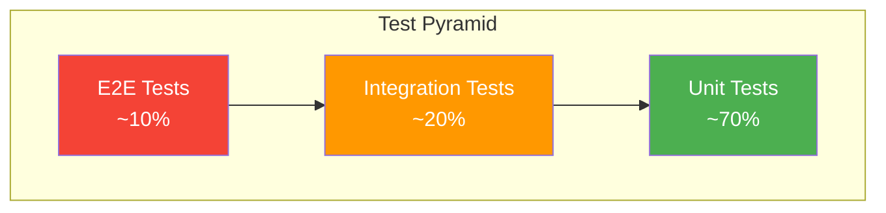

# Testing in Python

Testing is not optional in professional software development. It catches bugs before production, enables confident refactoring, and serves as living documentation for how your code should behave.

## Why testing matters

The cost of fixing bugs increases exponentially the later they are found:

| Stage | Relative Cost |
|-------|---------------|
| During development | 1x |
| During code review | 5x |
| During QA | 10x |
| In production | 100x |

Automated tests provide:
- **Regression protection**: Ensure changes do not break existing functionality
- **Refactoring confidence**: Change implementation without fear
- **Documentation**: Tests show how code is intended to be used
- **Design feedback**: Hard-to-test code often indicates design problems

## The test pyramid

Structure your tests as a pyramid, with more tests at the base and fewer at the top:

```
        /\
       /  \     E2E Tests (Few)
      /----\    - Full system tests
     /      \   - Slow, brittle
    /--------\  Integration Tests (Some)
   /          \ - Component interactions
  /------------\- Database, API calls
 /              \ Unit Tests (Many)
/----------------\- Single functions/classes
                  - Fast, isolated
```

**Recommended ratio**: 70% unit, 20% integration, 10% E2E



## Framework comparison

| Feature | unittest | pytest |
|---------|----------|--------|
| Style | Class-based, Java-like | Function-based |
| Assertions | `self.assertEqual()` | Plain `assert` |
| Setup/Teardown | `setUp`/`tearDown` methods | Fixtures |
| Parametrization | Limited | Built-in `@pytest.mark.parametrize` |
| Plugins | Few | Extensive ecosystem |
| Output | Verbose | Clean, colorized |

**Recommendation**: Use pytest for new projects. It is more Pythonic, requires less boilerplate, and has better error messages.

## pytest fundamentals

### Installation

```bash
uv add --dev pytest pytest-cov
```

### Test discovery

pytest automatically finds tests following these conventions:
- Files named `test_*.py` or `*_test.py`
- Functions and methods prefixed with `test_`
- Classes prefixed with `Test` (no `__init__` method)

```
project/
├── src/
│   └── calculator.py
└── tests/
    ├── __init__.py
    ├── test_calculator.py
    └── conftest.py          # Shared fixtures
```

### Writing tests

```python
# tests/test_calculator.py
from calculator import add, divide

def test_add_positive_numbers():
    """Test addition of two positive integers."""
    result = add(2, 3)
    assert result == 5

def test_add_negative_numbers():
    """Test addition with negative numbers."""
    assert add(-1, -1) == -2
    assert add(-1, 1) == 0

def test_divide_by_zero_raises():
    """Division by zero should raise ZeroDivisionError."""
    import pytest
    with pytest.raises(ZeroDivisionError):
        divide(10, 0)
```

### Running tests

```bash
# Run all tests
pytest

# Run with verbose output
pytest -v

# Run specific file
pytest tests/test_calculator.py

# Run specific test function
pytest tests/test_calculator.py::test_add_positive_numbers

# Run tests matching pattern
pytest -k "add"

# Stop on first failure
pytest -x

# Run last failed tests
pytest --lf

# Show print statements
pytest -s
```

### Assertion introspection

pytest provides detailed failure messages automatically:

```python
def test_list_equality():
    expected = [1, 2, 3, 4]
    actual = [1, 2, 4, 4]
    assert actual == expected
    # Output shows exactly which element differs:
    # E       assert [1, 2, 4, 4] == [1, 2, 3, 4]
    # E         At index 2 diff: 4 != 3
```

## Fixtures

Fixtures provide a way to set up preconditions for tests and clean up afterward.

### Basic fixtures

```python
import pytest

@pytest.fixture
def sample_user():
    """Create a sample user for testing."""
    return {"name": "Alice", "email": "alice@example.com", "active": True}

def test_user_is_active(sample_user):
    assert sample_user["active"] is True

def test_user_has_email(sample_user):
    assert "@" in sample_user["email"]
```

### Fixture with teardown (yield)

Use `yield` to run cleanup code after the test completes:

```python
import pytest
import tempfile
import os

@pytest.fixture
def temp_file():
    """Create a temporary file, clean up after test."""
    fd, path = tempfile.mkstemp()
    os.close(fd)

    yield path  # Test runs here

    # Cleanup runs after test, even if test fails
    if os.path.exists(path):
        os.remove(path)

def test_write_to_temp_file(temp_file):
    with open(temp_file, "w") as f:
        f.write("test data")

    with open(temp_file, "r") as f:
        assert f.read() == "test data"
```

### Fixture scope

Control how often a fixture is created:

| Scope | Created | Use Case |
|-------|---------|----------|
| `function` (default) | Once per test | Most fixtures |
| `class` | Once per test class | Shared class state |
| `module` | Once per module | Expensive setup |
| `session` | Once per test run | Database connections |

```python
import pytest

@pytest.fixture(scope="session")
def database_connection():
    """Create database connection once for entire test session."""
    conn = create_connection()
    yield conn
    conn.close()

@pytest.fixture(scope="function")
def clean_database(database_connection):
    """Reset database state before each test."""
    database_connection.execute("DELETE FROM users")
    yield database_connection
```

### conftest.py

Place shared fixtures in `conftest.py` files. pytest automatically discovers them:

```python
# tests/conftest.py
import pytest

@pytest.fixture
def api_client():
    """Shared API client for all tests."""
    from myapp import create_app
    app = create_app(testing=True)
    return app.test_client()

@pytest.fixture
def authenticated_client(api_client):
    """API client with authentication token."""
    api_client.post("/login", json={"user": "test", "password": "test"})
    return api_client
```

### Factory fixtures

Use factories when you need to create multiple instances with different parameters:

```python
import pytest

@pytest.fixture
def make_user():
    """Factory fixture to create users with custom attributes."""
    created_users = []

    def _make_user(name="Test User", email=None, active=True):
        email = email or f"{name.lower().replace(' ', '.')}@example.com"
        user = {"name": name, "email": email, "active": active}
        created_users.append(user)
        return user

    yield _make_user

    # Cleanup: delete all created users
    for user in created_users:
        # cleanup_user(user)
        pass

def test_multiple_users(make_user):
    alice = make_user("Alice")
    bob = make_user("Bob", active=False)

    assert alice["active"] is True
    assert bob["active"] is False
```

## Parametrization

Test multiple inputs with a single test function:

### Basic parametrization

```python
import pytest

@pytest.mark.parametrize("input,expected", [
    (1, 1),
    (2, 4),
    (3, 9),
    (4, 16),
])
def test_square(input, expected):
    assert input ** 2 == expected
```

### Multiple parameters

```python
@pytest.mark.parametrize("a,b,expected", [
    (1, 2, 3),
    (0, 0, 0),
    (-1, 1, 0),
    (100, 200, 300),
])
def test_addition(a, b, expected):
    assert a + b == expected
```

### Custom IDs for readability

```python
import pytest

@pytest.mark.parametrize("input,expected", [
    pytest.param("hello", "HELLO", id="lowercase"),
    pytest.param("WORLD", "WORLD", id="already_upper"),
    pytest.param("MiXeD", "MIXED", id="mixed_case"),
    pytest.param("", "", id="empty_string"),
])
def test_uppercase(input, expected):
    assert input.upper() == expected
```

### Parametrize fixtures

```python
@pytest.fixture(params=["mysql", "postgres", "sqlite"])
def database(request):
    """Run tests against multiple database backends."""
    db_type = request.param
    conn = connect_to(db_type)
    yield conn
    conn.close()

def test_query(database):
    # This test runs 3 times, once for each database type
    result = database.execute("SELECT 1")
    assert result == 1
```

## Mocking

Replace dependencies with controlled substitutes during testing.

### When to mock

Mock when testing code that depends on:
- External services (APIs, databases)
- Time-dependent behavior
- Random values
- Expensive operations
- Side effects (email sending, file writing)

**Do not** mock the code you are testing, only its dependencies.

### unittest.mock basics

```python
from unittest.mock import Mock, patch, MagicMock

# Create a mock object
mock_db = Mock()
mock_db.query.return_value = [{"id": 1, "name": "Alice"}]

# Use the mock
result = mock_db.query("SELECT * FROM users")
assert result == [{"id": 1, "name": "Alice"}]

# Verify calls
mock_db.query.assert_called_once_with("SELECT * FROM users")
```

### patch decorator

Replace objects during test execution:

```python
from unittest.mock import patch

# Function to test
def get_user_count():
    import requests
    response = requests.get("https://api.example.com/users")
    return len(response.json())

# Test with mocked requests
@patch("requests.get")
def test_get_user_count(mock_get):
    mock_get.return_value.json.return_value = [
        {"id": 1}, {"id": 2}, {"id": 3}
    ]

    result = get_user_count()

    assert result == 3
    mock_get.assert_called_once_with("https://api.example.com/users")
```

### patch as context manager

```python
from unittest.mock import patch

def test_get_user_count_context():
    with patch("requests.get") as mock_get:
        mock_get.return_value.json.return_value = [{"id": 1}]

        result = get_user_count()

        assert result == 1
```

### MagicMock for complex objects

MagicMock automatically creates attributes and methods:

```python
from unittest.mock import MagicMock

mock_file = MagicMock()

# Use like a file object
mock_file.read.return_value = "file contents"
mock_file.__enter__.return_value = mock_file  # For context manager

with mock_file as f:
    content = f.read()

assert content == "file contents"
```

### pytest-mock plugin

Provides a cleaner interface via the `mocker` fixture:

```bash
uv add --dev pytest-mock
```

```python
def test_with_mocker(mocker):
    mock_get = mocker.patch("requests.get")
    mock_get.return_value.json.return_value = [{"id": 1}]

    result = get_user_count()

    assert result == 1
```

### Spy on real objects

Watch real methods while letting them execute:

```python
def test_spy(mocker):
    spy = mocker.spy(some_module, "some_function")

    result = some_module.some_function("arg")

    # Function really executed
    assert result == "real result"
    # But we can inspect the call
    spy.assert_called_once_with("arg")
```

## Testing patterns

### AAA pattern (Arrange-Act-Assert)

Structure tests in three clear sections:

```python
def test_user_creation():
    # Arrange - Set up test data and conditions
    name = "Alice"
    email = "alice@example.com"

    # Act - Perform the action being tested
    user = create_user(name, email)

    # Assert - Verify the expected outcome
    assert user.name == name
    assert user.email == email
    assert user.id is not None
```

### Test isolation

Each test should be independent:

```python
# BAD - Tests depend on each other
class TestUserBad:
    user = None

    def test_create_user(self):
        self.user = create_user("Alice")  # Modifies class state

    def test_user_exists(self):
        assert self.user is not None  # Depends on previous test

# GOOD - Tests are independent
class TestUserGood:
    @pytest.fixture
    def user(self):
        return create_user("Alice")

    def test_create_user(self, user):
        assert user.name == "Alice"

    def test_user_has_id(self, user):
        assert user.id is not None
```

### Testing exceptions

```python
import pytest

def test_raises_value_error():
    with pytest.raises(ValueError) as exc_info:
        int("not a number")

    assert "invalid literal" in str(exc_info.value)

def test_raises_with_match():
    with pytest.raises(ValueError, match=r"invalid literal.*base 10"):
        int("not a number")
```

### Testing async code

```python
import pytest

@pytest.mark.asyncio
async def test_async_function():
    result = await fetch_data()
    assert result == expected_data
```

Requires `pytest-asyncio`:

```bash
uv add --dev pytest-asyncio
```

## Coverage

Measure how much of your code is executed by tests.

### Setup

```bash
uv add --dev pytest-cov coverage
```

### Running with coverage

```bash
# Generate coverage report
pytest --cov=src --cov-report=html

# View terminal report
pytest --cov=src --cov-report=term-missing

# Fail if coverage below threshold
pytest --cov=src --cov-fail-under=80
```

### Coverage configuration

```ini
# pyproject.toml
[tool.coverage.run]
source = ["src"]
branch = true
omit = ["*/tests/*", "*/__init__.py"]

[tool.coverage.report]
exclude_lines = [
    "pragma: no cover",
    "if TYPE_CHECKING:",
    "raise NotImplementedError",
]
```

### Meaningful coverage

Coverage percentage alone is not a quality metric:

```python
# 100% coverage but useless test
def test_add():
    add(1, 2)  # No assertion!

# Meaningful test
def test_add():
    assert add(1, 2) == 3
    assert add(-1, 1) == 0
    assert add(0, 0) == 0
```

**Target**: 80-90% coverage is reasonable. 100% often requires testing trivial code.

## Example from our code

The `gds_database` package includes tests demonstrating these patterns:

```python
# python/gds_database/tests/test_connection.py
import pytest
from unittest.mock import patch, MagicMock

@pytest.fixture
def mock_connection():
    """Create a mock database connection."""
    conn = MagicMock()
    conn.execute.return_value = [{"id": 1, "name": "test"}]
    return conn

@pytest.fixture(scope="session")
def vault_client():
    """Session-scoped Vault client for integration tests."""
    from gds_vault import VaultClient
    return VaultClient()

def test_query_returns_results(mock_connection):
    """Unit test with mocked connection."""
    result = mock_connection.execute("SELECT * FROM users")

    assert len(result) == 1
    assert result[0]["name"] == "test"
    mock_connection.execute.assert_called_once()

@pytest.mark.parametrize("db_type,expected_port", [
    ("postgres", 5432),
    ("mssql", 1433),
    ("mongodb", 27017),
])
def test_default_ports(db_type, expected_port):
    """Test default port configuration for each database type."""
    config = get_config(db_type)
    assert config.port == expected_port
```

## Anti-patterns to avoid

### Testing implementation details

```python
# BAD - Tests internal implementation
def test_user_storage():
    user = User("Alice")
    assert user._internal_data["name"] == "Alice"  # Testing private attribute

# GOOD - Tests behavior
def test_user_name():
    user = User("Alice")
    assert user.name == "Alice"  # Tests public interface
```

### Over-mocking

```python
# BAD - Mocks the thing being tested
@patch("mymodule.process_data")
def test_process_data(mock_process):
    mock_process.return_value = "result"
    result = process_data("input")  # Not testing real code!

# GOOD - Mock only external dependencies
@patch("mymodule.external_api.fetch")
def test_process_data(mock_fetch):
    mock_fetch.return_value = {"data": "value"}
    result = process_data("input")  # Tests real process_data
    assert result == expected_output
```

### Flaky tests

Tests that sometimes pass and sometimes fail:

```python
# BAD - Depends on timing
def test_async_operation():
    start_async_task()
    time.sleep(0.1)  # Hope it finished
    assert get_result() is not None

# GOOD - Wait for completion
def test_async_operation():
    task = start_async_task()
    task.wait(timeout=5)  # Explicit wait
    assert task.result is not None
```

### Test pollution

```python
# BAD - Modifies global state
def test_config():
    settings.DEBUG = True  # Affects other tests
    assert something()

# GOOD - Restore state
def test_config():
    original = settings.DEBUG
    try:
        settings.DEBUG = True
        assert something()
    finally:
        settings.DEBUG = original

# BETTER - Use monkeypatch fixture
def test_config(monkeypatch):
    monkeypatch.setattr(settings, "DEBUG", True)
    assert something()
    # Automatically restored after test
```

## Best practices summary

1. **Follow the test pyramid**: Many unit tests, fewer integration tests, minimal E2E tests
2. **Use fixtures**: Avoid duplication in test setup
3. **Parametrize**: Test multiple inputs without copy-paste
4. **Mock at boundaries**: Mock external services, not internal code
5. **Keep tests fast**: Slow tests get skipped
6. **Test behavior, not implementation**: Tests should survive refactoring
7. **Use descriptive names**: `test_user_with_invalid_email_raises_validation_error`
8. **One assertion concept per test**: Multiple asserts are fine if testing one behavior
9. **Keep tests independent**: No test should depend on another test running first
10. **Maintain your tests**: Delete obsolete tests, update tests when requirements change

---

[← Back to Module 3](./README.md) | [Next: Performance →](./18_performance.md)
