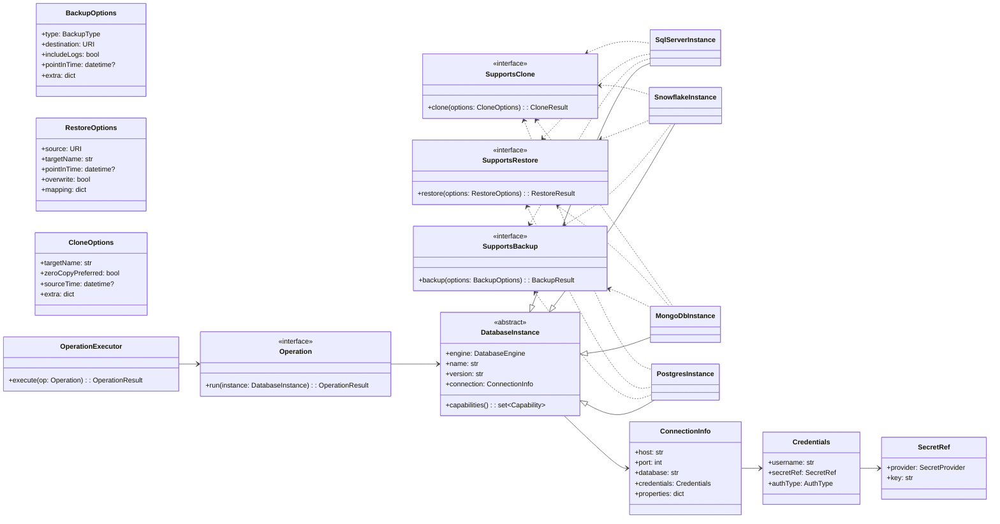
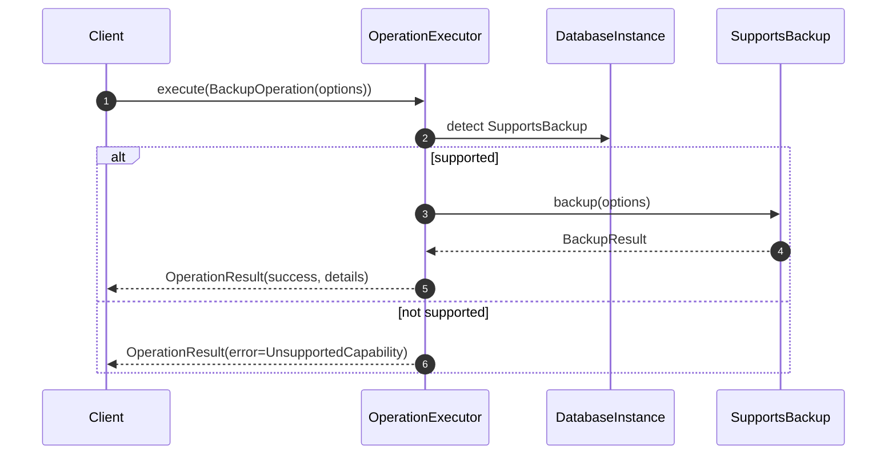

## Database Instance Object-Oriented Design and Architecture

### Purpose

Provide a clean, extensible OO design to manage heterogeneous database platforms—Microsoft SQL Server, Snowflake, MongoDB, PostgreSQL—with consistent abstractions for common operations (backup, restore, clone) and room for platform-specific capabilities.

### Design Goals

- **Consistency**: Unified API for common operations.
- **Extensibility**: Add new platforms/capabilities without modifying core code (Open/Closed Principle).
- **Separation of Concerns**: Distinct layers for platform description, connection/config, and operations.
- **Capability-Driven**: Only expose operations a platform actually supports at runtime.
- **Testability**: Small interfaces, dependency injection for IO boundaries.

### High-Level Architecture



### Core Abstractions

- **DatabaseInstance (abstract)**: Identity, version, connection, and declared capability set. Implementations: `SqlServerInstance`, `SnowflakeInstance`, `MongoDbInstance`, `PostgresInstance`.
- **Capability Interfaces**: `SupportsBackup`, `SupportsRestore`, `SupportsClone`. Platforms implement only those they support. This prevents exposing unsupported operations.
- **Value Objects**: `ConnectionInfo`, `Credentials`, `SecretRef`, `BackupOptions`, `RestoreOptions`, `CloneOptions` isolate IO/config concerns and options.
- **Operations**: Optional Command pattern via `Operation` and `OperationExecutor` to compose complex workflows (schedule, retries, audit).

### Sequence: Backup Operation



### Platform Capabilities and Nuances

- **Microsoft SQL Server**
  - **Attributes**: instanceName, edition, collation, compatibilityLevel, fileGroups, recoveryModel, availabilityGroups.
  - **Backup**: full, differential, transaction log, copy-only; destinations: disk, URL. Options: compression, checksum, encryption.
  - **Restore**: with MOVE, RECOVERY/NORECOVERY, point-in-time (STOPAT with logs), tail-log backup.
  - **Clone**: structural clone via `DBCC CLONEDATABASE` (schema/stats only), or full copy via backup/restore.

- **Snowflake**
  - **Attributes**: account, region, organization, edition, timeTravelRetention, failSafe, defaultWarehouse, role.
  - **Backup**: service-managed via Time Travel + Fail-safe; manual “backup” often means external stage unload.
  - **Restore**: time-travel restore to timestamp/query ID; undrop within retention.
  - **Clone**: zero-copy `CLONE` at database/schema/table level, optionally at a point in time.

- **MongoDB**
  - **Attributes**: topology (standalone/replicaSet/sharded), storageEngine, journaling, featureCompatibilityVersion.
  - **Backup**: `mongodump` logical; filesystem snapshots for consistent backups; `mongoexport` for collections.
  - **Restore**: `mongorestore` logical; snapshot restore; PIT requires replica set with Oplog and appropriate tooling.
  - **Clone**: copy database by dump/restore; in-cluster cloning via aggregation/copy or snapshots.

- **PostgreSQL**
  - **Attributes**: clusterName, dataDirectory, walLevel, archiveMode, maxConnections, installedExtensions.
  - **Backup**: `pg_dump` logical; `pg_basebackup` physical; WAL archiving for PITR.
  - **Restore**: `pg_restore` logical; PITR using base backup + WAL replay (recovery settings).
  - **Clone**: create database from template; clone via base backup/restore; logical dump/restore.

### Programming Model (Python skeletons)

```python
from dataclasses import dataclass
from enum import Enum
from typing import Dict, Optional, Protocol, Set
from datetime import datetime


class DatabaseEngine(str, Enum):
    SQLSERVER = "sqlserver"
    SNOWFLAKE = "snowflake"
    MONGODB = "mongodb"
    POSTGRES = "postgres"

class AuthType(str, Enum):
    PASSWORD = "password"
    KEYPAIR = "keypair"
    OAUTH = "oauth"

class BackupType(str, Enum):
    FULL = "full"
    DIFFERENTIAL = "differential"
    LOG = "log"
    SNAPSHOT = "snapshot"
    LOGICAL = "logical"

@dataclass(frozen=True)
class SecretRef:
    provider: str  # e.g., "vault", "aws-secrets-manager"
    key: str

@dataclass(frozen=True)
class Credentials:
    username: str
    secretRef: SecretRef
    authType: AuthType

@dataclass(frozen=True)
class ConnectionInfo:
    host: str
    port: int
    database: str
    credentials: Credentials
    properties: Dict[str, str]

@dataclass(frozen=True)
class BackupOptions:
    type: BackupType
    destination: str  # URI
    includeLogs: bool = False
    pointInTime: Optional[datetime] = None
    extra: Dict[str, str] = None

@dataclass(frozen=True)
class RestoreOptions:
    source: str  # URI
    targetName: str
    pointInTime: Optional[datetime] = None
    overwrite: bool = False
    mapping: Dict[str, str] = None

@dataclass(frozen=True)
class CloneOptions:
    targetName: str
    zeroCopyPreferred: bool = True
    sourceTime: Optional[datetime] = None
    extra: Dict[str, str] = None

@dataclass(frozen=True)
class OperationResult:
    success: bool
    message: str = ""
    details: Dict[str, str] = None

class SupportsBackup(Protocol):
    def backup(self, options: BackupOptions) -> OperationResult: ...

class SupportsRestore(Protocol):
    def restore(self, options: RestoreOptions) -> OperationResult: ...

class SupportsClone(Protocol):
    def clone(self, options: CloneOptions) -> OperationResult: ...

class DatabaseInstance:
    def __init__(self, engine: DatabaseEngine, name: str, version: str, connection: ConnectionInfo):
        self.engine = engine
        self.name = name
        self.version = version
        self.connection = connection

    def capabilities(self) -> Set[str]:
        return set()

class SqlServerInstance(DatabaseInstance, SupportsBackup, SupportsRestore, SupportsClone):
    def capabilities(self) -> Set[str]:
        return {"backup", "restore", "clone"}
    def backup(self, options: BackupOptions) -> OperationResult:
        # Issue BACKUP DATABASE ... WITH options (compression/checksum/etc.)
        return OperationResult(True, "SQL Server backup initiated")
    def restore(self, options: RestoreOptions) -> OperationResult:
        # RESTORE DATABASE ... WITH MOVE, RECOVERY/NORECOVERY, STOPAT
        return OperationResult(True, "SQL Server restore initiated")
    def clone(self, options: CloneOptions) -> OperationResult:
        # Prefer backup/restore approach or DBCC CLONEDATABASE for schema/stats
        return OperationResult(True, "SQL Server clone initiated")

class SnowflakeInstance(DatabaseInstance, SupportsBackup, SupportsRestore, SupportsClone):
    def capabilities(self) -> Set[str]:
        return {"backup", "restore", "clone"}
    def backup(self, options: BackupOptions) -> OperationResult:
        # Typically implemented via Time Travel or UNLOAD to stages
        return OperationResult(True, "Snowflake backup (time-travel/unload) planned")
    def restore(self, options: RestoreOptions) -> OperationResult:
        # Time-travel restore or re-import from stage
        return OperationResult(True, "Snowflake restore planned")
    def clone(self, options: CloneOptions) -> OperationResult:
        # CREATE DATABASE <new> CLONE <src> AT (TIMESTAMP => ...)
        return OperationResult(True, "Snowflake zero-copy clone initiated")

class MongoDbInstance(DatabaseInstance, SupportsBackup, SupportsRestore, SupportsClone):
    def capabilities(self) -> Set[str]:
        return {"backup", "restore", "clone"}
    def backup(self, options: BackupOptions) -> OperationResult:
        # mongodump or filesystem snapshot
        return OperationResult(True, "MongoDB backup initiated")
    def restore(self, options: RestoreOptions) -> OperationResult:
        # mongorestore or snapshot restore
        return OperationResult(True, "MongoDB restore initiated")
    def clone(self, options: CloneOptions) -> OperationResult:
        # dump/restore or in-cluster copy
        return OperationResult(True, "MongoDB clone initiated")

class PostgresInstance(DatabaseInstance, SupportsBackup, SupportsRestore, SupportsClone):
    def capabilities(self) -> Set[str]:
        return {"backup", "restore", "clone"}
    def backup(self, options: BackupOptions) -> OperationResult:
        # pg_dump or pg_basebackup
        return OperationResult(True, "PostgreSQL backup initiated")
    def restore(self, options: RestoreOptions) -> OperationResult:
        # pg_restore or PITR via WAL
        return OperationResult(True, "PostgreSQL restore initiated")
    def clone(self, options: CloneOptions) -> OperationResult:
        # CREATE DATABASE ... TEMPLATE ... or dump/restore
        return OperationResult(True, "PostgreSQL clone initiated")
```

### Error Handling and Idempotency

- Use domain errors: `UnsupportedCapability`, `InvalidOptions`, `AuthenticationFailed`, `IOError`, `Timeout`.
- Prefer idempotent operations (e.g., upsert-like restores with `overwrite=false` by default).
- Return structured `OperationResult` with machine-readable `details` for orchestration layers.

### Observability and Audit

- Inject `AuditLogger` to record who-what-when-where for each operation.
- Attach correlation IDs to `OperationResult.details` for traceability.
- Emit metrics per operation (latency, success rate, bytes processed).

### Extending to a New Engine/Instance

1. Implement a new `XyzInstance(DatabaseInstance, [capabilities...])`.
2. Map its native features into `BackupOptions`/`RestoreOptions`/`CloneOptions.extra`.
3. Register its capability set and wire secrets/connection properties through `ConnectionInfo`.

### Minimal Usage Example

```python
instance = SnowflakeInstance(
    engine=DatabaseEngine.SNOWFLAKE,
    name="core_dw",
    version="7.x",
    connection=ConnectionInfo(
        host="abc-xy123.snowflakecomputing.com",
        port=443,
        database="PROD_DB",
        credentials=Credentials(
            username="svc.backup",
            secretRef=SecretRef(provider="vault", key="snowflake/svc.backup/password"),
            authType=AuthType.PASSWORD,
        ),
        properties={"account": "ABC-XY123", "warehouse": "WH_XL"}
    )
)

if "clone" in instance.capabilities():
    result = instance.clone(CloneOptions(targetName="PROD_DB_CLONE", zeroCopyPreferred=True))
    assert result.success
```

### Notes on Real-World Implementation

- SQL Server: `BACKUP/RESTORE` T-SQL with options like `WITH COMPRESSION, CHECKSUM`; structural clone via `DBCC CLONEDATABASE`.
- Snowflake: `CREATE DATABASE <new> CLONE <src> [AT(TIMESTAMP=>...)]`; use Time Travel and Fail-safe concepts.
- MongoDB: `mongodump/mongorestore` or snapshots; ensure replica set for consistency and PITR.
- PostgreSQL: choose logical (`pg_dump/pg_restore`) vs physical (`pg_basebackup + WAL`) per use case; template DB cloning for fast local copies.
