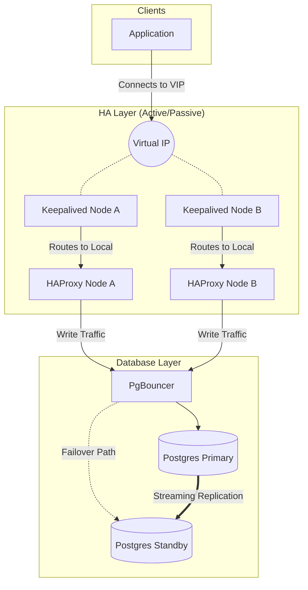

# PostgreSQL High Availability Architecture

This document describes a robust High Availability (HA) architecture for PostgreSQL using industry-standard open source components: HAProxy, Keepalived, and PgBouncer.

## Components Overview

### 1. PostgreSQL (The Database)
The core of the stack. In an HA setup, we use **Streaming Replication** to maintain data consistency between nodes.
-   **Primary Node**: Handles all Rights (INSERT, UPDATE, DELETE) and Reads.
-   **Standby Node(s)**: Replicates data from the Primary. Can be used for Read-Only traffic.

### 2. PgBouncer (The Connection Pooler)
PostgreSQL has a significant per-connection overhead. PgBouncer sits between the application and the database to maintain a pool of open connections, reusing them for clients.
-   **Why it's needed**: It prevents connection spikes from overwhelming the database server and improves transaction throughput.

### 3. HAProxy (The Load Balancer)
HAProxy acts as the traffic director. It is responsible for:
-   **Health Checking**: Constantly checking which Postgres node is the *Primary* and which is *Standby*.
-   **Routing**: Sending write traffic *only* to the current Primary node.
-   **Load Balancing**: Optionally distributing read-only traffic across Standby nodes.

### 4. Keepalived (The VIP Manager)
High Availability needs to exist at the entry point too. If we have multiple HAProxy nodes (to prevent HAProxy from being a single point of failure), we need a way to share a single IP address.
-   **VIP (Virtual IP)**: A floating IP address that clients connect to.
-   **VRRP**: Keepalived uses the Virtual Router Redundancy Protocol to float the VIP between active HAProxy nodes.

---

## Architecture Diagram

The flows shows a write request traveling from the Application to the Primary Database.

> **Note**: In many setups, PgBouncer is installed on the *same node* as the App (for local pooling) or the same node as the DB (for server-side pooling). This diagram depicts a centralized pooling layer or sidecar model for simplicity.

---

## Traffic Flow

1.  **Application** tries to connect to the database using the **Virtual IP (VIP)**.
2.  **Keepalived** ensures the VIP is active on the primary Load Balancer node.
3.  The request reaches **HAProxy**.
4.  **HAProxy** checks its backend status. It uses a specialized external check (often a script or a query) to ask each Postgres node: *"Are you the Primary?"*
5.  HAProxy forwards the connection to the node that replied "I am Primary".
6.  The request hits **PgBouncer** (if configured as a separate layer or on the DB node).
7.  **PgBouncer** assigns an existing idle connection from its pool.
8.  The query executes on **Postgres Primary**.

## Failover Mechanisms

### Database Failover
If the **Primary Postgres** fails:
1.  HAProxy health checks fail for that node.
2.  Orchestration tools (like Patroni or manual intervention) promote the **Standby** to **Primary**.
3.  HAProxy health checks detect the *new* Primary.
4.  HAProxy reroutes all new connections to the new Primary.
5.  *Downtime*: A few seconds (depends on health check interval and promotion time).

### Load Balancer Failover
If the **Active HAProxy/Keepalived** node fails:
1.  Keepalived on the *Backup* node stops receiving "heartbeats" from the Active node.
2.  The Backup node claims the **VIP**.
3.  Traffic now routes to the Backup HAProxy instance.
4.  *Downtime*: Almost instantaneous (milliseconds to seconds).
