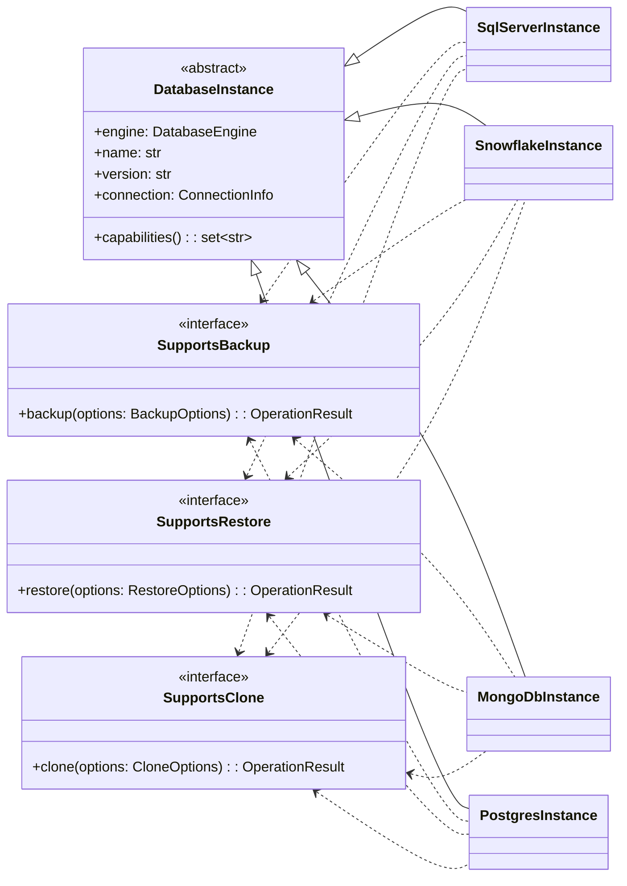
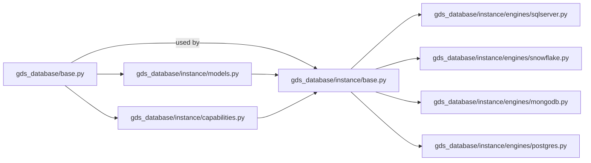
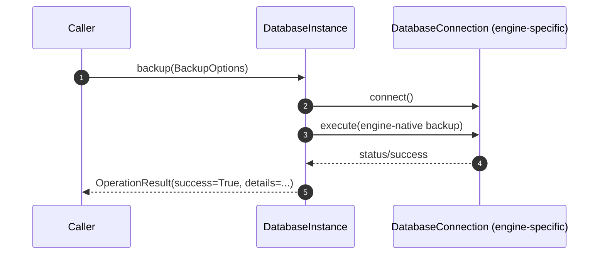

## Plan: Introduce DatabaseInstance Layer into gds_database

### Purpose
Add a first-class `DatabaseInstance` abstraction (with `DatabaseEngine` and capability interfaces) without breaking existing `gds_database` APIs centered on `DatabaseConnection`. This enables consistent operations like backup/restore/clone across heterogeneous engines (SQL Server, Snowflake, MongoDB, PostgreSQL).

### Inputs Reviewed
- `gds_database/docs/ARCHITECTURE.md`: Focuses on OOP foundations (ABCs, Protocols), core types like `DatabaseConnection`, `TransactionalConnection`, `ResourceManager`, `RetryableOperation`, and `OperationResult`. No instance-level orchestration or capability-driven design yet.
- `gds_database/docs/DEVELOPER_GUIDE.md`: Developer workflow, how to add new connections and components; does not define an instance-level model or cross-engine operations.
- `gds_database/docs/BUILD_GUIDE.md`: Build, test, quality checks; no structural blockers for adding new modules.
- `docs/database-instance-oo-design.md`: Proposes `DatabaseInstance`, `DatabaseEngine`, capability Protocols (`SupportsBackup`, `SupportsRestore`, `SupportsClone`), value objects (`ConnectionInfo`, `Credentials`, `SecretRef`, options dataclasses), and diagrams.

### Gap Analysis (Current vs Target)
- **Layering**
  - Current: Connection-oriented API; per-database implementations are implied but not formalized at the instance level.
  - Target: Add `DatabaseInstance` as orchestration layer above connections with explicit capabilities.

- **Capabilities**
  - Current: No standardized way to express platform-specific ops like backup/restore/clone.
  - Target: Protocols for capabilities; instances declare supported operations at runtime.

- **Value Objects**
  - Current: Uses `OperationResult`; no shared `ConnectionInfo`, `Credentials`, `SecretRef`, or operation option DTOs.
  - Target: Introduce these DTOs to standardize inputs across engines.

- **Extensibility**
  - Current: Clear for connections; less clear for instance-level features.
  - Target: New `instance/` package with engines under `engines/` and capability protocols in `capabilities.py`.

- **Docs & Dev Experience**
  - Current: Great for connections; lacks guidance for adding new engine instances or cross-engine ops.
  - Target: Add developer guidance and architecture diagrams for instance layer.

### Architectural Target (Summary)

Interaction with existing `DatabaseConnection` remains composition/usage inside instance methods; no inheritance coupling required.

### Module Layout (Proposed)

- `gds_database/instance/base.py`: `DatabaseInstance`, `DatabaseEngine` enum, abstract plumbing.
- `gds_database/instance/capabilities.py`: `SupportsBackup`, `SupportsRestore`, `SupportsClone` Protocols.
- `gds_database/instance/models.py`: `ConnectionInfo`, `Credentials`, `SecretRef`, `BackupOptions`, `RestoreOptions`, `CloneOptions`.
- `gds_database/instance/engines/*.py`: per-engine concrete instances.

### Reuse vs New Types
- Reuse existing `OperationResult` from `gds_database` to avoid duplication; align signatures accordingly.
- Introduce `ConnectionInfo`/`Credentials`/`SecretRef` value objects scoped to the instance layer; they are orthogonal to low-level connection handles.

### Backward Compatibility
- No changes to current `DatabaseConnection` APIs.
- New instance APIs are additive. Existing code continues to work.
- Optional adapters can bridge instance operations to connection-based workflows when needed.

### Phased Implementation Plan

1) Foundations (Week 1)
- Add `gds_database/instance/models.py` with value objects and enums.
- Add `gds_database/instance/capabilities.py` with capability Protocols.
- Add `gds_database/instance/base.py` with `DatabaseInstance` abstract class and default `capabilities()` behavior.
- Add unit tests for models and base behaviors.

2) Engine Implementations (Week 2)
- Create `engines/sqlserver.py`, `engines/snowflake.py`, `engines/mongodb.py`, `engines/postgres.py` stubs implementing `DatabaseInstance` and capability Protocols.
- For each engine, implement minimal no-op/skeleton logic that integrates with `OperationResult`.
- Add per-engine tests asserting capability exposure and method contracts.

3) Orchestration and Operations (Week 3)
- Optionally add an `Operation` command interface and `OperationExecutor` for composition, retries, and audit hooks (leveraging `RetryableOperation` and logging patterns from existing docs).
- Provide examples and tests for common flows (backup/restore/clone) driven by instance capabilities.

4) Documentation and Developer Experience (Week 3)
- Update `gds_database/docs/ARCHITECTURE.md`: add diagrams with `DatabaseInstance`, module layout, and sequence interactions.
- Update `gds_database/docs/DEVELOPER_GUIDE.md`: how to implement a new `XyzInstance`, capability Protocols, and examples.
- `gds_database/docs/BUILD_GUIDE.md`: minor additions if new test targets or optional extras are introduced.
- Ensure `__init__.py` exports for new public APIs.

5) Optional Adapters and Utilities (Week 4, optional)
- Add helpers to translate instance options to engine-specific SQL/CLI calls where appropriate.
- Add an example CLI or script demonstrating cross-engine clone via `DatabaseInstance`.

### Example Sequence (Instance + Connection)

The instance owns orchestration and uses engine-native connections/clients internally.

### Risks and Mitigations
- **Overlapping abstractions** (connection vs instance): Keep composition boundaries clean; instance orchestrates, connection executes.
- **Engine discrepancies** (e.g., Snowflake time travel vs SQL Server backups): Capture engine-specific knobs in `extra` fields of options; document per-engine behavior.
- **Scope creep**: Start with backup/restore/clone only; defer admin workflows (user/role management) to future phases.
- **Docs drift**: Land code and docs in the same PR; add tests referencing public contracts.

### Acceptance Criteria
- New instance layer compiles with type hints and passes tests.
- Each engine exposes a sensible `capabilities()` set and stubs for backup/restore/clone.
- Docs updated with diagrams and clear developer instructions.
- Zero breaking changes to existing `DatabaseConnection` consumers.

### Next Steps
- Implement Phase 1 foundations and open a PR with models, base, capabilities, tests, and updated docs outline.
- After review, proceed with engine stubs and examples.
