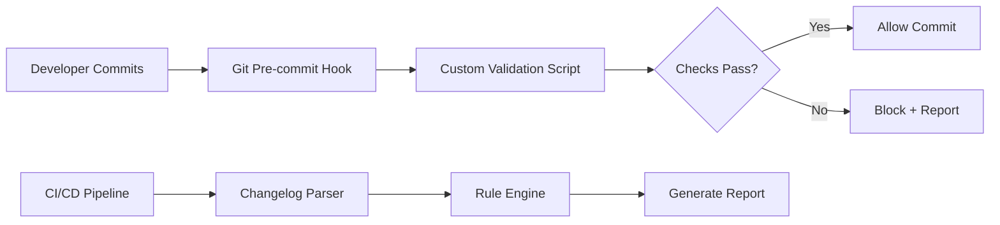
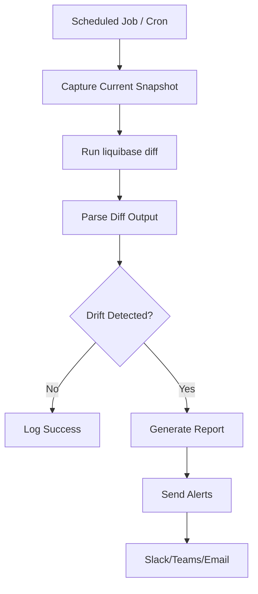
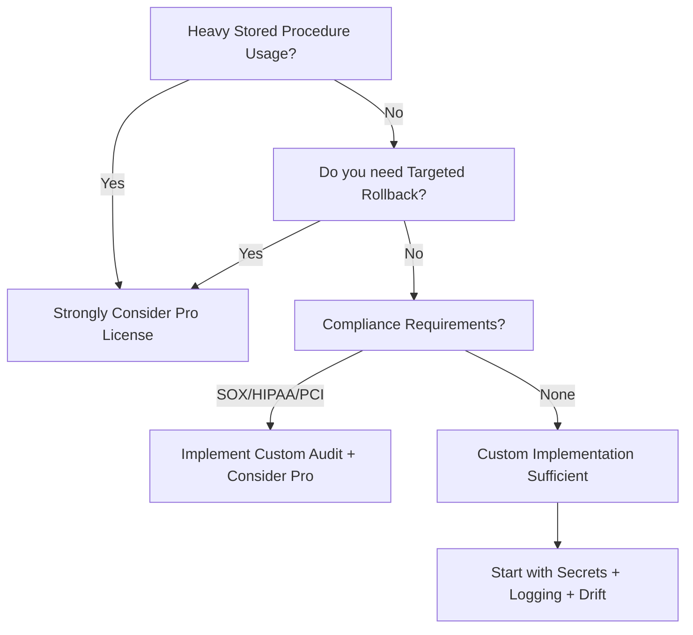

# Liquibase Secure Edition Implementation Analysis

**🔗 [← Back to Liquibase Documentation Index](./README.md)** — Navigation guide for all Liquibase docs

> **Document Version:** 1.0
> **Last Updated:** January 12, 2026
> **Maintainers:** Global Data Services Team
> **Status:** Strategic Planning Document
> **Audience:** Tech leads, architects, budget decision-makers


> [!IMPORTANT]
> **Related Docs:** [Concepts](./liquibase-concepts.md) | [Architecture](./liquibase-architecture.md) | [Operations](../../how-to/liquibase/liquibase-operations-guide.md) | [Reference](../../reference/liquibase/liquibase-reference.md) | [Drift Management](./liquibase-drift-management.md)

This document analyzes the features of **Liquibase Secure** (formerly Liquibase Pro/Enterprise) and assesses what would be required to implement equivalent functionality using the **Community Edition**. Use this to make informed decisions about licensing vs. custom implementation.

> [!IMPORTANT]
> Some Liquibase Secure features are deeply integrated into the core product and would require significant engineering effort to replicate. In many cases, the cost of custom implementation exceeds the cost of licensing.

## Table of Contents

- [Feature Comparison Matrix](#feature-comparison-matrix)
- [Detailed Feature Analysis](#detailed-feature-analysis)
  - [1. Policy Checks (Quality Checks)](#1-policy-checks-quality-checks)
  - [2. Secrets Management](#2-secrets-management)
  - [3. Drift Detection with Automated Reporting](#3-drift-detection-with-automated-reporting)
  - [4. Stored Logic Management](#4-stored-logic-management)
  - [5. Targeted Rollback](#5-targeted-rollback)
  - [6. Flowfiles (Workflow Orchestration)](#6-flowfiles-workflow-orchestration)
  - [7. Structured Logging (JSON Format)](#7-structured-logging-json-format)
  - [8. RBAC and SSO Integration](#8-rbac-and-sso-integration)
  - [9. Audit Trails and Compliance Reporting](#9-audit-trails-and-compliance-reporting)
- [Legend](#legend)

## Feature Comparison Matrix

| Feature Category | Community Edition | Liquibase Secure | Implementation Complexity |
|-----------------|-------------------|------------------|---------------------------|
| **Basic Schema Changes** | ✅ Full Support | ✅ Full Support | N/A |
| **Changelog Formats** | ✅ XML, YAML, JSON, SQL | ✅ Same + Enhancements | N/A |
| **Basic Rollback** | ✅ Sequential only | ✅ Targeted + Sequential | 🟡 Medium |
| **Drift Detection** | ⚠️ Manual `diff` only | ✅ Automated with Reports | 🟢 Low-Medium |
| **Stored Logic Management** | ⚠️ Raw SQL only | ✅ Automated Extraction | 🔴 High |
| **Policy Checks** | ❌ Not Available | ✅ Built-in + Custom | 🟡 Medium |
| **Secrets Management** | ❌ Manual/ENV only | ✅ Vault Integrations | 🟢 Low |
| **Flowfiles (Workflow)** | ⚠️ Basic only | ✅ Advanced Conditionals | 🟡 Medium |
| **Structured Logging** | ❌ Not Available | ✅ JSON + SIEM | 🟢 Low |
| **Operation Reports** | ❌ Not Available | ✅ HTML Reports | 🟡 Medium |
| **Targeted Rollback** | ❌ Not Available | ✅ `rollback-one-*` | 🔴 High |
| **RBAC/SSO** | ❌ Not Available | ✅ Built-in | 🔴 Very High |
| **Audit Trails** | ⚠️ DATABASECHANGELOG only | ✅ Tamper-evident logs | 🟡 Medium |

**Legend:**

- 🟢 **Low** = Can be implemented with scripts/wrappers
- 🟡 **Medium** = Requires moderate development effort
- 🔴 **High/Very High** = Requires significant engineering or is impractical

---

## Detailed Feature Analysis

### 1. Policy Checks (Quality Checks)

**What Liquibase Secure Provides:**

- Built-in library of pre-configured checks (50+)
- Custom Python-based policy checks
- Integration with CI/CD pipelines to block deployments
- Checks Report generation with HTML output
- Scope options: changelog, changeset, database

**Community Edition Alternative Implementation:**



**Implementation Requirements:**

1. **Changelog Parser (Python/Node.js)**
   - Parse YAML/XML/JSON changelogs
   - Extract changeset metadata and SQL content
   - Effort: ~40-60 hours

2. **Rule Engine**
   - Define rules in configuration files (YAML)
   - Example rules:
     - Block `DROP TABLE` without explicit approval
     - Require rollback blocks for all changesets
     - Enforce naming conventions
   - Effort: ~60-80 hours

3. **Example Custom Check (Python):**

```python
# custom_checks/no_drop_table.py
import re

def check_changeset(changeset_sql: str) -> dict:
    """Block DROP TABLE statements without approval tag."""
    if re.search(r'DROP\s+TABLE', changeset_sql, re.IGNORECASE):
        return {
            'passed': False,
            'severity': 'ERROR',
            'message': 'DROP TABLE requires explicit approval via @approved-drop tag'
        }
    return {'passed': True}
```

4. **Integration Points:**
   - Git pre-commit hooks
   - GitHub Actions/CI pipeline stages
   - Effort: ~20-30 hours

**Total Estimated Effort:** 120-170 hours

---

### 2. Secrets Management

**What Liquibase Secure Provides:**

- Native HashiCorp Vault integration
- AWS Secrets Manager integration
- Runtime credential fetching by key reference
- Environment variable abstraction

**Community Edition Alternative Implementation:**

This is one of the **easiest features to replicate** since Liquibase already supports environment variables.

**Implementation Approach:**

```yaml
# liquibase.properties (template)
url: ${DB_URL}
username: ${DB_USERNAME}
password: ${DB_PASSWORD}
```

**Wrapper Script (Bash):**

```bash
#!/bin/bash
# scripts/liquibase-with-vault.sh

# Fetch secrets from HashiCorp Vault
export DB_USERNAME=$(vault kv get -field=username secret/database/prod)
export DB_PASSWORD=$(vault kv get -field=password secret/database/prod)
export DB_URL=$(vault kv get -field=url secret/database/prod)

# Run Liquibase with secrets injected
liquibase "$@"
```

**AWS Secrets Manager Version:**

```bash
#!/bin/bash
# scripts/liquibase-with-aws-secrets.sh

SECRET_JSON=$(aws secretsmanager get-secret-value \
    --secret-id prod/database/liquibase \
    --query SecretString --output text)

export DB_USERNAME=$(echo $SECRET_JSON | jq -r '.username')
export DB_PASSWORD=$(echo $SECRET_JSON | jq -r '.password')
export DB_URL=$(echo $SECRET_JSON | jq -r '.url')

liquibase "$@"
```

**GitHub Actions Integration:**

```yaml
# .github/workflows/deploy.yml
jobs:
  deploy:
    steps:
      - name: Fetch Secrets from Vault
        uses: hashicorp/vault-action@v2
        with:
          url: ${{ secrets.VAULT_ADDR }}
          token: ${{ secrets.VAULT_TOKEN }}
          secrets: |
            secret/data/database/prod username | DB_USERNAME ;
            secret/data/database/prod password | DB_PASSWORD

      - name: Run Liquibase
        run: liquibase update
        env:
          LIQUIBASE_COMMAND_USERNAME: ${{ env.DB_USERNAME }}
          LIQUIBASE_COMMAND_PASSWORD: ${{ env.DB_PASSWORD }}
```

**Total Estimated Effort:** 16-24 hours

---

### 3. Drift Detection with Automated Reporting

**What Liquibase Secure Provides:**

- Automated drift reports (HTML)
- JSON output for CI/CD integration
- Proactive alerts when drift is detected
- Changeset generation to reconcile drift

**Community Edition Alternative Implementation:**

The Community Edition's `diff` command provides the foundation; we need to add reporting and alerting.

**Implementation Architecture:**



**Drift Detection Script:**

```bash
#!/bin/bash
# scripts/drift-detector.sh

SNAPSHOT_DIR="/data/liquibase/snapshots"
REPORT_DIR="/data/liquibase/reports"
DATE=$(date +%Y%m%d_%H%M%S)

# Capture current database state
liquibase --defaults-file=/data/liquibase/env/liquibase.prod.properties \
    snapshot --output-file="${SNAPSHOT_DIR}/current_${DATE}.json"

# Compare against reference (last deployed changelog)
liquibase --defaults-file=/data/liquibase/env/liquibase.prod.properties \
    diff --format=json > "${REPORT_DIR}/drift_${DATE}.json"

# Parse and alert if drift found
python3 scripts/parse_drift.py "${REPORT_DIR}/drift_${DATE}.json"
```

**Python Drift Parser:**

```python
# scripts/parse_drift.py
import json
import sys
import requests

def parse_drift_report(filepath: str) -> dict:
    with open(filepath) as f:
        data = json.load(f)

    changes = {
        'missing_objects': [],
        'unexpected_objects': [],
        'changed_objects': []
    }

    # Parse diff output (structure varies by version)
    for obj in data.get('missingObjects', []):
        changes['missing_objects'].append(obj)
    for obj in data.get('unexpectedObjects', []):
        changes['unexpected_objects'].append(obj)

    return changes

def send_alert(changes: dict):
    if any(changes.values()):
        webhook_url = os.environ.get('SLACK_WEBHOOK')
        message = f"⚠️ Database Drift Detected!\n" \
                  f"Missing: {len(changes['missing_objects'])}\n" \
                  f"Unexpected: {len(changes['unexpected_objects'])}"
        requests.post(webhook_url, json={'text': message})

if __name__ == '__main__':
    changes = parse_drift_report(sys.argv[1])
    send_alert(changes)
```

**Total Estimated Effort:** 40-60 hours

---

### 4. Stored Logic Management

**What Liquibase Secure Provides:**

- Automatic extraction via `generateChangeLog`
- Dedicated change types: `createFunction`, `createProcedure`, `createTrigger`, `createPackage`
- Proper handling in snapshots and diffs
- Versioning with `runOnChange`

**Community Edition Limitations:**

- `generateChangeLog` does NOT capture stored procedures, functions, triggers, or packages
- Must manually extract and manage these objects

**Community Edition Alternative Implementation:**

> [!CAUTION]
> This is one of the most complex features to replicate. Full parity is impractical without significant engineering.

**Partial Implementation Strategy:**

1. **Database-Native Extraction Scripts:**

```sql
-- extract_stored_procs.sql (SQL Server)
SELECT
    SCHEMA_NAME(o.schema_id) AS SchemaName,
    o.name AS ObjectName,
    o.type_desc AS ObjectType,
    m.definition AS ObjectDefinition,
    o.modify_date AS LastModified
FROM sys.objects o
JOIN sys.sql_modules m ON o.object_id = m.object_id
WHERE o.type IN ('P', 'FN', 'TF', 'IF', 'TR', 'V')
ORDER BY o.type, o.name;
```

2. **Changeset Generator (Python):**

```python
# scripts/extract_stored_logic.py
import pyodbc
from datetime import datetime

def extract_and_generate_changesets(connection_string: str, output_dir: str):
    conn = pyodbc.connect(connection_string)
    cursor = conn.cursor()

    cursor.execute("""
        SELECT name, type_desc, definition
        FROM sys.objects o
        JOIN sys.sql_modules m ON o.object_id = m.object_id
        WHERE o.type IN ('P', 'FN')
    """)

    for name, obj_type, definition in cursor.fetchall():
        filename = f"{output_dir}/{obj_type.lower()}/{name}.sql"
        changeset = f"""
--changeset automation:proc_{name} runOnChange:true
{definition}
GO
"""
        with open(filename, 'w') as f:
            f.write(changeset)
```

3. **Directory Structure:**

```
changelog/
├── root.xml
├── procedures/
│   ├── sp_GetCustomer.sql
│   └── sp_UpdateOrder.sql
├── functions/
│   ├── fn_CalculateTotal.sql
│   └── fn_FormatDate.sql
└── triggers/
    └── trg_AuditLog.sql
```

4. **Include Pattern in Root Changelog:**

```xml
<databaseChangeLog>
    <includeAll path="procedures/" relativeToChangelogFile="true"/>
    <includeAll path="functions/" relativeToChangelogFile="true"/>
    <includeAll path="triggers/" relativeToChangelogFile="true"/>
</databaseChangeLog>
```

**Limitations of Custom Implementation:**

- No automatic synchronization with database
- Manual maintenance required
- No diff/snapshot support for these objects
- Deployment ordering can be complex

**Total Estimated Effort:** 80-120 hours (basic), 200+ hours (full parity)

---

### 5. Targeted Rollback

**What Liquibase Secure Provides:**

- `rollback-one-changeset`: Rollback a specific changeset without affecting others
- `rollback-one-update`: Rollback all changesets from a specific deployment
- Preview commands: `rollback-one-changeset-sql`, `rollback-one-update-sql`

**Community Edition Limitations:**

- Only sequential rollback is supported (rollback everything after a tag/count/date)

**Community Edition Alternative Implementation:**

> [!WARNING]
> Implementing targeted rollback in Community Edition is complex and carries significant risk.

**Approach 1: Manual SQL Execution**

```bash
#!/bin/bash
# scripts/targeted-rollback.sh

CHANGESET_ID=$1
AUTHOR=$2

# 1. Extract rollback SQL from changelog
ROLLBACK_SQL=$(grep -A 50 "id=\"${CHANGESET_ID}\".*author=\"${AUTHOR}\"" changelog.xml | \
    grep -oP '(?<=<rollback>).*(?=</rollback>)')

# 2. Execute rollback SQL
echo "$ROLLBACK_SQL" | liquibase executeSql

# 3. Delete from DATABASECHANGELOG
liquibase executeSql --sql="DELETE FROM DATABASECHANGELOG WHERE ID='${CHANGESET_ID}' AND AUTHOR='${AUTHOR}'"
```

**Approach 2: Wrapper Script with Safety Checks**

```python
# scripts/targeted_rollback.py
import subprocess
import xml.etree.ElementTree as ET

def targeted_rollback(changeset_id: str, author: str, changelog_path: str):
    """
    WARNING: Use with extreme caution in production.
    """
    # Parse changelog to find rollback SQL
    tree = ET.parse(changelog_path)
    rollback_sql = None

    for changeset in tree.findall('.//changeSet'):
        if changeset.get('id') == changeset_id and changeset.get('author') == author:
            rollback = changeset.find('rollback')
            if rollback is not None:
                rollback_sql = rollback.text
            break

    if not rollback_sql:
        raise ValueError(f"No rollback found for {changeset_id}:{author}")

    # Execute with confirmation
    print(f"Will execute:\n{rollback_sql}")
    confirm = input("Proceed? (yes/no): ")

    if confirm.lower() == 'yes':
        subprocess.run(['liquibase', 'executeSql', '--sql', rollback_sql])
        # Remove from tracking table
        subprocess.run(['liquibase', 'executeSql', '--sql',
            f"DELETE FROM DATABASECHANGELOG WHERE ID='{changeset_id}' AND AUTHOR='{author}'"])
```

**Risks:**

- No automatic dependency checking
- Can leave database in inconsistent state
- No DATABASECHANGELOGHISTORY tracking
- No `--force` safety mechanism

**Total Estimated Effort:** 40-60 hours (basic), high ongoing maintenance risk

---

### 6. Flowfiles (Workflow Orchestration)

**What Liquibase Secure Provides:**

- YAML-based workflow definition
- Stages and Actions
- Conditional logic (AND, OR, NOT)
- Variable substitution
- Nested flow files

**Community Edition Status:**

- Basic Flowfiles ARE available in Community (4.15.0+)
- Advanced conditionals require Liquibase Secure (4.17.0+)

**Community Edition Alternative Implementation:**

For basic workflows, use the built-in Flowfile support:

```yaml
# liquibase.flowfile.yaml (Community Edition compatible)
stages:
  - stage: validate
    actions:
      - type: liquibase
        command: validate

  - stage: deploy
    actions:
      - type: liquibase
        command: update
      - type: liquibase
        command: tag
        cmdArgs:
          tag: ${VERSION}
```

**For Advanced Conditionals (Shell-based Wrapper):**

```bash
#!/bin/bash
# scripts/advanced-flow.sh

ENVIRONMENT=${1:-dev}
DRY_RUN=${2:-false}

# Stage 1: Validate
echo "=== Validation Stage ==="
liquibase validate
if [ $? -ne 0 ]; then
    echo "Validation failed!"
    exit 1
fi

# Stage 2: Conditional Checks
echo "=== Checks Stage ==="
if [ "$ENVIRONMENT" == "prod" ]; then
    # Additional production checks would go here
    echo "Running production-level validations..."
fi

# Stage 3: Deploy (or Dry Run)
echo "=== Deploy Stage ==="
if [ "$DRY_RUN" == "true" ]; then
    liquibase updateSQL
else
    liquibase update
    liquibase tag "deploy-$(date +%Y%m%d-%H%M%S)"
fi
```

**Total Estimated Effort:** 20-40 hours (for shell-based equivalent)

---

### 7. Structured Logging (JSON Format)

**What Liquibase Secure Provides:**

- JSON and JSON_PRETTY log formats
- Mapped Diagnostic Context (MDC)
- Custom key injection
- SIEM-ready output

**Community Edition Limitations:**

- Only unstructured text logging
- No `--log-format=JSON` option

**Community Edition Alternative Implementation:**

**Approach: Log Parser + Transformer**

```python
# scripts/log_transformer.py
import re
import json
import sys
from datetime import datetime

def parse_liquibase_log(log_line: str) -> dict:
    """Parse unstructured Liquibase log line to JSON."""
    # Example pattern: "INFO 12:34:56 - Successfully ran sql..."
    pattern = r'^(\w+)\s+(\d{2}:\d{2}:\d{2})\s+-\s+(.*)$'
    match = re.match(pattern, log_line)

    if match:
        return {
            'timestamp': datetime.now().isoformat(),
            'level': match.group(1),
            'time': match.group(2),
            'message': match.group(3),
            'source': 'liquibase'
        }
    return {'raw': log_line}

# Usage: liquibase update 2>&1 | python log_transformer.py
for line in sys.stdin:
    print(json.dumps(parse_liquibase_log(line.strip())))
```

**Wrapper Script:**

```bash
#!/bin/bash
# scripts/liquibase-json-log.sh

LOG_FILE="/var/log/liquibase/$(date +%Y%m%d).json"

liquibase "$@" 2>&1 | python3 scripts/log_transformer.py | tee -a "$LOG_FILE"
```

**Fluentd/Filebeat Configuration:**

```yaml
# filebeat.yml
filebeat.inputs:
  - type: log
    enabled: true
    paths:
      - /var/log/liquibase/*.json
    json.keys_under_root: true
    json.add_error_key: true

output.elasticsearch:
  hosts: ["elasticsearch:9200"]
  index: "liquibase-logs-%{+yyyy.MM.dd}"
```

**Total Estimated Effort:** 24-40 hours

---

### 8. RBAC and SSO Integration

**What Liquibase Secure Provides:**

- Role-Based Access Control
- SSO via SAML 2.0
- MFA support
- Separation of duties enforcement

**Community Edition Status:**

- ❌ Not available - Liquibase Community has no user/role concept
- Runs as whatever database user is configured

**Alternative Implementation Strategy:**

> [!NOTE]
> RBAC/SSO cannot be implemented within Liquibase itself. These must be enforced at the **CI/CD pipeline level**.

**CI/CD-Based Access Control:**

```yaml
# .github/workflows/deploy.yml
name: Database Deployment

on:
  push:
    branches: [main]
  workflow_dispatch:

jobs:
  validate:
    runs-on: ubuntu-latest
    steps:
      - name: Check User Permissions
        run: |
          # Verify deployer has appropriate role
          ALLOWED_DEPLOYERS="${{ secrets.ALLOWED_DEPLOYERS }}"
          if [[ ! "$ALLOWED_DEPLOYERS" =~ "${{ github.actor }}" ]]; then
            echo "User ${{ github.actor }} is not authorized to deploy"
            exit 1
          fi

  deploy-dev:
    needs: validate
    environment: development
    # GitHub Environment protection rules provide approval gates
    steps:
      - uses: actions/checkout@v4
      - name: Deploy to Dev
        run: liquibase update

  deploy-prod:
    needs: deploy-dev
    environment: production
    # Requires manual approval from designated reviewers
    steps:
      - uses: actions/checkout@v4
      - name: Deploy to Production
        run: liquibase update
```

**Database-Level Access Control:**

```sql
-- Create dedicated Liquibase service accounts with minimal privileges
CREATE LOGIN liquibase_dev WITH PASSWORD = 'xxx';
CREATE LOGIN liquibase_prod WITH PASSWORD = 'xxx';

-- Grant only necessary permissions
GRANT ALTER, CONTROL ON SCHEMA::dbo TO liquibase_dev;
GRANT ALTER, CONTROL ON SCHEMA::dbo TO liquibase_prod;
```

**Total Estimated Effort:** 40-60 hours (CI/CD controls), ongoing governance overhead

---

### 9. Audit Trails and Compliance Reporting

**What Liquibase Secure Provides:**

- Tamper-evident audit logs
- DATABASECHANGELOGHISTORY table
- Rollback tracking
- Compliance reports for SOX, HIPAA, PCI-DSS

**Community Edition Status:**

- DATABASECHANGELOG table tracks deployments
- No rollback history
- No built-in compliance reporting

**Community Edition Alternative Implementation:**

**Enhanced Tracking Table:**

```sql
-- Create custom audit table
CREATE TABLE LIQUIBASE_AUDIT_LOG (
    AuditID INT IDENTITY PRIMARY KEY,
    ChangeSetID NVARCHAR(255) NOT NULL,
    Author NVARCHAR(255) NOT NULL,
    Operation NVARCHAR(50) NOT NULL,  -- DEPLOY, ROLLBACK, SYNC
    ExecutedBy NVARCHAR(255),
    ExecutedAt DATETIME2 DEFAULT GETDATE(),
    Environment NVARCHAR(50),
    PipelineRunID NVARCHAR(255),
    CommitSHA NVARCHAR(40),
    ChangeDescription NVARCHAR(MAX),
    ChecksumBefore NVARCHAR(50),
    ChecksumAfter NVARCHAR(50)
);
```

**Audit Trigger:**

```sql
CREATE TRIGGER trg_AuditChangelog
ON DATABASECHANGELOG
AFTER INSERT, UPDATE, DELETE
AS
BEGIN
    INSERT INTO LIQUIBASE_AUDIT_LOG (
        ChangeSetID, Author, Operation, ExecutedAt
    )
    SELECT
        COALESCE(i.ID, d.ID),
        COALESCE(i.AUTHOR, d.AUTHOR),
        CASE
            WHEN d.ID IS NULL THEN 'DEPLOY'
            WHEN i.ID IS NULL THEN 'ROLLBACK'
            ELSE 'UPDATE'
        END,
        GETDATE()
    FROM INSERTED i
    FULL OUTER JOIN DELETED d ON i.ID = d.ID AND i.AUTHOR = d.AUTHOR;
END;
```

**Compliance Report Generator:**

```python
# scripts/compliance_report.py
import pyodbc
from datetime import datetime, timedelta
from jinja2 import Template

def generate_sox_report(connection_string: str, days: int = 30):
    conn = pyodbc.connect(connection_string)
    cursor = conn.cursor()

    cursor.execute("""
        SELECT
            ChangeSetID, Author, Operation, ExecutedBy,
            ExecutedAt, Environment, CommitSHA
        FROM LIQUIBASE_AUDIT_LOG
        WHERE ExecutedAt >= DATEADD(day, -?, GETDATE())
        ORDER BY ExecutedAt DESC
    """, (days,))

    changes = cursor.fetchall()

    report_template = Template("""
    # SOX Compliance Report
    Generated: {{ now }}
    Period: Last {{ days }} days

    ## Summary
    - Total Changes: {{ total }}
    - Production Deployments: {{ prod_count }}

    ## Change Log
    
    - {{ change.ExecutedAt }}: {{ change.ChangeSetID }} by {{ change.Author }}
    
    """)

    return report_template.render(
        now=datetime.now(),
        days=days,
        total=len(changes),
        prod_count=sum(1 for c in changes if c.Environment == 'prod'),
        changes=changes
    )
```

**Total Estimated Effort:** 60-80 hours

---

## Implementation Priority Matrix

Based on value vs. effort, here is the recommended implementation order:

| Priority | Feature | Effort | Value | Recommendation |
|----------|---------|--------|-------|----------------|
| 1 | Secrets Management | 🟢 Low | 🔴 High | **Implement First** - Easy win with high security value |
| 2 | Structured Logging | 🟢 Low | 🟡 Medium | **Implement** - Improves observability |
| 3 | Drift Detection | 🟡 Medium | 🔴 High | **Implement** - Critical for production safety |
| 4 | Policy Checks | 🟡 Medium | 🔴 High | **Implement** - Prevents bad deployments |
| 5 | Audit Trails | 🟡 Medium | 🟡 Medium | **Implement if regulated** - Required for compliance |
| 6 | Flowfile Enhancement | 🟢 Low | 🟡 Medium | **Use built-in** - Basic support exists |
| 7 | Stored Logic | 🔴 High | 🟡 Medium | **Consider License** - Manual alternative is painful |
| 8 | Targeted Rollback | 🔴 High | 🟡 Medium | **Consider License** - High risk to implement manually |
| 9 | RBAC/SSO | 🔴 Very High | Varies | **Use CI/CD Controls** - Cannot replicate in Liquibase |

---

## Total Implementation Effort Summary

| Approach | Estimated Hours | Ongoing Maintenance |
|----------|-----------------|---------------------|
| **Essential Features Only** (Secrets, Logging, Drift) | 80-124 hours | Low |
| **Governance Features** (Checks, Audit, Reports) | 240-370 hours | Medium |
| **Full Parity Attempt** | 500+ hours | High |
| **Liquibase Pro License** | ~$15,000-50,000/year | Vendor Supported |

---

## Recommendation

> [!TIP]
> **Hybrid Approach Recommended**
>
> 1. Implement custom solutions for: **Secrets Management**, **Structured Logging**, and **Drift Detection**
> 2. Use CI/CD pipeline controls for: **Access Control** and **Approval Gates**
> 3. Evaluate Liquibase Pro license if: **Stored Logic Management** or **Targeted Rollback** are critical requirements

### Decision Tree



---

## References

- [Liquibase Pro Features](https://www.liquibase.com/pricing)
- [Liquibase Documentation](https://docs.liquibase.com/)
- [Policy Checks Documentation](https://docs.liquibase.com/commands/policy-checks/home.html)
- [Secrets Management Extensions](https://docs.liquibase.com/tools-integrations/extensions/secrets-management/home.html)
- [Structured Logging](https://docs.liquibase.com/parameters/log-format.html)
