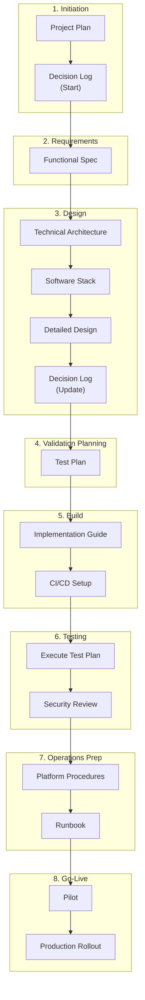

# Active Directory Password Rotation with HashiCorp Vault

This directory contains all documentation for the AD Password Rotation project, which automates the rotation of Active Directory service account passwords using HashiCorp Vault.

## Project Management Best Practices

This project follows industry-standard documentation practices to ensure successful delivery, maintainability, and knowledge transfer.

### Documentation Framework (Recommended Order)

Documents are listed in the recommended creation order. Follow this flow for new projects:

| # | Phase | Document | Purpose | Status |
|---|-------|----------|---------|--------|
| 1 | **Initiation** | [Project Plan](management/project-plan.md) | Timeline, effort, resources, risks | 📝 Drafted |
| 2 | **Initiation** | [Decision Log](management/decision-log.md) | ADRs - start at Day 1, update throughout | 📝 Drafted |
| 3 | **Requirements** | [Functional Specification](specs/functional-spec.md) | User stories, acceptance criteria, NFRs | 📝 Drafted |
| 4 | **Design** | [Technical Architecture](architecture/technical-architecture.md) | High-level design, component interactions | 📝 Drafted |
| 5 | **Design** | [Software Stack](architecture/software-stack.md) | Technology choices, CI/CD approach | 📝 Drafted |
| 6 | **Design** | [Detailed Design](design/design.md) | Data flows, error handling, schemas | 📝 Drafted |
| 7 | **Validation** | [Test Plan](testing/test-plan.md) | Test cases - write BEFORE implementation | 📝 Drafted |
| 8 | **Build** | [Implementation Guide](implementation/implementation-guide.md) | Step-by-step build instructions | 📝 Drafted |
| 9 | **Operations** | [Platform Procedures](operations/platform-rotation-procedures.md) | Platform-specific operational steps | 📝 Drafted |
| 10 | **Operations** | [Runbook](operations/runbook.md) | Incident response, troubleshooting | 📝 Drafted |

> [!TIP]
> **Key Insight:** The Test Plan should be written *before* implementation to define acceptance criteria. This ensures the team knows what "done" looks like before coding begins.

### Best Practices Checklist

This project adheres to the following industry best practices:

#### ✅ Requirements & Planning
- [x] **Clear scope definition** - In/Out of scope documented in specs and project plan
- [x] **User stories with acceptance criteria** - Functional spec includes testable criteria
- [x] **Non-functional requirements** - Performance, security, availability targets defined
- [x] **Risk assessment** - Risks identified with mitigations in project plan
- [x] **Effort estimation** - Hours by role documented
- [x] **Phased delivery** - Discovery → Infrastructure → Pilot → Production rollout

#### ✅ Architecture & Design
- [x] **High-level architecture diagram** - Mermaid diagrams showing component interactions
- [x] **Technology stack documentation** - Tools, versions, and rationale documented
- [x] **Detailed data flows** - Sequence diagrams for rotation and error flows
- [x] **Configuration schemas** - HCL/YAML examples for all components
- [x] **Error handling matrix** - Errors, detection, response, and alerting defined
- [x] **Security controls** - Least privilege, encryption, audit logging documented
- [x] **Container support** - Docker/Kubernetes patterns documented

#### ✅ Implementation & Operations
- [x] **Step-by-step implementation guide** - Phased instructions with code examples
- [x] **Platform-specific procedures** - MSSQL, PostgreSQL, MongoDB, Snowflake covered
- [x] **Rollback procedures** - Manual and emergency rollback documented
- [x] **CI/CD workflows** - GitHub Actions with Terraform integration
- [x] **Troubleshooting guide** - Common issues with causes and solutions

#### ✅ Governance & Quality
- [x] **Test Plan** - Formal test cases for pilot validation
- [x] **Runbook** - Day-2 operations and incident response
- [x] **Decision Log** - Architecture Decision Records (ADRs)
- [ ] **Security Review** - Threat model and security sign-off (requires Security Team)

## Quick Links

| Document | Purpose |
|----------|---------|
| [Project Plan](management/project-plan.md) | Timeline, effort, and resource planning |
| [Functional Specification](specs/functional-spec.md) | Requirements and acceptance criteria |
| [Technical Architecture](architecture/technical-architecture.md) | High-level system design |
| [Detailed Design](design/design.md) | Data flows, error handling, configurations |
| [Software Stack](architecture/software-stack.md) | Technology choices and CI/CD approach |
| [Implementation Guide](implementation/implementation-guide.md) | Step-by-step build instructions |
| [Platform Procedures](operations/platform-rotation-procedures.md) | Platform-specific rotation steps |

## Directory Structure

```
ad-password-rotation/
├── README.md                 # This file (project overview & best practices)
├── architecture/
│   ├── technical-architecture.md   # High-level architecture diagram
│   └── software-stack.md           # Technology stack and CI/CD
├── design/
│   └── design.md                   # Detailed technical design
├── implementation/
│   └── implementation-guide.md     # Step-by-step implementation
├── management/
│   ├── project-plan.md             # Project plan and timeline
│   └── decision-log.md             # Architecture Decision Records
├── operations/
│   ├── platform-rotation-procedures.md  # DB-specific procedures
│   └── runbook.md                  # Day-2 operations & incident response
├── specs/
│   └── functional-spec.md          # Functional requirements
└── testing/
    └── test-plan.md                # Test cases & validation criteria
```

## Related Documentation

- [How-to: Rotate AD Passwords with Vault](../../how-to/vault/rotate-ad-passwords.md) - Quick reference guide
- [Workflow Engine Comparison](../explanation/workflow-engine-comparison.md) - Analysis of orchestration tools
- [Secrets Management Comparison](../explanation/secrets-management-comparison.md) - Vault vs alternatives

## Project Lifecycle

This diagram shows the recommended flow for project implementation:



> [!IMPORTANT]
> **Test Plan before Implementation:** Write the Test Plan during/after Design to define acceptance criteria *before* coding. This prevents "we'll figure out testing later" anti-patterns.

## Status

### Status Definitions

Use consistent status indicators across all project phases and documents:

| Status | Icon | Definition | Next Action |
|--------|------|------------|-------------|
| **Not Started** | ⬜ | Work has not begun | Assign owner, schedule kickoff |
| **In Progress** | 🟡 | Actively being worked on | Continue work |
| **Drafted** | 📝 | Initial draft complete, pending review | Submit for review |
| **In Review** | 🔍 | Under formal review by stakeholders | Address feedback |
| **Approved** | ✅ | Formally reviewed and approved | Proceed to next phase |
| **Blocked** | 🚫 | Cannot proceed due to dependency | Resolve blocker |
| **On Hold** | ⏸️ | Paused, may resume later | Await decision |

> [!NOTE]
> **Formal Approval Required:** A phase is only considered **Approved** (✅) after formal review and sign-off by designated approvers. Draft completion does not equal approval.

### Approval Matrix

| Phase | Approver(s) | Approval Method |
|-------|-------------|-----------------|
| 1. Initiation | Project Sponsor | Meeting sign-off |
| 2. Requirements | Product Owner, Stakeholders | Document review + sign-off |
| 3. Design | Technical Lead, Security Team | Architecture review meeting |
| 4. Validation Planning | QA Lead, DBA Team | Test plan walkthrough |
| 5. Build | Technical Lead | Code review + PR approval |
| 6. Testing | QA Lead, Security Team | Test results sign-off |
| 7. Operations Prep | Operations Lead, DBA Team | Runbook walkthrough |
| 8. Go-Live | Project Sponsor, Change Advisory Board | Go/No-Go meeting |

### Current Status

| Phase | Status | Documents | Approver | Approved Date |
|-------|--------|-----------|----------|---------------|
| 1. Initiation | 📝 Drafted | Project Plan, Decision Log | Project Sponsor | Pending |
| 2. Requirements | 📝 Drafted | Functional Spec | Product Owner | Pending |
| 3. Design | 📝 Drafted | Architecture, Software Stack, Detailed Design | Technical Lead | Pending |
| 4. Validation Planning | 📝 Drafted | Test Plan | QA Lead | Pending |
| 5. Build | 📝 Drafted | Implementation Guide, CI/CD | Technical Lead | Pending |
| 6. Testing | ⬜ Not Started | Execute Test Plan, Security Review | QA Lead | - |
| 7. Operations Prep | 📝 Drafted | Platform Procedures, Runbook | Operations Lead | Pending |
| 8. Go-Live | ⬜ Not Started | Pilot, Production Rollout | CAB | - |

## Getting Started

1. **New to the project?** Start with the [Functional Specification](specs/functional-spec.md) to understand requirements
2. **Ready to implement?** Follow the [Implementation Guide](implementation/implementation-guide.md) step-by-step
3. **Need a quick reference?** See the [How-to Guide](../../how-to/vault/rotate-ad-passwords.md)
4. **Troubleshooting?** Check the troubleshooting sections in the Implementation Guide
