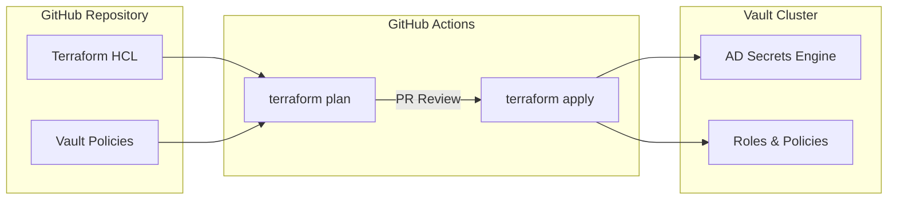

# Software Stack and Automation Workflows

## 1. Software Stack

This project leverages a combination of infrastructure-as-code, secrets management, and orchestration tools.

### Core Components

- **Secrets Manager**: HashiCorp Vault Enterprise (or Open Source).
- **Identity Provider**: Active Directory (Microsoft).
- **Configuration Management**: Terraform (for provisioning Vault resources).
- **Local Agent**: Vault Agent (Sidecar/Service) for local retrieval and rendering.
- **Scripting**:
  - **PowerShell**: Windows automation (MSSQL Service management).
  - **Bash/Python**: Linux automation (Keytab generation, config updates).

### Recommended Automation Stack

| Component | Technology | Purpose |
|-----------|------------|---------|
| **GitOps/CI/CD** | **GitHub Actions** | Managing the *configuration* of Vault (e.g., creating Roles, Policies) via Terraform. Ensuring auditability of who changed the rotation policy. |
| **Local Runtime** | **Vault Agent** | The "last mile" delivery. Runs on the DB server, handles AuthN to Vault, watches for TTL expiry, and executes restart commands. |
| **Orchestrator** | **Temporal.io** | (Optional/Advanced) For complex, multi-step rotations requiring high reliability (e.g., "Drain traffic -> Rotate -> Restart -> Verify -> Undrain"). |

## 2. Scripts and Processes

To support the rotation, several "Glue" scripts are required:

### A. Windows (MSSQL)

- `Update-SQLServiceAccount.ps1`:
  - Inputs: New Password.
  - Actions: Calls `sc.exe config`, updates `Update-HostStorage` (if clustered), restarts SQL Service.

### B. Linux (Postgres/Mongo)

- `Rotate-KerberosKeytab.sh`:
  - Inputs: New Password, Principal Name.
  - Actions: Uses `ktutil` to generate a new keytab file, replaces the old one, and signals the DB process.
- `Reload-DbConfig.sh`:
  - Actions: Sends `SIGHUP` to the process (e.g., `kill -HUP $(pidof postgres)`).

## 3. Workflow Engine Analysis

For a deep dive into the trade-offs between GitHub Actions, Temporal, Airflow, and others, please refer to the [Workflow Engine Comparison](../../explanation/workflow-engine-comparison.md).

## 4. Proposed CI/CD Process



### Workflow Steps

1. **Infrastructure as Code**: All Vault configurations (roles, policies, engine settings) stored in Git.
2. **Pull Request**: Changes require PR with review from Security team.
3. **Terraform Plan**: GitHub Actions runs `terraform plan` and posts diff as PR comment.
4. **Apply on Merge**: After approval, merge triggers `terraform apply` to update Vault.
5. **Audit Trail**: All changes tracked in Git history and Vault audit logs.

### Secret ID Rotation

Secret IDs for AppRoles should be rotated every 30 days:

```bash
# Automated via GitHub Actions scheduled workflow
vault write -f auth/approle/role/<role-name>/secret-id
```

## 5. TLS and Security Configuration

### Certificate Requirements

| Connection | Protocol | Certificate |
|------------|----------|-------------|
| Vault → AD | LDAPS (636) | AD CA certificate required |
| Agent → Vault | HTTPS (8200) | Vault CA certificate |
| Vault API | HTTPS | Valid TLS certificate |

### Vault Bind Account Permissions

The AD service account used by Vault requires these delegated permissions on the target OU:

- Reset Password
- Change Password
- Read userAccountControl
- Write userAccountControl
