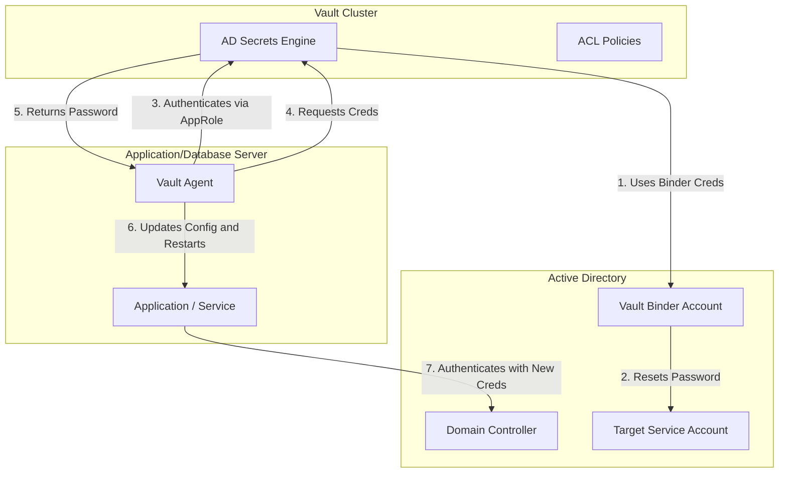
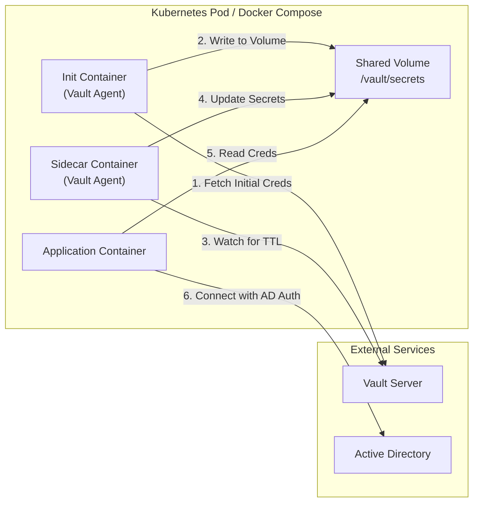

# Technical Architecture: Active Directory Password Rotation

## Overview

This document outlines the architectural design for rotating Active Directory credentials using HashiCorp Vault. The system follows a "pull" model where applications and services retrieve valid credentials from Vault, while Vault manages the "push" (rotation) updates to Active Directory.

## High-Level Diagram



## Description of Components

### 1. HashiCorp Vault

- **Role**: Central Secret Authority.
- **Engine**: `ad` (Active Directory Secrets Engine).
- **Configuration**:
  - **Bind DN**: `CN=svc_vault,CN=Users,DC=example,DC=com` (Used to reset passwords).
  - **Roles**: Map to specific AD accounts (e.g., `role/mssql_svc`).
  - **TTL**: Default 24h, Max 7d.

### 2. Active Directory

- **Role**: Identity Provider.
- **Requirements**:
  - Functional Level: 2008 R2 or later.
  - LDAPS (Port 636) enabled for secure transport.
  - Delegation: `svc_vault` must have delegated permissions to "Reset Password" on the `Safe_ServiceAccounts` OU.

### 3. Vault Agent (The Client)

- **Role**: Local orchestrator on the application/database server.
- **Function**:
  - Authenticates to Vault (e.g., via AppRole or Azure Auth).
  - Fetches the dynamic AD password.
  - Renders the password into a configuration file (e.g., `appsettings.json`, `fstab`, `systemd unit`).
  - Executes a command upon change (e.g., `systemctl restart mssql-server`).

### 4. Database Platforms

#### MSSQL (Windows)

- **Integration**: MSSQL Service runs as an AD User.
- **Rotation Flow**:
    1. Vault rotates password in AD.
    2. Vault Agent (on Windows Host) pulls new password.
    3. Vault Agent uses `sc.exe config` to update service password.
    4. Vault Agent restarts MSSQL Service.
    *Risk*: Short downtime during restart.

#### PostgreSQL / MongoDB (Linux)

- **Integration**: Database uses AD for *client* authentication (Kerberos/LDAP).
- **Rotation Flow**:
    1. **Keytabs**: If using Kerberos, a scripted process must regenerate the keytab using `ktutil` with the new password fetched from Vault.
    2. **LDAP Bind**: `pg_hba.conf` or `mongod.conf` updated by Vault Agent templates => `SIGHUP` to reload.

### 5. Docker Containers

For containerized workloads, Vault Agent runs as a **sidecar container** or uses **init container** pattern.



#### Deployment Patterns

| Pattern | Use Case | Pros | Cons |
|---------|----------|------|------|
| **Init Container** | One-time secret fetch at startup | Simple, no sidecar overhead | No rotation during container lifetime |
| **Sidecar Container** | Long-running apps needing rotation | Continuous sync, handles TTL | Extra resource overhead |
| **Vault Agent Injector** | Kubernetes with mutating webhook | Automatic injection, minimal config | Requires Kubernetes |

#### Docker Compose Example

```yaml
services:
  vault-agent:
    image: hashicorp/vault:latest
    command: ["vault", "agent", "-config=/etc/vault/agent.hcl"]
    volumes:
      - vault-secrets:/vault/secrets
      - ./agent.hcl:/etc/vault/agent.hcl:ro
    environment:
      VAULT_ADDR: https://vault.example.com:8200

  app:
    image: my-app:latest
    volumes:
      - vault-secrets:/vault/secrets:ro
    depends_on:
      - vault-agent

volumes:
  vault-secrets:
```

#### Container-Specific Considerations

1. **No Service Restart**: Containers cannot restart themselves; application must reload credentials from file/env.
2. **File Watching**: Application should watch `/vault/secrets/creds.json` for changes or poll periodically.
3. **Graceful Reload**: Implement `SIGHUP` handler or config reload endpoint in application.
4. **Keytab in Containers**: Mount keytab to shared volume; ensure container user has read access (UID/GID mapping).

## Security Controls

1. **Least Privilege**: The `svc_vault` account only has permissions on the specific OU containing rotatable accounts.
2. **Audit Logs**: Vault audit logs capture every access and rotation event.
3. **Transit Encryption**: All traffic between Vault, AD, and Agents is encrypted (TLS 1.2+).
4. **Access Control**: Only authorized AppRoles can request credentials for specific AD Roles.
5. **Container Secrets**: Secrets written to `tmpfs` or ephemeral volumes; never baked into images.
