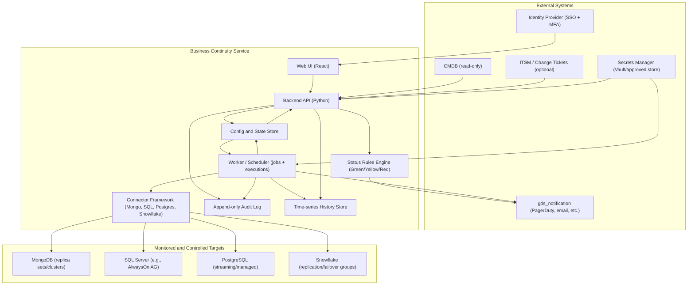
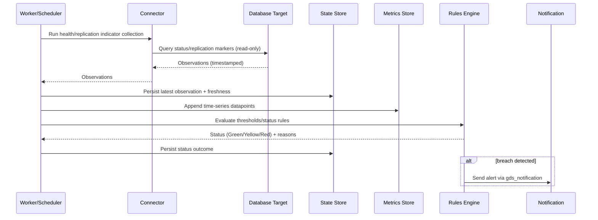
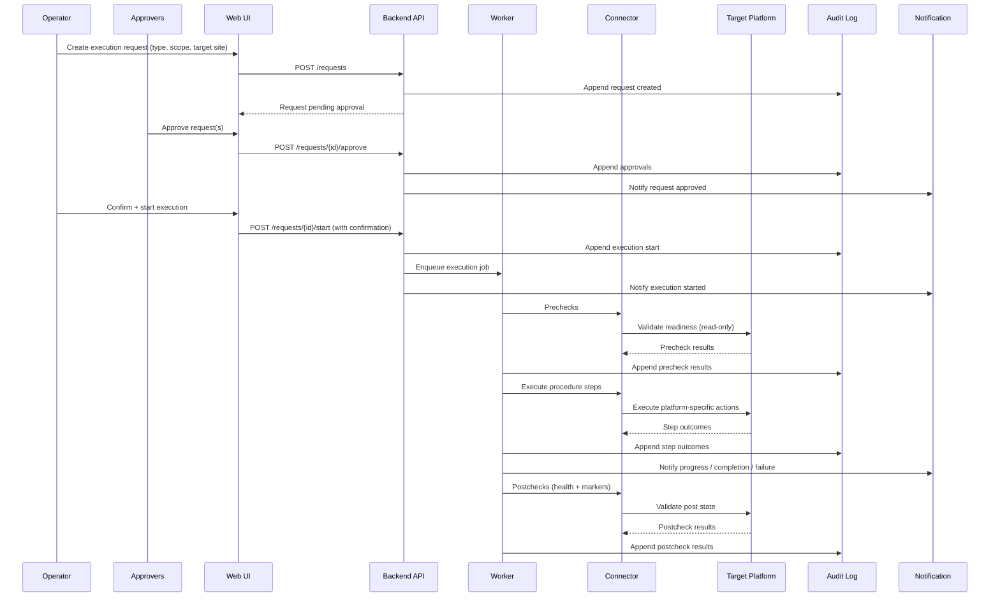

# Technical Architecture: Business Continuity (DR Readiness & Failover Management)

## 1. Overview

This document describes the high-level architecture for the Business Continuity service, a DR readiness monitoring system with **approval-gated failover (emergency) and switchover (planned) workflows**.

The architecture is designed to:

- Provide a **single control plane** for visibility across heterogeneous database platforms
- Minimize blast radius by separating **read-only monitoring** from **state-changing execution**
- Enforce **RBAC + separation of duties** for high-risk actions (Operator vs Approver(s))
- Produce **auditable evidence** for DR readiness and exercise outcomes

Primary reference for requirements: `../specs/functional-spec.md`.

## 2. Architecture Diagram

## 3. Component Descriptions

### Web UI

- **Purpose:** Operator and approver interface for monitoring dashboards, requests/approvals, and execution status.
- **Technology:** React (per functional spec constraints).
- **Interfaces:** HTTPS to Backend API; SSO redirect to Identity Provider.

### Backend API

- **Purpose:** Control plane for configuration, inventory, dashboards, approvals, audit access, and data exports.
- **Technology:** Python (per functional spec constraints).
- **Interfaces:**
  - REST/JSON (or equivalent) to UI
  - CMDB read-only integration
  - Identity provider integration (SSO + group claims)
  - Notification integration via `gds_notification`

### Worker / Scheduler

- **Purpose:**
  - Periodic monitoring collection jobs (health + replication indicators + optional heartbeat)
  - Execution orchestration (failover/switchover/failback) with prechecks/postchecks
  - Schedule handling (scheduling can create requests, but execution remains approval-gated)
- **Technology:** Python job runner (exact framework TBD in `software-stack.md` / ADRs).
- **Interfaces:** Uses Connector Framework; writes to Stores; emits notifications.

### Connector Framework

- **Purpose:** A consistent abstraction for interacting with heterogeneous systems.
- **Responsibilities:**
  - Collect indicators (health, replication position/lag, freshness)
  - Run prechecks/postchecks
  - Execute platform-specific procedures via APIs/CLIs (where supported)
  - Provide clear “not supported / monitor-only” behavior when capabilities differ by platform
- **Supported connectors (initial):** MongoDB, SQL Server, PostgreSQL, Snowflake.

### Status Rules Engine

- **Purpose:** Evaluate status per resource/group (Green/Yellow/Red) based on thresholds and rules.
- **Inputs:** Observations + configured RPO thresholds, freshness requirements, connectivity state.
- **Outputs:** Current status + reason codes suitable for UI and alerting.

### Config + State Store

- **Purpose:** Persistent configuration and current state.
- **Examples of stored entities:**
  - Resources and dependency groups (Tier, owners, environments)
  - RPO targets and alert thresholds
  - Approval policy by tier/type
  - Execution requests and state machine status
- **Implementation:** Database-backed store (technology choice documented in `software-stack.md`).

### Audit Log (Append-only)

- **Purpose:** Tamper-evident record of high-impact events for compliance evidence:
  - request created
  - approvals/denials
  - execution started/completed/failed
  - break-glass invocation
  - configuration changes
- **Implementation requirement:** Append-only or immutability-supporting backend (exact approach captured in ADRs).

### Time-series History Store

- **Purpose:** Retain short-horizon history (e.g., 24h+) of key indicators for trends and evidence.
- **Examples:** replication lag over time, freshness, heartbeat timestamps, rule outcomes.

## 4. Data Flow

### 4.1 Monitoring Collection (read-only)

### 4.2 Controlled Failover / Switchover (approval-gated)

## 5. Security Architecture

- **Authentication:** SSO with MFA (via Identity Provider).
- **Authorization:** RBAC with separation of duties:
  - Viewer (read-only)
  - Operator (request + run prechecks; initiate start with confirmation)
  - Approver(s) (IT and Business/App Owner, configurable by tier/type)
  - Admin (configuration)
- **Approval policy:** Tier 1 may require multi-approval (two-person rule).
- **Encryption:** TLS in transit (target TLS 1.3 where feasible); at-rest encryption per chosen data store defaults/controls.
- **Secrets management:** All credentials/keys via approved secrets manager; no secrets in config files or source control.
- **Audit logging:** Append-only audit log for approvals and executions; include actor identity, timestamps, request payload, outcome, and reason codes.
- **Break-glass:** Emergency access is time-bound, policy-driven, and fully audited (who/why/when).

## 6. High Availability

- **Redundancy:** Deploy the control plane (API + worker + stores) in a highly available configuration appropriate to the hosting environment (VM/K8s).
- **Degraded mode:** If targets are unreachable (e.g., during incident), the UI/API must clearly indicate **loss of visibility** and show the last known good data with timestamps.
- **Failover (of the tool):** The service should be deployable in a way that remains reachable during primary-site outages (design captured in `software-stack.md` and ADRs).
- **Recovery:** The service’s own RTO/RPO targets should be defined (ideally at least as resilient as Tier 1 monitoring needs).

## 7. Open Decisions (to capture as ADRs)

- Choice of persistence layer(s) for state, time-series history, and append-only audit.
- Job runner/execution framework and deployment model.
- Connector capability matrix per platform (monitor-only vs executable actions).
- Required change-management integration (ticket mandatory for Tier 1?).
