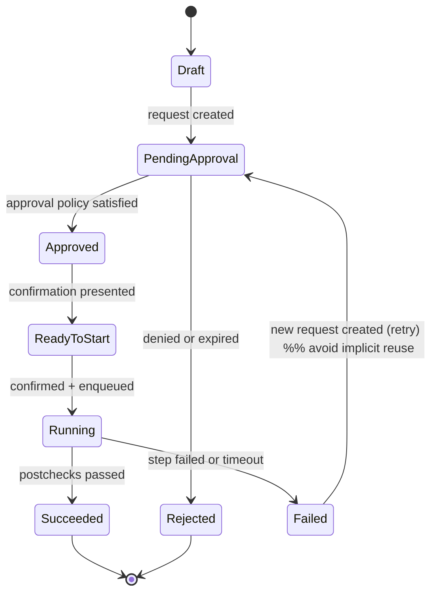

# Detailed Design: Business Continuity (DR Readiness & Failover Management)

This document captures the detailed design needed to implement the requirements in `../specs/functional-spec.md`.

## 1. Design Goals

- **Safety first:** no unattended execution; tier-based approvals; separation of duties (ADR-001).
- **Auditability:** every decision/action is reconstructible from audit + state.
- **Connector isolation:** platform specifics contained in connectors; core stays platform-agnostic.
- **Degraded-mode clarity:** when visibility is lost, the UI must show “last known” state and freshness.

## 2. Domain Model (conceptual)

### 2.1 Core Entities

- **Resource**
  - id, name, platform (mongo/mssql/postgres/snowflake), tier (1/2), environment, owner
  - primary site / dr site metadata
  - connector config reference
  - rpo target + thresholds
  - optional heartbeat config
- **Group**
  - id, name, tier
  - member resources
  - dependency ordering (if needed) or dependency graph metadata
- **Observation**
  - resource_id, timestamp, freshness
  - indicators (replication lag, replication marker, health status, connectivity)
  - raw connector payload (sanitized) for troubleshooting
- **StatusOutcome**
  - resource_id/group_id, computed status (green/yellow/red)
  - reasons (codes + human text)
- **ExecutionRequest**
  - id, type (failover/switchover/drill/failback)
  - scope (resource or group)
  - target site
  - tier, created_by, created_at
  - change ticket reference (optional/required by policy)
  - approvals required vs approvals received
  - current state + timestamps
- **ExecutionEvent (Audit/Event stream)**
  - append-only record: request created, approval granted/denied, step started/completed, precheck/postcheck results, break-glass invoked

## 3. Execution State Machine (high level)

States are intentionally explicit to support auditability and safe resumes.

Notes:

- We avoid “silent retries” of the same request for Tier 1; retries should be new requests (fresh approvals/audit).
- Resume behavior (FR-035) is allowed only when connector guarantees idempotency of remaining steps.

## 4. Connector Capability Matrix (initial)

Connectors must declare capabilities so UI and policies can behave correctly.

| Platform | Monitor indicators | Replication marker | Heartbeat support | Execute switchover | Execute failover | Execute failback | Notes |
|----------|--------------------|--------------------|------------------|-------------------|------------------|------------------|------|
| MongoDB | Yes | optime/committed optime (if available) | Optional | Maybe | Maybe | Maybe | Depends on deployment and privileges |
| SQL Server | Yes | LSN equivalents (AG DMVs) | Optional | Maybe | Maybe | Maybe | Depends on AG/cluster config |
| PostgreSQL | Yes | WAL LSN (replay/flush) | Optional | Maybe | Maybe | Maybe | Depends on replication tooling |
| Snowflake | Yes (metadata) | Vendor-specific timestamps/metadata | Optional | Maybe | Maybe | Maybe | Execution depends on configured failover groups |

The “Maybe” cells become explicit per organization standards and tested runbooks.

## 5. Data-Loss Determination and Evidence

- Prefer platform-native **replication markers** as primary evidence.
- Heartbeat is an **operator-friendly RPO indicator**, not proof of completeness.
- The UI/report should present conclusions conservatively:
  - “Caught up to marker X / heartbeat T”
  - “Potential loss window up to Y”
  - “Marker unavailable: unable to prove completeness; see integrity checks”

## 6. Error Handling Matrix (starter)

| Category | Example | Detection | UI/Operator Action | Notification | Audit |
|----------|---------|-----------|--------------------|--------------|-------|
| Auth | SSO token invalid | API middleware | re-auth required | none | log denial |
| Permission | user lacks role | RBAC check | show forbidden | none | record denied attempt (policy) |
| Connectivity | target unreachable | connector timeout | show “loss of visibility” + freshness | alert (tier-based) | record observation |
| Precheck failure | replication behind | precheck | block start or require override | notify approvers | audit precheck results |
| Execution failure | step failed | connector step | mark failed; stop safely | notify | audit step outcomes |
| Incomplete evidence | marker missing | connector | show “cannot prove” | notify (Tier 1) | audit limitation |

## 7. Configuration and Schema Notes

Exact schemas (tables/documents) should be derived from the domain model above and reviewed with DBAs/Security before implementation.
