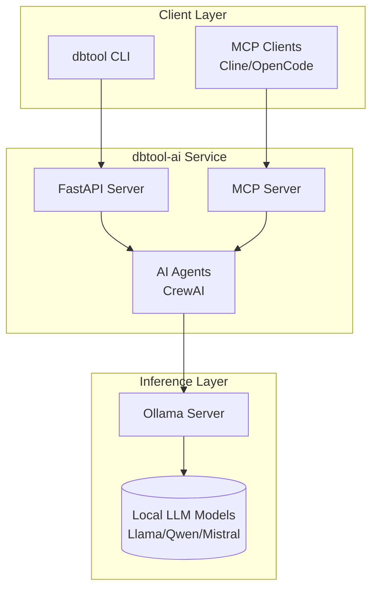

# Project: dbtool-ai

**[← Back to Projects Index](../README.md)**

> **Document Version:** 1.0
> **Last Updated:** January 22, 2026
> **Maintainers:** Application Infrastructure Team
> **Status:** Draft


> [!IMPORTANT]
> **Core Requirement:** This project uses local LLM models only. No third-party LLM services (OpenAI, Anthropic, Google) are used to ensure sensitive data never leaves the corporate network.

## Overview

The **dbtool-ai** project implements a local Large Language Model (LLM) infrastructure for AI-powered database operations assistance. It provides intelligent database troubleshooting, log analysis, and query optimization while maintaining complete data privacy through on-premise deployment.

### Key features

- **100% Local Processing**: All AI inference runs on-premise via Ollama
- **Privacy-First**: Sensitive database logs and queries never leave your network
- **Multi-Agent System**: Specialized AI agents for different database tasks
- **MCP Integration**: Model Context Protocol support for tool augmentation
- **Multi-Database Support**: SQL Server, PostgreSQL, MongoDB

## Documentation index

### Planning and design

| Document | Description |
|:---------|:------------|
| [Project Definition](./project-definition.md) | Project scope, objectives, success criteria |
| [Architecture](./architecture.md) | System design, components, data flow |

### Technical guides

| Document | Description |
|:---------|:------------|
| [Hardware Requirements](./hardware-requirements.md) | GPU, VRAM, and system requirements |
| [LLM Model Selection](./llm-model-selection.md) | Model comparison and recommendations |
| [Implementation Guide](./implementation-guide.md) | Step-by-step setup and deployment |
| [MCP Integration](./mcp-integration.md) | MCP servers, Claude Code alternatives, tooling |

## Quick start

### Prerequisites

- Ubuntu 22.04 LTS (or compatible)
- NVIDIA GPU with 12GB+ VRAM (or CPU-only mode)
- Python 3.11+
- Docker/Podman (optional)

### Installation

```bash
# 1. Install Ollama
curl -fsSL https://ollama.com/install.sh | sh

# 2. Pull recommended models
ollama pull llama3.1:8b
ollama pull qwen2.5:7b

# 3. Clone and setup dbtool-ai
git clone <repository-url>
cd dbtool-ai
uv sync

# 4. Start the service
uvicorn dbtool_ai.api.app:app --host 0.0.0.0 --port 8080
```

### Quick test

```bash
# Health check
curl http://localhost:8080/health

# Analyze a log
curl -X POST http://localhost:8080/api/v1/analyze-log \
  -H "Content-Type: application/json" \
  -d '{"content": "ERROR: connection timeout after 30 seconds"}'
```

## Architecture overview



## Technology stack

| Layer | Technology |
|:------|:-----------|
| **Runtime** | Python 3.12+, UV |
| **API** | FastAPI, Uvicorn |
| **Agents** | CrewAI, LangGraph |
| **Inference** | Ollama, vLLM (optional) |
| **Models** | Llama 3.x, Qwen 2.5, Mistral |
| **Protocol** | MCP (Model Context Protocol) |
| **Container** | Docker/Podman |

## Recommended models

| Use Case | Model | VRAM Required |
|:---------|:------|:--------------|
| Development | Llama 3.1 8B | 5 GB (Q4) |
| Tool Calling | Qwen 2.5 7B | 4.5 GB (Q4) |
| Code Analysis | Qwen 2.5 Coder 7B | 4.5 GB (Q4) |
| Production | Llama 3.1 70B | 40 GB (Q4) |
| CPU-only | Phi-3 Mini 3.8B | 4 GB RAM |

## Use cases

### 1. Log analysis

```text
Input: SQL Server error log with deadlock information
Output: Root cause analysis, affected queries, remediation steps
```

### 2. Query explanation

```text
Input: Complex SQL query with execution plan
Output: Plain English explanation, optimization suggestions
```

### 3. Configuration tuning

```text
Input: postgresql.conf contents
Output: Recommended changes based on workload type
```

### 4. Multi-agent diagnostics

```text
Input: Combined logs, metrics, and configuration
Output: Comprehensive diagnostic report with prioritized actions
```

## Hardware tiers

| Tier | Hardware | Supported Models | Users |
|:-----|:---------|:-----------------|:------|
| **Development** | RTX 3060 12GB | 7-8B | 1-2 |
| **Team** | RTX 4090 24GB | 7-14B, some 30B | 3-10 |
| **Production** | A100 80GB | Up to 70B | 10-50 |
| **Enterprise** | Multi-GPU H100 | All models | 50+ |

See [Hardware Requirements](./hardware-requirements.md) for detailed specifications.

## Integration with AI coding assistants

Since this project requires local LLMs only, Claude Code cannot be used directly. Instead, use these MCP-compatible alternatives:

| Tool | Type | Best For |
|:-----|:-----|:---------|
| **Cline** | VS Code Extension | IDE-integrated AI coding |
| **OpenCode** | Terminal TUI | CLI-first workflow |
| **Aider** | Terminal | Git-aware editing |
| **Continue** | IDE Extension | Code completion |

See [MCP Integration](./mcp-integration.md) for setup instructions.

## Project timeline

| Phase | Duration | Deliverables |
|:------|:---------|:-------------|
| **Foundation** | Weeks 1-4 | Infrastructure, model evaluation |
| **Development** | Weeks 5-10 | Core service, agents, MCP |
| **Testing** | Weeks 11-14 | Benchmarking, UAT, docs |
| **Deployment** | Weeks 15-16 | Production rollout |

See [Project Definition](./project-definition.md) for detailed timeline.

## Related documentation

- [Documentation Standards](../../best-practices/documentation-standards.md)
- [Python Coding Standards](../../development/coding-standards/python-coding-standards.md)
- [dbtool-cli Project](../dbtool-cli/README.md) (if exists)

## Sources and references

Research for this project was based on:

- [Open Source LLMs Guide - Hugging Face](https://huggingface.co/blog/daya-shankar/open-source-llms)
- [Top Open Source LLMs 2025 - n8n](https://blog.n8n.io/open-source-llm/)
- [Best Open Source LLMs with GPU Sizing - AceCloud](https://acecloud.ai/blog/best-open-source-llms/)
- [Ollama VRAM Requirements Guide - LocalLLM](https://localllm.in/blog/ollama-vram-requirements-for-local-llms)
- [LLM VRAM Calculator - AIMultiple](https://research.aimultiple.com/self-hosted-llm/)
- [MCP with Ollama Tutorial - Medium](https://medium.com/data-science-in-your-pocket/model-context-protocol-mcp-using-ollama-e719b2d9fd7a)
- [CrewAI Documentation](https://docs.crewai.com/)
- [Claude Code Alternatives - Qodo](https://www.qodo.ai/blog/claude-code-alternatives/)
- [Open Source Claude Code Alternatives - OpenAlternative](https://openalternative.co/alternatives/claude-code)
