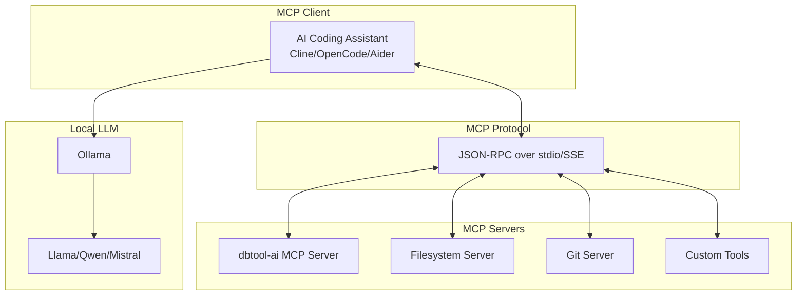

# dbtool-ai: MCP and tools integration guide

**[← Back to dbtool-ai Index](./README.md)**

> **Document Version:** 1.0
> **Last Updated:** January 22, 2026
> **Maintainers:** Application Infrastructure Team
> **Status:** Draft


> [!IMPORTANT]
> **Related Docs:** [Architecture](./architecture.md) | [Implementation Guide](./implementation-guide.md) | [LLM Model Selection](./llm-model-selection.md)

## Table of contents

- [MCP overview](#mcp-overview)
- [MCP server implementation](#mcp-server-implementation)
- [Claude Code alternatives for local LLM](#claude-code-alternatives-for-local-llm)
- [Integrating with Cline](#integrating-with-cline)
- [Integrating with OpenCode](#integrating-with-opencode)
- [Integrating with Aider](#integrating-with-aider)
- [Custom MCP client setup](#custom-mcp-client-setup)
- [Skills and tool patterns](#skills-and-tool-patterns)
- [Best practices](#best-practices)

## MCP overview

### What is Model Context Protocol (MCP)?

Model Context Protocol (MCP) is an open standard developed by Anthropic for connecting AI models to external tools and data sources. Think of it as "USB-C for AI" - a universal connector that allows any MCP-compatible client to work with any MCP server.

### Benefits of MCP with local LLMs

| Benefit | Description |
|:--------|:------------|
| **Standardization** | One protocol for all tool integrations |
| **Portability** | Tools work across different LLM backends |
| **Privacy** | Run everything locally with Ollama |
| **Extensibility** | Easy to add new tools and capabilities |
| **Community** | Thousands of pre-built MCP servers available |

### MCP architecture



[↑ Back to Table of Contents](#table-of-contents)

## MCP server implementation

### dbtool-ai MCP server

```python
# src/dbtool_ai/mcp/server.py
import asyncio
from mcp.server import Server
from mcp.types import Tool, TextContent
from mcp.server.stdio import stdio_server

from dbtool_ai.agents.log_analyzer import LogAnalyzerAgent
from dbtool_ai.agents.query_explainer import QueryExplainerAgent
from dbtool_ai.agents.config_advisor import ConfigAdvisorAgent
from dbtool_ai.utils.sanitizer import DataSanitizer

# Initialize server
server = Server("dbtool-ai")

# Initialize agents
log_agent = LogAnalyzerAgent()
query_agent = QueryExplainerAgent()
config_agent = ConfigAdvisorAgent()
sanitizer = DataSanitizer()


@server.list_tools()
async def list_tools() -> list[Tool]:
    """List available tools."""
    return [
        Tool(
            name="analyze_database_log",
            description="Analyze database error logs (SQL Server, PostgreSQL, MongoDB) and identify issues",
            inputSchema={
                "type": "object",
                "properties": {
                    "log_content": {
                        "type": "string",
                        "description": "The log content to analyze",
                    },
                    "database_type": {
                        "type": "string",
                        "enum": ["sqlserver", "postgresql", "mongodb", "auto"],
                        "default": "auto",
                        "description": "Type of database",
                    },
                },
                "required": ["log_content"],
            },
        ),
        Tool(
            name="explain_sql_query",
            description="Explain a SQL query in plain English and suggest optimizations",
            inputSchema={
                "type": "object",
                "properties": {
                    "query": {
                        "type": "string",
                        "description": "The SQL query to explain",
                    },
                    "execution_plan": {
                        "type": "string",
                        "description": "Optional execution plan XML/JSON",
                    },
                },
                "required": ["query"],
            },
        ),
        Tool(
            name="analyze_database_config",
            description="Analyze database configuration and recommend improvements",
            inputSchema={
                "type": "object",
                "properties": {
                    "config_content": {
                        "type": "string",
                        "description": "Configuration file content",
                    },
                    "workload_type": {
                        "type": "string",
                        "enum": ["oltp", "olap", "mixed", "batch"],
                        "default": "mixed",
                        "description": "Type of workload",
                    },
                },
                "required": ["config_content"],
            },
        ),
        Tool(
            name="generate_index_suggestion",
            description="Suggest indexes based on query patterns",
            inputSchema={
                "type": "object",
                "properties": {
                    "table_name": {
                        "type": "string",
                        "description": "Target table name",
                    },
                    "query_patterns": {
                        "type": "array",
                        "items": {"type": "string"},
                        "description": "Common query patterns",
                    },
                },
                "required": ["table_name", "query_patterns"],
            },
        ),
    ]


@server.call_tool()
async def call_tool(name: str, arguments: dict) -> list[TextContent]:
    """Execute a tool."""
    try:
        if name == "analyze_database_log":
            sanitized = sanitizer.sanitize(arguments["log_content"])
            result = await log_agent.analyze(sanitized)
            return [TextContent(type="text", text=result["analysis"])]

        elif name == "explain_sql_query":
            result = await query_agent.explain_query(
                arguments["query"],
                arguments.get("execution_plan"),
            )
            return [TextContent(type="text", text=result["explanation"])]

        elif name == "analyze_database_config":
            result = await config_agent.analyze_config(
                arguments["config_content"],
                arguments.get("workload_type", "mixed"),
            )
            return [TextContent(type="text", text=result["recommendations"])]

        elif name == "generate_index_suggestion":
            # Implement index suggestion logic
            suggestion = f"Index suggestions for {arguments['table_name']}..."
            return [TextContent(type="text", text=suggestion)]

        else:
            return [TextContent(type="text", text=f"Unknown tool: {name}")]

    except Exception as e:
        return [TextContent(type="text", text=f"Error: {str(e)}")]


async def main():
    """Run the MCP server."""
    async with stdio_server() as (read_stream, write_stream):
        await server.run(read_stream, write_stream, server.create_initialization_options())


if __name__ == "__main__":
    asyncio.run(main())
```

### Running the MCP server

```bash
# Direct execution
python -m dbtool_ai.mcp.server

# Or via entry point (if configured in pyproject.toml)
dbtool-ai-mcp
```

[↑ Back to Table of Contents](#table-of-contents)

## Claude Code alternatives for local LLM

Since Claude Code requires Anthropic's API, you need alternatives for fully local AI coding assistance. Here are the recommended options:

### Comparison matrix

| Tool | MCP Support | Local LLM | IDE Integration | License | Best For |
|:-----|:------------|:----------|:----------------|:--------|:---------|
| **Cline** | Excellent | Yes | VS Code | Apache 2.0 | VS Code users |
| **OpenCode** | Excellent | Yes | Terminal | MIT | CLI-first workflow |
| **Aider** | Limited | Yes | Terminal | Apache 2.0 | Git-focused workflow |
| **Continue** | Good | Yes | VS Code/JetBrains | Apache 2.0 | IDE autocomplete |
| **LocalAI** | Yes | Yes | API | MIT | Self-hosted API |

### Key features comparison

| Feature | Cline | OpenCode | Aider | Continue |
|:--------|:------|:---------|:------|:---------|
| Plan mode | Yes | Yes | No | No |
| Multi-file editing | Yes | Yes | Yes | Limited |
| Tool calling | Yes | Yes | Limited | Yes |
| Conversation history | Yes | Yes | Yes | Yes |
| Code review | Yes | Yes | Yes | No |
| Ollama support | Yes | Yes | Yes | Yes |
| MCP servers | Yes | Yes | No | Limited |

[↑ Back to Table of Contents](#table-of-contents)

## Integrating with Cline

Cline is an autonomous AI coding agent for VS Code with excellent MCP support.

### Install Cline

1. Open VS Code
2. Go to Extensions (Ctrl+Shift+X)
3. Search for "Cline"
4. Install the extension

### Configure Cline for Ollama

```json
// VS Code settings.json
{
  "cline.apiProvider": "ollama",
  "cline.ollamaBaseUrl": "http://localhost:11434",
  "cline.ollamaModel": "qwen2.5:7b"
}
```

### Add dbtool-ai MCP server to Cline

```json
// ~/.config/Code/User/globalStorage/saoudrizwan.claude-dev/settings/cline_mcp_settings.json
{
  "mcpServers": {
    "dbtool-ai": {
      "command": "python",
      "args": ["-m", "dbtool_ai.mcp.server"],
      "env": {
        "DBTOOL_AI_OLLAMA_HOST": "http://localhost:11434"
      }
    },
    "filesystem": {
      "command": "npx",
      "args": ["-y", "@modelcontextprotocol/server-filesystem", "/home/user/projects"]
    }
  }
}
```

### Using Cline with dbtool-ai

After configuration, you can use natural language commands in Cline:

```text
User: Analyze the PostgreSQL error log at /var/log/postgresql/postgresql-15-main.log

Cline: [Calls analyze_database_log tool via MCP]
       The log shows several connection timeout errors. Here's my analysis...
```

[↑ Back to Table of Contents](#table-of-contents)

## Integrating with OpenCode

OpenCode is an open-source terminal-based AI coding assistant with MCP support.

### Install OpenCode

```bash
# Using pipx (recommended)
pipx install opencode-ai

# Or using pip
pip install opencode-ai
```

### Configure OpenCode for Ollama

```yaml
# ~/.config/opencode/config.yaml
llm:
  provider: ollama
  model: qwen2.5:7b
  base_url: http://localhost:11434
  temperature: 0.3

mcp:
  servers:
    dbtool-ai:
      command: python
      args:
        - -m
        - dbtool_ai.mcp.server
      env:
        DBTOOL_AI_OLLAMA_HOST: http://localhost:11434
    filesystem:
      command: npx
      args:
        - -y
        - "@modelcontextprotocol/server-filesystem"
        - /home/user/projects
```

### Using OpenCode

```bash
# Start OpenCode
opencode

# In the OpenCode interface
> Analyze the SQL Server error log and identify any blocking issues
[OpenCode calls dbtool-ai MCP tools and provides analysis]

> Explain this query: SELECT * FROM users WHERE created_at > NOW() - INTERVAL '7 days'
[OpenCode provides plain English explanation]
```

[↑ Back to Table of Contents](#table-of-contents)

## Integrating with Aider

Aider is a Git-aware AI coding assistant for the terminal.

### Install Aider

```bash
# Using pipx
pipx install aider-chat

# Or using pip
pip install aider-chat
```

### Configure Aider for Ollama

```bash
# Set environment variables
export OLLAMA_API_BASE=http://localhost:11434
export AIDER_MODEL=ollama/qwen2.5:7b

# Or create config file
# ~/.aider.conf.yml
model: ollama/qwen2.5:7b
ollama-base-url: http://localhost:11434
auto-commits: true
```

### Using Aider

```bash
# Start Aider in your project
cd /path/to/project
aider

# In Aider
> Add error handling to the database connection function

# Aider will edit files and create commits
```

> [!NOTE]
> Aider has limited MCP support compared to Cline and OpenCode. For full dbtool-ai integration, use Cline or OpenCode.

[↑ Back to Table of Contents](#table-of-contents)

## Custom MCP client setup

### Building a custom MCP client with Ollama

```python
# custom_mcp_client.py
import asyncio
import json
from mcp import ClientSession, StdioServerParameters
from mcp.client.stdio import stdio_client
import httpx


class OllamaMCPClient:
    """Custom MCP client using Ollama for inference."""

    def __init__(self, ollama_host: str = "http://localhost:11434", model: str = "qwen2.5:7b"):
        self.ollama_host = ollama_host
        self.model = model
        self.mcp_session: ClientSession | None = None
        self.available_tools: list = []

    async def connect_mcp_server(self, command: str, args: list[str]):
        """Connect to an MCP server."""
        server_params = StdioServerParameters(command=command, args=args)

        async with stdio_client(server_params) as (read, write):
            async with ClientSession(read, write) as session:
                self.mcp_session = session
                await session.initialize()

                # Get available tools
                tools_result = await session.list_tools()
                self.available_tools = tools_result.tools

                yield session

    async def chat_with_tools(self, user_message: str) -> str:
        """Send message to Ollama with tool calling."""
        # Format tools for Ollama
        tools = [
            {
                "type": "function",
                "function": {
                    "name": tool.name,
                    "description": tool.description,
                    "parameters": tool.inputSchema,
                },
            }
            for tool in self.available_tools
        ]

        # Call Ollama with tools
        async with httpx.AsyncClient() as client:
            response = await client.post(
                f"{self.ollama_host}/api/chat",
                json={
                    "model": self.model,
                    "messages": [{"role": "user", "content": user_message}],
                    "tools": tools,
                    "stream": False,
                },
            )
            result = response.json()

        # Check if model wants to call a tool
        message = result.get("message", {})
        tool_calls = message.get("tool_calls", [])

        if tool_calls:
            # Execute tool calls via MCP
            tool_results = []
            for tool_call in tool_calls:
                func = tool_call.get("function", {})
                tool_name = func.get("name")
                tool_args = json.loads(func.get("arguments", "{}"))

                # Call MCP tool
                mcp_result = await self.mcp_session.call_tool(tool_name, tool_args)
                tool_results.append(mcp_result)

            # Return combined results
            return "\n".join(str(r) for r in tool_results)

        return message.get("content", "")


async def main():
    """Example usage."""
    client = OllamaMCPClient()

    async with client.connect_mcp_server("python", ["-m", "dbtool_ai.mcp.server"]):
        print("Available tools:", [t.name for t in client.available_tools])

        response = await client.chat_with_tools(
            "Analyze this log: ERROR: connection to database failed"
        )
        print("Response:", response)


if __name__ == "__main__":
    asyncio.run(main())
```

### Using ollama-mcp-bridge

For a simpler setup, use the community ollama-mcp-bridge project:

```bash
# Install
pip install ollama-mcp-bridge

# Configure
cat > mcp-config.json << 'EOF'
{
  "mcpServers": {
    "dbtool-ai": {
      "command": "python",
      "args": ["-m", "dbtool_ai.mcp.server"]
    }
  }
}
EOF

# Run bridge (acts as Ollama API proxy with MCP tools)
ollama-mcp-bridge --config mcp-config.json --port 11435

# Use the bridge instead of direct Ollama
curl http://localhost:11435/api/chat -d '{
  "model": "qwen2.5:7b",
  "messages": [{"role": "user", "content": "Analyze PostgreSQL logs for errors"}]
}'
```

[↑ Back to Table of Contents](#table-of-contents)

## Skills and tool patterns

### Implementing skills (reusable prompts)

Skills are pre-defined prompt templates that encapsulate common tasks:

```python
# src/dbtool_ai/skills/database_skills.py
from dataclasses import dataclass


@dataclass
class Skill:
    name: str
    description: str
    prompt_template: str


DATABASE_SKILLS = [
    Skill(
        name="log-analysis",
        description="Analyze database error logs",
        prompt_template="""You are a database log analyst. Analyze the following log and provide:
1. Error summary
2. Root cause analysis
3. Severity (Critical/High/Medium/Low)
4. Recommended actions

Log:
{log_content}
""",
    ),
    Skill(
        name="query-optimize",
        description="Optimize SQL queries",
        prompt_template="""You are a SQL optimization expert. Review this query and suggest improvements:

Query:
```sql
{query}
```

Execution Plan (if available):
{execution_plan}

Provide specific, actionable optimizations with explanations.
""",
    ),
    Skill(
        name="config-review",
        description="Review database configuration",
        prompt_template="""You are a database configuration specialist. Review this configuration:

```
{config}
```

Workload type: {workload_type}

Identify:
1. Suboptimal settings
2. Security concerns
3. Performance opportunities
4. Recommended changes with justification
""",
    ),
    Skill(
        name="deadlock-analyze",
        description="Analyze database deadlocks",
        prompt_template="""You are a concurrency expert. Analyze this deadlock information:

{deadlock_info}

Explain:
1. What resources were involved
2. Why the deadlock occurred
3. Which transaction was chosen as the victim and why
4. How to prevent this deadlock in the future
""",
    ),
]


def get_skill(name: str) -> Skill | None:
    """Get a skill by name."""
    return next((s for s in DATABASE_SKILLS if s.name == name), None)


def apply_skill(skill: Skill, **kwargs) -> str:
    """Apply a skill with given parameters."""
    return skill.prompt_template.format(**kwargs)
```

### Using skills with MCP

```python
@server.tool()
async def run_skill(name: str, parameters: dict) -> list[TextContent]:
    """Run a predefined skill."""
    skill = get_skill(name)
    if not skill:
        return [TextContent(type="text", text=f"Unknown skill: {name}")]

    prompt = apply_skill(skill, **parameters)

    # Call Ollama directly
    async with httpx.AsyncClient() as client:
        response = await client.post(
            f"{settings.ollama_host}/api/generate",
            json={
                "model": settings.default_model,
                "prompt": prompt,
                "stream": False,
            },
        )
        result = response.json()

    return [TextContent(type="text", text=result.get("response", ""))]
```

[↑ Back to Table of Contents](#table-of-contents)

## Best practices

### Tool calling model selection

| Requirement | Recommended Model | Notes |
|:------------|:------------------|:------|
| Best tool calling | Qwen 2.5 7B/14B | Native function calling |
| Fast responses | Mistral 7B | Good speed/quality |
| Complex reasoning | Llama 3.1 70B | Better multi-step |
| Code-heavy tasks | Qwen 2.5 Coder | SQL optimization |

> [!WARNING]
> DeepSeek reasoning models (R1, R1-Distill) do not support tool calling. Do not use them for MCP integration.

### Security considerations

1. **Input sanitization**: Always sanitize inputs before passing to LLM
2. **Output validation**: Validate LLM outputs before executing actions
3. **Least privilege**: MCP tools should have minimal permissions
4. **Audit logging**: Log all tool calls for review
5. **Rate limiting**: Prevent abuse of expensive operations

```python
# Example: Secure tool implementation
@server.call_tool()
async def call_tool(name: str, arguments: dict) -> list[TextContent]:
    # 1. Validate inputs
    if not validate_arguments(name, arguments):
        raise ValueError("Invalid arguments")

    # 2. Sanitize sensitive data
    sanitized_args = sanitize_arguments(arguments)

    # 3. Log the call
    logger.info("Tool called", tool=name, user=get_current_user())

    # 4. Execute with timeout
    async with asyncio.timeout(30):
        result = await execute_tool(name, sanitized_args)

    # 5. Validate output
    validated_result = validate_output(result)

    return [TextContent(type="text", text=validated_result)]
```

### Performance optimization

1. **Model caching**: Keep models loaded in Ollama
2. **Connection pooling**: Reuse HTTP connections
3. **Async operations**: Use async/await throughout
4. **Batch requests**: Combine multiple tool calls when possible
5. **Context management**: Limit context size for faster inference

```bash
# Ollama configuration for better performance
export OLLAMA_NUM_PARALLEL=4      # Concurrent requests
export OLLAMA_MAX_LOADED_MODELS=2 # Keep 2 models in memory
export OLLAMA_KEEP_ALIVE=5m       # Keep model loaded for 5 minutes
```

### Error handling

```python
class MCPError(Exception):
    """Base MCP error."""
    pass


class ToolNotFoundError(MCPError):
    """Tool not found."""
    pass


class ToolExecutionError(MCPError):
    """Tool execution failed."""
    pass


@server.call_tool()
async def call_tool(name: str, arguments: dict) -> list[TextContent]:
    try:
        result = await execute_tool(name, arguments)
        return [TextContent(type="text", text=result)]

    except ToolNotFoundError:
        return [TextContent(type="text", text=f"Tool '{name}' not found")]

    except ToolExecutionError as e:
        logger.error("Tool execution failed", tool=name, error=str(e))
        return [TextContent(type="text", text=f"Tool execution failed: {e}")]

    except asyncio.TimeoutError:
        return [TextContent(type="text", text="Tool execution timed out")]

    except Exception as e:
        logger.exception("Unexpected error", tool=name)
        return [TextContent(type="text", text="An unexpected error occurred")]
```

[↑ Back to Table of Contents](#table-of-contents)
