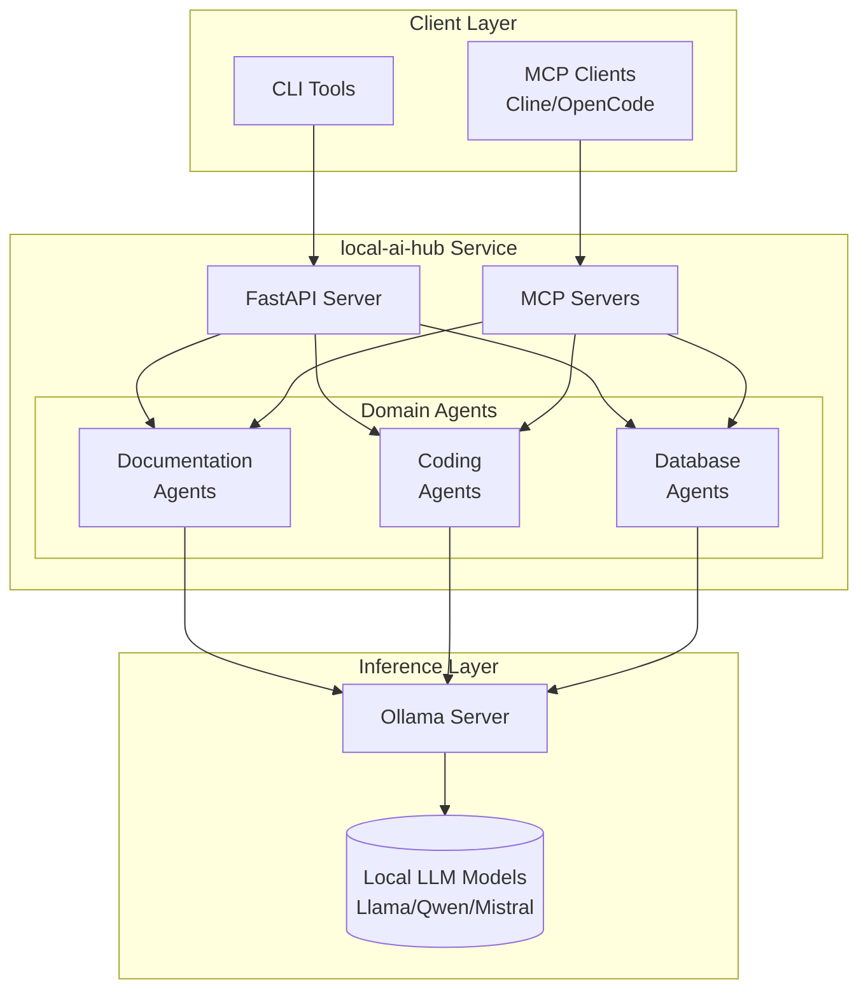

# Project: local-ai-hub

**[← Back to Projects Index](../README.md)**

> **Document Version:** 2.0
> **Last Updated:** January 22, 2026
> **Maintainers:** Application Infrastructure Team
> **Status:** Draft


> [!IMPORTANT]
> **Core Requirement:** This project uses local LLM models only. No third-party LLM services (OpenAI, Anthropic, Google) are used to ensure sensitive data never leaves the corporate network.

## Overview

The **local-ai-hub** project implements a local Large Language Model (LLM) infrastructure for AI-powered assistance across three domains: database operations, documentation management, and code development. It provides intelligent automation while maintaining complete data privacy through on-premise deployment.

### Key features

- **100% Local Processing**: All AI inference runs on-premise via Ollama
- **Privacy-First**: Sensitive data never leaves your network
- **Multi-Agent System**: Specialized AI agents for different tasks
- **MCP Integration**: Model Context Protocol support for tool augmentation
- **Three Domains**: Database operations, documentation conversion, coding assistance

## Use case domains

```text
                      ┌─────────────────────────────────┐
                      │         local-ai-hub            │
                      │    Local AI Platform for        │
                      │    Infrastructure Teams         │
                      └─────────────────────────────────┘
                                     │
          ┌──────────────────────────┼──────────────────────────┐
          │                          │                          │
          ▼                          ▼                          ▼
┌─────────────────────┐  ┌─────────────────────┐  ┌─────────────────────┐
│   Documentation     │  │      Coding         │  │     Database        │
│                     │  │                     │  │                     │
│ • Confluence → MD   │  │ • Code review       │  │ • Log analysis      │
│ • Standards check   │  │ • Refactoring       │  │ • Query explanation │
│ • Technical writing │  │ • Test generation   │  │ • Config tuning     │
│ • Diátaxis mapping  │  │ • Documentation     │  │ • Troubleshooting   │
└─────────────────────┘  └─────────────────────┘  └─────────────────────┘
```

| Domain | Purpose | Example Tasks |
|:-------|:--------|:--------------|
| **Documentation** | Convert, validate, and write technical docs | Confluence→Markdown, standards compliance, Diátaxis categorization |
| **Coding** | Assist with code development | Code review, refactoring suggestions, test generation |
| **Database** | Database operations assistance | Log analysis, query explanation, configuration tuning |

## Documentation index

### Getting started

| Document | Description |
|:---------|:------------|
| [AI Concepts Glossary](./ai-concepts-glossary.md) | Terminology, concepts, and diagrams for AI newcomers |

### Planning and design

| Document | Description |
|:---------|:------------|
| [Project Definition](./project-definition.md) | Project scope, objectives, success criteria |
| [Architecture](./architecture.md) | System design, components, data flow |

### Technical guides

| Document | Description |
|:---------|:------------|
| [Hardware Requirements](./hardware-requirements.md) | GPU, VRAM, and system requirements |
| [LLM Model Selection](./llm-model-selection.md) | Model comparison and recommendations |
| [Implementation Guide](./implementation-guide.md) | Step-by-step setup and deployment |
| [MCP Integration](./mcp-integration.md) | MCP servers, Claude Code alternatives, tooling |

### Operations

| Document | Description |
|:---------|:------------|
| [Operations Guide](./operations-guide.md) | Runbook, monitoring, troubleshooting, DR, incident response |

## Quick start

### Prerequisites

- Linux (RHEL 8+, Ubuntu 22.04+, or compatible)
- NVIDIA GPU with 12GB+ VRAM (or CPU-only mode)
- Python 3.11+
- Docker/Podman (optional)

### Installation

```bash
# 1. Install Ollama
curl -fsSL https://ollama.com/install.sh | sh

# 2. Pull recommended models
ollama pull llama3.1:8b
ollama pull qwen2.5:7b

# 3. Clone and setup local-ai-hub
git clone <repository-url>
cd local-ai-hub
uv sync

# 4. Start the service
uvicorn local_ai_hub.api.app:app --host 0.0.0.0 --port 8080
```

### Quick test

```bash
# Health check
curl http://localhost:8080/health

# Analyze a database log
curl -X POST http://localhost:8080/api/v1/database/analyze-log \
  -H "Content-Type: application/json" \
  -d '{"content": "ERROR: connection timeout after 30 seconds"}'

# Validate documentation against standards
curl -X POST http://localhost:8080/api/v1/docs/validate \
  -H "Content-Type: application/json" \
  -d '{"content": "# My Document\n\nSome content..."}'
```

## Architecture overview



## Technology stack

| Layer | Technology |
|:------|:-----------|
| **Runtime** | Python 3.12+, UV |
| **API** | FastAPI, Uvicorn |
| **Agents** | CrewAI, LangGraph |
| **Inference** | Ollama, vLLM (optional) |
| **Models** | Llama 3.x, Qwen 2.5, Mistral |
| **Protocol** | MCP (Model Context Protocol) |
| **Container** | Docker/Podman |

## Recommended models

| Use Case | Model | VRAM Required |
|:---------|:------|:--------------|
| Development | Llama 3.1 8B | 5 GB (Q4) |
| Tool Calling | Qwen 2.5 7B | 4.5 GB (Q4) |
| Code Analysis | Qwen 2.5 Coder 7B | 4.5 GB (Q4) |
| Production | Llama 3.1 70B | 40 GB (Q4) |
| CPU-only | Phi-3 Mini 3.8B | 4 GB RAM |

## Domain use cases

### Documentation domain

| Use Case | Input | Output |
|:---------|:------|:-------|
| Confluence conversion | Confluence page URL/export | Standards-compliant Markdown |
| Standards validation | Markdown document | Compliance report with fixes |
| Diátaxis categorization | Document content | Recommended category and structure |
| Technical writing | Topic and outline | Draft documentation |

### Coding domain

| Use Case | Input | Output |
|:---------|:------|:-------|
| Code review | Source code | Review comments, suggestions |
| Refactoring | Code + goal | Refactored code with explanation |
| Test generation | Source code | Unit tests |
| Documentation | Code | Docstrings, README content |

### Database domain

| Use Case | Input | Output |
|:---------|:------|:-------|
| Log analysis | Error log content | Root cause, remediation steps |
| Query explanation | SQL query + plan | Plain English explanation |
| Config tuning | Config file + workload | Optimized settings |
| Troubleshooting | Symptoms + context | Diagnostic report |

## Hardware tiers

| Tier | Hardware | Supported Models | Users |
|:-----|:---------|:-----------------|:------|
| **Development** | RTX 3060 12GB | 7-8B | 1-2 |
| **Team** | RTX 4090 24GB | 7-14B, some 30B | 3-10 |
| **Production** | A100 80GB | Up to 70B | 10-50 |
| **Enterprise** | Multi-GPU H100 | All models | 50+ |

See [Hardware Requirements](./hardware-requirements.md) for detailed specifications.

## Integration with AI coding assistants

Since this project requires local LLMs only, Claude Code cannot be used directly. Instead, use these MCP-compatible alternatives:

| Tool | Type | Best For |
|:-----|:-----|:---------|
| **Cline** | VS Code Extension | IDE-integrated AI coding |
| **OpenCode** | Terminal TUI | CLI-first workflow |
| **Aider** | Terminal | Git-aware editing |
| **Continue** | IDE Extension | Code completion |

See [MCP Integration](./mcp-integration.md) for setup instructions.

## Project timeline

| Phase | Duration | Deliverables |
|:------|:---------|:-------------|
| **Foundation** | Weeks 1-4 | Infrastructure, model evaluation |
| **Core Development** | Weeks 5-10 | Database agents, API, MCP |
| **Domain Expansion** | Weeks 11-14 | Documentation + coding agents |
| **Testing** | Weeks 15-18 | Benchmarking, UAT, docs |
| **Deployment** | Weeks 19-20 | Production rollout |

See [Project Definition](./project-definition.md) for detailed timeline.

## Package structure

```text
local-ai-hub/
├── src/local_ai_hub/
│   ├── __init__.py
│   ├── config.py
│   ├── api/
│   │   ├── app.py
│   │   ├── routes/
│   │   │   ├── database.py
│   │   │   ├── docs.py
│   │   │   └── coding.py
│   ├── agents/
│   │   ├── database/
│   │   │   ├── log_analyzer.py
│   │   │   ├── query_explainer.py
│   │   │   └── config_advisor.py
│   │   ├── docs/
│   │   │   ├── converter.py
│   │   │   ├── validator.py
│   │   │   └── writer.py
│   │   └── coding/
│   │       ├── reviewer.py
│   │       └── refactorer.py
│   ├── mcp/
│   │   ├── database_server.py
│   │   ├── docs_server.py
│   │   └── coding_server.py
│   └── utils/
│       ├── sanitizer.py
│       └── templates.py
├── tests/
├── configs/
├── pyproject.toml
└── docker-compose.yml
```

## Related documentation

- [Documentation Standards](../../best-practices/documentation-standards.md)
- [Python Coding Standards](../../development/coding-standards/python-coding-standards.md)
- [dbtool-cli Project](../dbtool-cli/README.md)

## Sources and references

- [Open Source LLMs Guide - Hugging Face](https://huggingface.co/blog/daya-shankar/open-source-llms)
- [Top Open Source LLMs 2025 - n8n](https://blog.n8n.io/open-source-llm/)
- [Best Open Source LLMs with GPU Sizing - AceCloud](https://acecloud.ai/blog/best-open-source-llms/)
- [Ollama VRAM Requirements Guide - LocalLLM](https://localllm.in/blog/ollama-vram-requirements-for-local-llms)
- [LLM VRAM Calculator - AIMultiple](https://research.aimultiple.com/self-hosted-llm/)
- [MCP with Ollama Tutorial - Medium](https://medium.com/data-science-in-your-pocket/model-context-protocol-mcp-using-ollama-e719b2d9fd7a)
- [CrewAI Documentation](https://docs.crewai.com/)
- [Claude Code Alternatives - Qodo](https://www.qodo.ai/blog/claude-code-alternatives/)
- [Open Source Claude Code Alternatives - OpenAlternative](https://openalternative.co/alternatives/claude-code)
