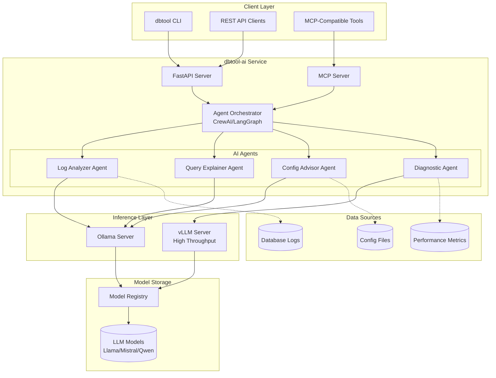
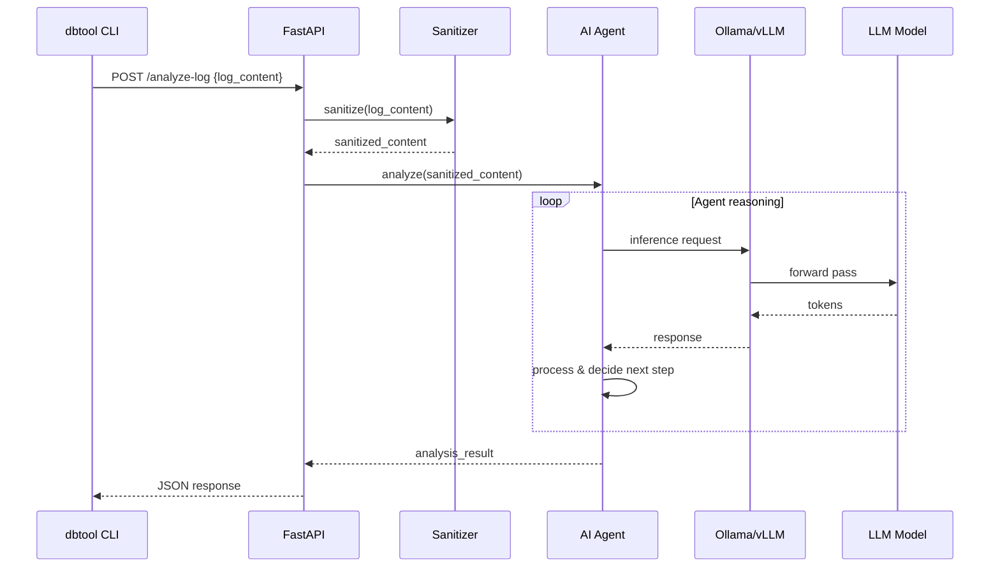
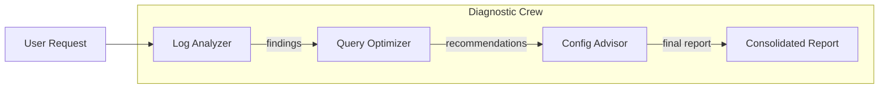
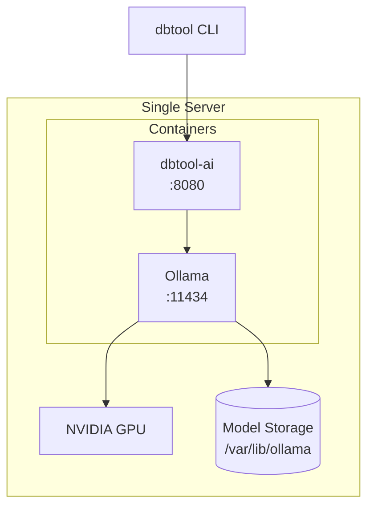
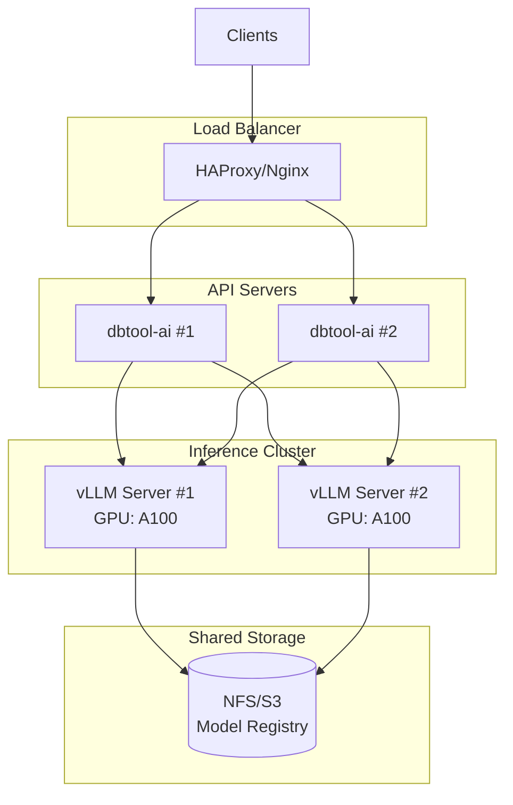
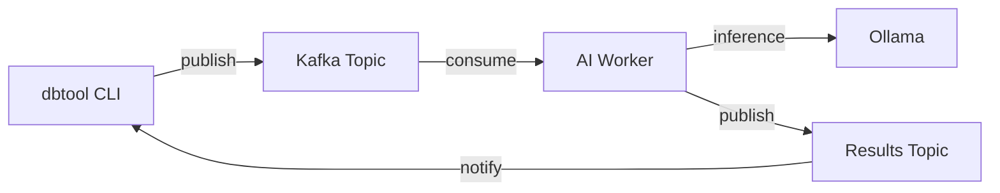

# local-ai-hub: Architecture and design

**[← Back to local-ai-hub Index](./README.md)**

> **Document Version:** 2.0
> **Last Updated:** January 22, 2026
> **Maintainers:** Application Infrastructure Team
> **Status:** Draft


> [!IMPORTANT]
> **Related Docs:** [Project Definition](./project-definition.md) | [Hardware Requirements](./hardware-requirements.md) | [Implementation Guide](./implementation-guide.md)

## Table of contents

- [Architecture overview](#architecture-overview)
- [System components](#system-components)
- [Technology stack](#technology-stack)
- [Data flow](#data-flow)
- [AI agent architecture](#ai-agent-architecture)
- [MCP integration](#mcp-integration)
- [Deployment architecture](#deployment-architecture)
- [Security architecture](#security-architecture)
- [Integration patterns](#integration-patterns)

## Architecture overview

The local-ai-hub system follows a **sidecar service pattern**, operating as an independent AI inference service that CLI tools, IDE extensions, and other applications can invoke via REST API or MCP. This separation ensures:

- Heavy ML dependencies remain isolated from lightweight CLI tools
- Independent scaling and lifecycle management
- Flexible deployment (same host, dedicated server, or container)

### High-level architecture



[↑ Back to Table of Contents](#table-of-contents)

## System components

### Core components

| Component | Purpose | Technology |
|:----------|:--------|:-----------|
| **FastAPI Server** | REST API gateway for AI services | Python, FastAPI, Uvicorn |
| **Agent Orchestrator** | Coordinates multi-step AI workflows | CrewAI / LangGraph |
| **MCP Server** | Model Context Protocol endpoint | mcp-python-sdk |
| **Ollama Server** | Local LLM inference engine | Ollama |
| **vLLM Server** | High-throughput inference (optional) | vLLM |
| **Model Registry** | Model version management | Local filesystem / MLflow |

### AI agents

| Agent | Function | Primary Model |
|:------|:---------|:--------------|
| **Log Analyzer** | Parse and summarize database error logs | Llama 3.1 8B |
| **Query Explainer** | Explain SQL execution plans in plain English | Qwen 2.5 7B |
| **Config Advisor** | Analyze and recommend configuration changes | Mistral 7B |
| **Diagnostic Agent** | Multi-step troubleshooting workflows | Llama 3.1 70B (or 8B quantized) |

### Supporting components

| Component | Purpose |
|:----------|:--------|
| **Prompt Templates** | Standardized prompts for each use case |
| **Context Manager** | Manages conversation history and context windows |
| **Sanitizer** | Removes/masks PII before processing |
| **Response Validator** | Validates and formats AI responses |
| **Metrics Collector** | OpenTelemetry-based observability |

[↑ Back to Table of Contents](#table-of-contents)

## Technology stack

### Runtime and frameworks

```text
┌─────────────────────────────────────────────────────────────┐
│                    Application Layer                         │
├─────────────────────────────────────────────────────────────┤
│  Python 3.12+  │  FastAPI  │  CrewAI  │  LangGraph          │
├─────────────────────────────────────────────────────────────┤
│                    Inference Layer                           │
├─────────────────────────────────────────────────────────────┤
│  Ollama  │  vLLM  │  llama.cpp  │  LiteLLM (abstraction)    │
├─────────────────────────────────────────────────────────────┤
│                    Model Layer                               │
├─────────────────────────────────────────────────────────────┤
│  Llama 3.x  │  Mistral  │  Qwen 2.5  │  DeepSeek-Coder     │
├─────────────────────────────────────────────────────────────┤
│                    Infrastructure                            │
├─────────────────────────────────────────────────────────────┤
│  Docker/Podman  │  NVIDIA CUDA  │  systemd                  │
└─────────────────────────────────────────────────────────────┘
```

### Key dependencies

```toml
# pyproject.toml excerpt
[project]
dependencies = [
    "fastapi>=0.115.0",
    "uvicorn[standard]>=0.32.0",
    "crewai>=0.80.0",
    "langgraph>=0.2.0",
    "litellm>=1.50.0",
    "ollama>=0.4.0",
    "mcp>=1.0.0",
    "pydantic>=2.10.0",
    "opentelemetry-api>=1.28.0",
]
```

### Inference engine comparison

| Feature | Ollama | vLLM | llama.cpp |
|:--------|:-------|:-----|:----------|
| **Ease of use** | Excellent | Good | Moderate |
| **Performance** | Good | Excellent | Good |
| **Multi-user** | Limited | Excellent | Limited |
| **GPU support** | NVIDIA, AMD, Apple | NVIDIA, AMD | All |
| **CPU fallback** | Yes | Limited | Excellent |
| **API compatibility** | OpenAI-like | OpenAI-compatible | Custom |
| **Recommended for** | Development, single-user | Production, multi-user | Edge, CPU-only |

[↑ Back to Table of Contents](#table-of-contents)

## Data flow

### Request processing flow



### Data sanitization

All input data passes through a sanitization layer before LLM processing:

```python
class DataSanitizer:
    """Removes or masks sensitive information before LLM processing."""

    patterns = {
        "ip_address": r"\b\d{1,3}\.\d{1,3}\.\d{1,3}\.\d{1,3}\b",
        "email": r"\b[\w.-]+@[\w.-]+\.\w+\b",
        "ssn": r"\b\d{3}-\d{2}-\d{4}\b",
        "credit_card": r"\b\d{4}[- ]?\d{4}[- ]?\d{4}[- ]?\d{4}\b",
        "connection_string": r"(Server|Host|Data Source)=[^;]+",
        "password": r"(password|pwd|passwd)=[^;]+",
    }

    def sanitize(self, text: str) -> str:
        for name, pattern in self.patterns.items():
            text = re.sub(pattern, f"[REDACTED_{name.upper()}]", text, flags=re.I)
        return text
```

[↑ Back to Table of Contents](#table-of-contents)

## AI agent architecture

### CrewAI implementation

The system uses CrewAI for orchestrating multi-agent workflows:

```python
from crewai import Agent, Task, Crew
from litellm import completion

# Configure local LLM
llm_config = {
    "model": "ollama/llama3.1:8b",
    "base_url": "http://localhost:11434",
}

# Define specialized agents
log_analyzer = Agent(
    role="Database Log Analyst",
    goal="Analyze database error logs and identify root causes",
    backstory="Expert DBA with 20 years of experience in SQL Server and PostgreSQL",
    llm=llm_config,
    verbose=True,
)

query_optimizer = Agent(
    role="Query Performance Specialist",
    goal="Analyze execution plans and suggest optimizations",
    backstory="Performance tuning expert specializing in complex query optimization",
    llm=llm_config,
    verbose=True,
)

# Create crew for complex diagnostics
diagnostic_crew = Crew(
    agents=[log_analyzer, query_optimizer],
    tasks=[
        Task(description="Analyze the provided error logs", agent=log_analyzer),
        Task(description="Review related query performance", agent=query_optimizer),
    ],
    verbose=True,
)
```

### Agent communication pattern



### Single-agent vs multi-agent

| Scenario | Approach | Agents |
|:---------|:---------|:-------|
| Simple log summary | Single agent | Log Analyzer |
| Query explanation | Single agent | Query Explainer |
| Performance investigation | Multi-agent crew | Log Analyzer + Query Optimizer |
| Full system diagnostic | Multi-agent crew | All agents |

[↑ Back to Table of Contents](#table-of-contents)

## MCP integration

### Model Context Protocol overview

MCP (Model Context Protocol) provides a standardized way for AI models to interact with external tools and data sources. This enables:

- Tool augmentation (file access, database queries, API calls)
- Consistent interface across different LLM backends
- Portable tool definitions

### MCP server implementation

```python
from mcp.server import Server
from mcp.types import Tool, TextContent

server = Server("dbtool-ai-mcp")

@server.tool()
async def analyze_sql_log(log_path: str, lines: int = 100) -> str:
    """Analyze SQL Server error log and return summary."""
    # Read and sanitize log content
    content = read_log_file(log_path, lines)
    sanitized = sanitizer.sanitize(content)

    # Invoke AI analysis
    result = await log_agent.analyze(sanitized)
    return result

@server.tool()
async def explain_query_plan(query: str, plan_xml: str) -> str:
    """Explain SQL execution plan in plain English."""
    result = await query_agent.explain(query, plan_xml)
    return result

@server.tool()
async def suggest_config_changes(config_path: str, workload: str) -> str:
    """Analyze database configuration and suggest improvements."""
    config = read_config_file(config_path)
    result = await config_agent.analyze(config, workload)
    return result
```

### MCP client integration

Tools like Claude Code, Cline, and other MCP-compatible clients can connect:

```json
{
  "mcpServers": {
    "dbtool-ai": {
      "command": "python",
      "args": ["-m", "dbtool_ai.mcp_server"],
      "env": {
        "OLLAMA_HOST": "http://localhost:11434"
      }
    }
  }
}
```

### Available MCP tools

| Tool | Description | Input |
|:-----|:------------|:------|
| `analyze_sql_log` | Analyze database error logs | log_path, lines |
| `explain_query_plan` | Explain execution plan | query, plan_xml |
| `suggest_config_changes` | Configuration recommendations | config_path, workload |
| `diagnose_performance` | Full performance diagnosis | metrics_json |
| `generate_index_suggestion` | Index recommendations | table, query_patterns |

[↑ Back to Table of Contents](#table-of-contents)

## Deployment architecture

### Single-server deployment

For development and small teams:



### Multi-server deployment

For production with high availability:



### Container configuration

```yaml
# docker-compose.yml
version: "3.9"
services:
  dbtool-ai:
    build: .
    ports:
      - "8080:8080"
    environment:
      - OLLAMA_HOST=http://ollama:11434
      - LOG_LEVEL=INFO
    depends_on:
      - ollama

  ollama:
    image: ollama/ollama:latest
    ports:
      - "11434:11434"
    volumes:
      - ollama_data:/root/.ollama
    deploy:
      resources:
        reservations:
          devices:
            - driver: nvidia
              count: 1
              capabilities: [gpu]

volumes:
  ollama_data:
```

[↑ Back to Table of Contents](#table-of-contents)

## Security architecture

### Security layers

```text
┌─────────────────────────────────────────────────────────────┐
│                    Network Security                          │
│  • Internal network only (no internet exposure)              │
│  • TLS 1.3 for all communications                           │
│  • Firewall rules restricting access                        │
├─────────────────────────────────────────────────────────────┤
│                    Authentication                            │
│  • API key authentication                                    │
│  • mTLS for service-to-service                              │
│  • Integration with corporate SSO (optional)                │
├─────────────────────────────────────────────────────────────┤
│                    Authorization                             │
│  • Role-based access control (RBAC)                         │
│  • Per-endpoint permissions                                  │
│  • Audit logging of all requests                            │
├─────────────────────────────────────────────────────────────┤
│                    Data Protection                           │
│  • Input sanitization (PII removal)                         │
│  • No data persistence (stateless processing)               │
│  • Encrypted model storage                                  │
└─────────────────────────────────────────────────────────────┘
```

### Security controls

| Control | Implementation |
|:--------|:---------------|
| Network isolation | Deploy on internal network only; no public endpoints |
| Authentication | API keys with rotation policy |
| Authorization | RBAC with least-privilege principle |
| Data sanitization | Automatic PII detection and masking |
| Audit logging | All requests logged with user, timestamp, action |
| Model integrity | Checksum verification for model files |
| Container security | Read-only filesystem, non-root user |

[↑ Back to Table of Contents](#table-of-contents)

## Integration patterns

### dbtool-cli integration

```python
# In dbtool-cli
import httpx

class AIClient:
    def __init__(self, base_url: str = "http://localhost:8080"):
        self.client = httpx.Client(base_url=base_url)

    def analyze_log(self, log_content: str) -> dict:
        response = self.client.post(
            "/api/v1/analyze-log",
            json={"content": log_content}
        )
        return response.json()

    def explain_query(self, query: str, plan: str) -> dict:
        response = self.client.post(
            "/api/v1/explain-query",
            json={"query": query, "execution_plan": plan}
        )
        return response.json()
```

### REST API endpoints

| Endpoint | Method | Description |
|:---------|:-------|:------------|
| `/api/v1/analyze-log` | POST | Analyze database error log |
| `/api/v1/explain-query` | POST | Explain SQL query/execution plan |
| `/api/v1/suggest-config` | POST | Configuration recommendations |
| `/api/v1/diagnose` | POST | Full diagnostic workflow |
| `/health` | GET | Service health check |
| `/metrics` | GET | Prometheus metrics |

### Event-driven integration (optional)

For asynchronous processing of large log files:



[↑ Back to Table of Contents](#table-of-contents)
