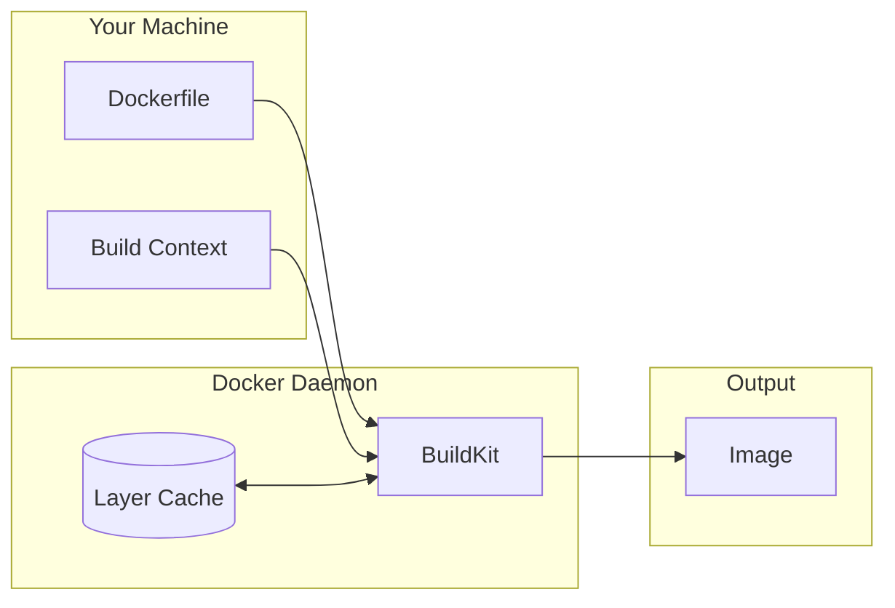

# Chapter 4: Dockerfile Basics

In Chapter 3, you learned how to run containers from existing images. Now, you’ll learn how to build your *own* images using a **Dockerfile**.

## What is a Dockerfile?

A **Dockerfile** is a text file that contains a set of instructions to build a Docker image. Think of it as a recipe: it tells Docker what ingredients (base OS, libraries, code) to use and what steps (install, copy, configure) to take.

> [!NOTE]
> The filename is typically just `Dockerfile` with no extension.

## Key Instructions

Here are the most common instructions you'll use:

| Instruction | Description | Example |
| :--- | :--- | :--- |
| **`FROM`** | Sets the base image to start from (must be the first line). | `FROM python:3.9-slim` |
| **`WORKDIR`** | Sets the working directory inside the container. All subsequent commands run here. | `WORKDIR /app` |
| **`COPY`** | Copies files from your host machine into the container. | `COPY . .` |
| **`RUN`** | Executes a command during the build process (e.g., installing packages). | `RUN pip install flask` |
| **`CMD`** | The default command to run when the container starts. | `CMD ["python", "app.py"]` |
| **`EXPOSE`** | Informs Docker that the container listens on specific ports. | `EXPOSE 8000` |

---

## Hands-On: Your First Custom Image

Let's build a simple Python web server image. You can find the complete code for this example in `examples/basics/python-app`.

### 1. The Application Code (`app.py`)

First, we need something to run. This is a standard Python script:

```python
# app.py
import http.server
import socketserver
import os

PORT = int(os.environ.get('PORT', 8000))
Handler = http.server.SimpleHTTPRequestHandler

with socketserver.TCPServer(("", PORT), Handler) as httpd:
    print(f"Serving at port {PORT}")
    httpd.serve_forever()
```

### 2. The Dockerfile

Create a file named `Dockerfile` in the same directory:

```dockerfile
# 1. Start with a pre-built Python image
FROM python:3.9-slim

# 2. Set our working directory
WORKDIR /app

# 3. Copy our code from the host to the container
COPY . .

# 4. Tell Docker we expect to use port 8000
EXPOSE 8000

# 5. Set the default command to run our app
CMD ["python", "app.py"]
```

### 3. Build the Image

Use the `docker build` command to create your image. The `-t` flag tags (names) the image.

```bash
cd docs/tutorials/docker/examples/basics/python-app
docker build -t my-python-app .
```

> [!IMPORTANT]
> Don't forget the `.` at the end of the command! It tells Docker to look for the Dockerfile in the *current directory*.

### 4. Run the Container

Now run your new image:

```bash
docker run -p 8000:8000 my-python-app
```

Visit `http://localhost:8000` in your browser. You should see the file listing from your container!

---

## Understanding the Build Context

The `.` in `docker build -t myapp .` refers to the **Build Context**. This is the set of files located at the specified path. Docker sends *everything* in this directory to the Docker daemon before building.

### The `.dockerignore` File

If your project has large files (like `.git`, `node_modules`, or temporary data) that aren't needed in the image, you should exclude them to speed up builds and reduce image size.

Create a `.dockerignore` file:

```text
.git
__pycache__
*.pyc
*.pyo
venv
```

This works exactly like `.gitignore`.

---

## CMD vs ENTRYPOINT

You might see `ENTRYPOINT` used instead of `CMD`.

- **`CMD`**: Default arguments. Can be overridden easily by the user.
  - `docker run myapp echo "hello"` -> Runs `echo "hello"` instead of the python app.
- **`ENTRYPOINT`**: The command to *always* run. Arguments passed to `docker run` are appended to it.

For beginners, stick with `CMD` until you have a specific need for `ENTRYPOINT`.

---

## Docker Build Architecture



---

## Exercises

### Exercise 1: Build Your First Image

1. Create a directory called `myapp`
2. Add a file `index.html` with some content
3. Create a Dockerfile:

   ```dockerfile
   FROM nginx:alpine
   COPY index.html /usr/share/nginx/html/
   ```

4. Build: `docker build -t my-nginx .`
5. Run: `docker run -p 8080:80 my-nginx`
6. Visit `http://localhost:8080`

### Exercise 2: Add a .dockerignore

1. Create a `secret.txt` file in your directory
2. Build the image and exec into it: `docker exec -it <id> sh`
3. Check if `secret.txt` exists (it shouldn't be in `/usr/share/nginx/html/`)
4. Now create a `.dockerignore` with `secret.txt`
5. Rebuild and verify the secret is excluded

### Exercise 3: Experiment with CMD

1. Build an image with `CMD ["echo", "Hello"]`
2. Run it: `docker run myimage` → outputs "Hello"
3. Override: `docker run myimage echo "Goodbye"` → outputs "Goodbye"

---

**Next Chapter:** Learn how to optimize your builds and make them production-ready in **Chapter 5: Advanced Dockerfile Techniques**.
