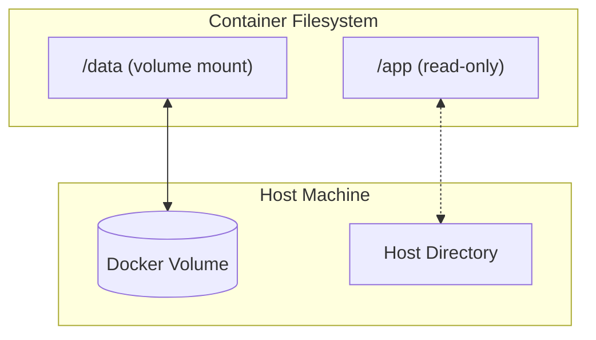

# Chapter 9: Persistence with Volumes and Mounts

By default, data written inside a container is **ephemeral**—it disappears when the container is removed. This chapter teaches you how to persist data.

## The Problem: Ephemeral Containers

```bash
# Run a container, create a file
docker run -it --name test alpine sh
/ # echo "important data" > /myfile.txt
/ # exit

# Remove the container
docker rm test

# The file is gone forever!
```

---

## Solution 1: Named Volumes (Recommended)

Named volumes are managed by Docker and are the preferred way to persist data.

### Create and Use a Volume

```bash
# Create a volume
docker volume create mydata

# Run a container with the volume attached
docker run -d --name db \
  -v mydata:/var/lib/postgresql/data \
  postgres:15

# Data in /var/lib/postgresql/data persists even if container is removed
```

### Common Volume Commands

```bash
# List all volumes
docker volume ls

# Inspect a volume (see where it's stored)
docker volume inspect mydata

# Remove a volume
docker volume rm mydata

# Remove all unused volumes
docker volume prune
```

### Why Named Volumes?

| Feature | Named Volume |
| :--- | :--- |
| Managed by Docker | ✅ Yes |
| Portable across hosts | ✅ With backup/restore |
| Works on all platforms | ✅ Yes |
| Easy backup | ✅ With helper containers |

---

## Solution 2: Bind Mounts

Bind mounts link a **host directory** directly into the container. Useful for development.

```bash
# Mount current directory into container
docker run -it \
  -v $(pwd):/app \
  node:18 sh

# Changes in /app inside container appear on your host, and vice versa
```

### Bind Mount Syntax

```bash
# Long form (recommended for clarity)
docker run -v /host/path:/container/path myimage

# Read-only mount
docker run -v /host/path:/container/path:ro myimage
```

### When to Use Bind Mounts

| Use Case | Bind Mount? |
| :--- | :--- |
| Development (live code reload) | ✅ Yes |
| Production data storage | ❌ Use volumes |
| Config files | ✅ Yes |
| Sharing data between host and container | ✅ Yes |

> [!WARNING]
> Bind mounts depend on the host's filesystem structure. They can break portability.

---

## Volumes in Docker Compose

```yaml
services:
  db:
    image: postgres:15
    volumes:
      - db-data:/var/lib/postgresql/data  # Named volume
      - ./init.sql:/docker-entrypoint-initdb.d/init.sql  # Bind mount

volumes:
  db-data:  # Declare the named volume
```

---

## Backing Up and Restoring Volumes

### Backup a Volume

```bash
docker run --rm \
  -v mydata:/data \
  -v $(pwd):/backup \
  alpine tar czf /backup/mydata-backup.tar.gz -C /data .
```

### Restore a Volume

```bash
docker run --rm \
  -v mydata:/data \
  -v $(pwd):/backup \
  alpine tar xzf /backup/mydata-backup.tar.gz -C /data
```

---

## Common Pitfalls

### 1. Permission Issues

The user inside the container (often `root` or a specific UID) must match the permissions on the host directory.

**Fix:**

```bash
# Run as a specific user ID
docker run -u $(id -u):$(id -g) -v $(pwd):/app myimage
```

### 2. Overwriting Container Contents

If you mount to a directory that already has files in the image, the mount **hides** those files.

**Example:**

```bash
# This hides the default nginx files!
docker run -v $(pwd)/empty:/usr/share/nginx/html nginx
```

### 3. Forgetting to Declare Volumes in Compose

If you don't declare the volume in the `volumes:` section at the bottom of your `docker-compose.yml`, Docker creates an anonymous volume that's hard to manage.

---

## Summary

| Method | Use Case | Managed by Docker? |
| :--- | :--- | :--- |
| **Named Volume** | Production data (databases, user uploads) | ✅ Yes |
| **Bind Mount** | Development (live editing), config files | ❌ No (host filesystem) |
| **tmpfs** | Sensitive data that shouldn't persist | ✅ Yes (in memory) |

---

## Volume Architecture



---

## Exercises

### Exercise 1: Create and Inspect a Volume

```bash
docker volume create test-vol
docker volume inspect test-vol
docker run --rm -v test-vol:/data alpine sh -c "echo 'Hello' > /data/test.txt"
docker run --rm -v test-vol:/data alpine cat /data/test.txt
docker volume rm test-vol
```

### Exercise 2: Backup and Restore

1. Use the scripts in `examples/volumes/` to backup a volume
2. Create a new volume and restore the backup
3. Verify the data survived

### Exercise 3: Bind Mount for Development

1. Create a simple HTML file locally
2. Mount it into nginx: `docker run -v $(pwd):/usr/share/nginx/html:ro -p 8080:80 nginx`
3. Edit the HTML file on your host
4. Refresh the browser to see changes

---

**Next Chapter:** Explore advanced storage options in **Chapter 10: Advanced Data & Storage**.
