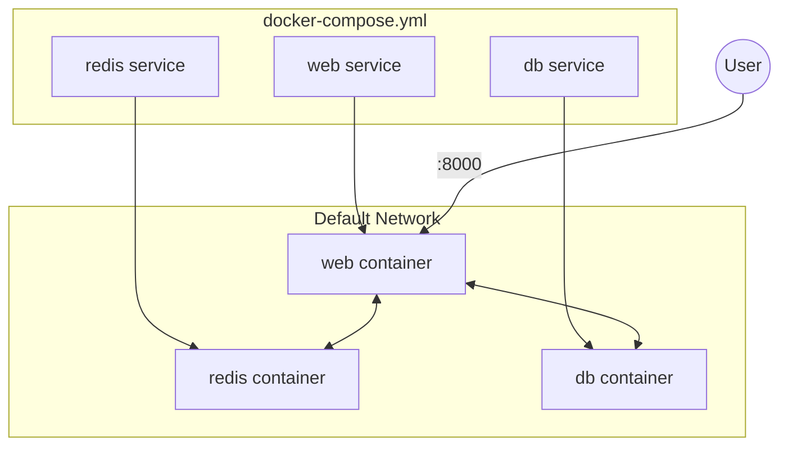

# Chapter 11: Introduction to Docker Compose

Running individual containers with `docker run` is fine for simple tests, but real applications usually consist of multiple services (e.g., a web app, a database, a cache) that need to talk to each other.

**Docker Compose** is a tool for defining and running multi-container Docker applications. You use a YAML file to configure your application's services, then create and start all the services with a single command.

## The `docker-compose.yml` File

This file describes your entire stack. Here is an example of a Python Flask application that uses Redis. (See runnable code in `examples/basics/compose-demo/`)

```yaml
version: "3.8"  # Optional in newer versions, but good practice

services:
  # Service 1: Our Web App
  web:
    build: .            # Build the image from the Dockerfile in current dir
    ports:
      - "8000:5000"     # Map host port 8000 to container port 5000
    volumes:
      - .:/code         # Sync current directory code to container (Hot Reloading!)
    environment:
      FLASK_DEBUG: "true"
    depends_on:
      - redis           # specific startup order

  # Service 2: Redis Cache
  redis:
    image: "redis:alpine"  # Use a pre-built image from Docker Hub
    # No ports mapped means Redis is ONLY accessible to 'web', not the outside world.
```

## Key Concepts

- **Services:** The computing components of your app overlay (web, db, worker).
- **Volumes:** Persistent data storage.
- **Networks:** By default, Compose sets up a single network for your app. Service `web` can reach service `redis` just by using the hostname `redis`.

## Common Commands

> [!NOTE]
> Modern Docker uses `docker compose` (v2). Older tutorials might use `docker-compose` (with a hyphen). Use the space version.

| Command | Description |
| :--- | :--- |
| **`docker compose up`** | Builds, creates, starts, and attaches to containers for a service. |
| **`docker compose up -d`** | Detached mode: Runs containers in the background. |
| **`docker compose down`** | Stops and removes containers, networks, images, and volumes. |
| **`docker compose logs -f`** | Follows log output from services. |
| **`docker compose ps`** | Lists containers. |
| **`docker compose build`** | Rebuilds services (needed if you change the Dockerfile). |

## Hands-On: Running the Stack

1. Navigate to the example directory:

    ```bash
    cd docs/tutorials/docker/examples/basics/compose-demo
    ```

2. Start the stack:

    ```bash
    docker compose up
    ```

3. Open `http://localhost:8000`. You should see "Hello Docker Compose!". Reflecting the count from Redis.
4. Refresh the page. The count increases!
5. Stop with `Ctrl+C`.
6. Clean up:

    ```bash
    docker compose down
    ```

## Why use Compose?

1. **Infrastructure as Code:** Your entire stack config is versioned in git.
2. **Single Command Startup:** `docker compose up` is all a new developer needs to run the project.
3. **Automatic Networking:** No need to manually link containers with IPs.
4. **Service Isolation:** Each project runs in its own network sandbox.

---

## Compose Architecture



---

## Exercises

### Exercise 1: Create Your Own Stack

1. Create a new directory
2. Write a `docker-compose.yml` with:
   - An nginx service on port 8080
   - A redis service (internal only)
3. Start with `docker compose up -d`
4. Verify nginx is accessible at localhost:8080
5. Verify you can ping redis from nginx: `docker compose exec nginx ping redis`

### Exercise 2: Modify and Rebuild

1. Add an environment variable to your nginx service
2. Run `docker compose up -d` again (it will recreate only changed services)
3. Verify the env var: `docker compose exec nginx printenv`

### Exercise 3: Explore Logs

1. Run `docker compose logs -f` to follow all logs
2. Run `docker compose logs redis` to see only redis logs
3. Stop a service and watch what happens in logs

---

**Next Chapter:** Learn advanced Compose patterns like profiles and overrides in **Chapter 12: Advanced Compose**.
