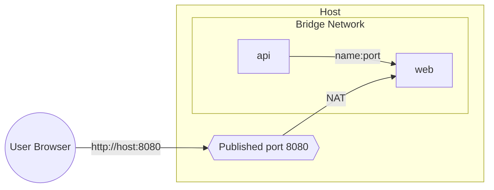
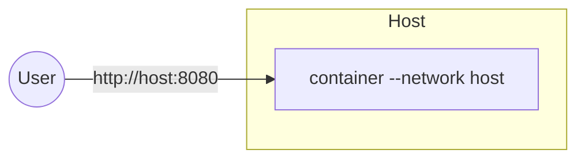

# Docker Networking Deep Dive

This guide expands on the networking section with visual mental models, practical commands, and Compose examples—from simple bridge networks to advanced host/macvlan setups.

---

## TL;DR

- Prefer user-defined bridge networks for day-to-day local dev and small stacks.
- Use host networking sparingly (Linux-only) for performance-sensitive workloads that don’t need port mapping.
- Consider macvlan only when you truly need L2 separation and a unique MAC/IP per container; it requires careful host/LAN configuration.

---

## Networking Modes

- none: fully isolated; no external connectivity.
- bridge (default): containers on a virtual bridge; port publishing brings traffic from host to container.
- host (Linux only): container shares host network namespace—no port mapping required, but reduced isolation.
- macvlan: container gets its own MAC and appears directly on the physical network segment.

### Visuals





---

## User‑Defined Bridge Networks (recommended default)

- Built-in DNS-based service discovery by container name.
- Automatic isolation from other networks; explicit joins only.

```bash
# Create an isolated bridge network
docker network create app-net

# Run two services on the same network
docker run -d --name api --network app-net -p 5000:5000 myorg/api:1.0
docker run -d --name web --network app-net -p 8080:80 myorg/web:1.0

# Service discovery (web -> api)
docker exec web getent hosts api
```

With Compose (see `examples/networking/compose-bridge.yaml`):

```yaml
services:
  api:
    image: myorg/api:1.0
    ports: ["5000:5000"]
  web:
    image: nginx:alpine
    ports: ["8080:80"]
networks:
  default:
    name: app-net
    driver: bridge
```

---

## Host Networking (Linux only)

- Shares the host network namespace; containers bind directly to host interfaces.
- No `-p host:container` port mapping—apps must bind their ports and avoid collisions.
- Reduced isolation; consider security implications.

Compose example (see `examples/networking/compose-host.yaml`):

```yaml
services:
  web:
    image: nginx:alpine
    network_mode: host
```

---

## Macvlan (advanced)

- Container gets a unique MAC and IP on your LAN.
- Requires supported NIC and proper parent interface configuration.
- Host may not be able to talk to the macvlan IP without workaround (macvlan bridge mode considerations).

Example (manual):

```bash
# Replace parent interface and subnet with your LAN details
PARENT=eth0
SUBNET=192.168.1.0/24
GATEWAY=192.168.1.1
RANGE=192.168.1.200/28

# Create macvlan network
docker network create -d macvlan \
  --subnet=$SUBNET --gateway=$GATEWAY \
  -o parent=$PARENT \
  -o macvlan_mode=bridge macvlan-net

# Attach a container (will receive an IP from RANGE if set as ip-range)
# docker run -d --name sensor --network macvlan-net <image>
```

Warnings:
- Many home/small office switches/APs block promiscuous MACs or have port-security policies.
- Troubleshoot with `docker network inspect`, `ip a`, and switch logs.

---

## Troubleshooting Playbook

- List networks: `docker network ls`
- Inspect: `docker network inspect <name>`
- Test DNS: `docker exec <svc> getent hosts <peer>`
- Check routes: `docker exec <svc> ip route`
- Verify bindings: `docker port <svc>` and application listen address (`0.0.0.0` vs `127.0.0.1`).

---

## Next Steps

- Try the Compose examples in `examples/networking`.
- Add health checks to services and simulate failures.
- Explore ingress/egress policies with firewalls or orchestrators when you move beyond single-host.
