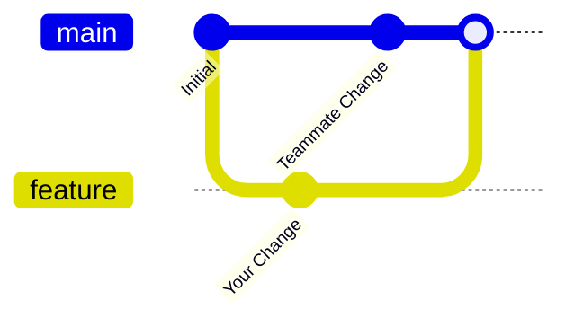

# Git: Branching & Merging Guide

> "Git is a time machine where you can save specific moments (commits) and travel between timelines (branches)."

This guide covers how to work with feature branches and what happens when your branch diverges from `main`.

## 1. The "Feature Branch" Workflow

In shared repositories, we **never** push directly to `main`. Instead:
1.  **Create** a branch for your work: `git checkout -b feature/login-page`
2.  **Commit** your changes: `git commit -m "Add login form"`
3.  **Merge** back to `main` when done.

## 2. The "Divergence" Problem

What happens if **you** make changes on your branch, but **someone else** pushes new code to `main` at the same time?



Your history has **diverged** (split). You have commits they don't have, and they have commits you don't have.

## 3. The 3-Way Merge

When you merge `feature` into `main`, Git performs a **3-Way Merge**. It looks at three specific snapshots:

1.  **Your Tip:** The latest commit on `feature`.
2.  **Their Tip:** The latest commit on `main`.
3.  **Common Ancestor:** The last commit shared by both branches (*Initial* in the graph above).

**Git's Logic:**
- If *Ancestry* said "A", and *You* said "B", and *They* said "A" (no change) -> Result is **B**.
- If *Ancestry* said "A", and *You* said "A", and *They* said "C" -> Result is **C**.
- If *Ancestry* said "A", and *You* said "B", and *They* said "C" -> **CONFLICT**.

If there are no conflicts, Git automatically creates a **Merge Commit** that joins the two histories together.

## 4. Resolving Conflicts

If both sides changed the same line, Git pauses.

### How to Fix
1.  **Run `git status`**: It shows which files are conflicted.
2.  **Open the file**: You will see markers:
    ```text
    <<<<<<< HEAD
    var color = "blue"; // User on main changed this
    =======
    var color = "green"; // You changed this
    >>>>>>> feature/login-page
    ```
3.  **Edit**: Delete the markers (`<<<<`, `====`, `>>>>`) and pick the correct code.
4.  **Finish**:
    ```powershell
    git add file.js
    git commit -m "Resolve merge conflict"
    ```

## 5. Best Practice: Update Often

To avoid massive conflicts at the end, pull changes from `main` into your branch frequently.

```powershell
# On your feature branch
git pull origin main
```

This triggers the merge (and potential conflicts) **on your branch**, leaving `main` safe.
