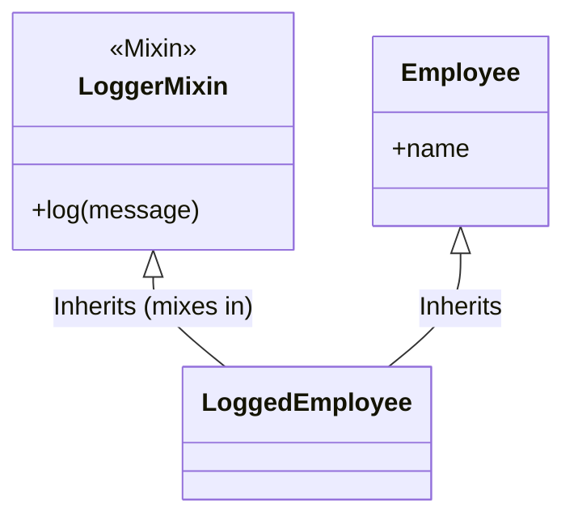

# Understanding Mixins in Python

Mixins are a powerful Object-Oriented Programming (OOP) pattern in Python that allows you to "mix in" additional functionality to a class without using deep inheritance hierarchies. They are a form of **composition through inheritance**.

## 🏗️ What is a Mixin?

A **Mixin** is a class designed to provide specific methods to other classes but is not intended to stand on its own.

Think of it like an ingredient or a topping:
- You don't eat a bowl of **sprinkles** (the Mixin) by itself.
- You add sprinkles to **Ice Cream** (the Main Class) to give it extra flavor/properties.

### Key Characteristics
1.  **Single Responsibility**: A mixin should do *one* thing well (e.g., `JsonSerializableMixin`, `LoggableMixin`).
2.  **Not Standalone**: You typically don't instantiate a Mixin class directly.
3.  **No "Is-A" Relationship**: A `Car` that inherits from `RadioMixin` isn't a "Radio"; it's a `Car` that *has* radio capabilities.

---

## 🚀 Basic Example

Let's say we have different types of employees and vehicles, and we want to give them the ability to log messages. Instead of duplicating the log method or creating a complex hierarchy, we use a Mixin.

```python
import datetime

# --- The Mixin ---
class LoggerMixin:
    """Adds logging capability to any class."""

    def log(self, message: str):
        # We assume the class using this mixin has a 'name' attribute,
        # or we can use the class name itself.
        identity = getattr(self, 'name', self.__class__.__name__)
        print(f"[{datetime.datetime.now()}] {identity}: {message}")

# --- Domain Classes ---

class Employee:
    def __init__(self, name):
        self.name = name

class Server:
    def __init__(self, ip):
        self.ip = ip

    # Using a property to adapt to what LoggerMixin expects, or LoggerMixin
    # could be made more robust (see Best Practices).
    property
    def name(self):
        return f"Server-{self.ip}"

# --- Mixing it In ---

class LoggedEmployee(LoggerMixin, Employee):
    """An Employee that can log activity."""
    pass

class LoggedServer(LoggerMixin, Server):
    """A Server that can log activity."""
    pass

# --- Usage ---

emp = LoggedEmployee("Alice")
emp.log("Clocked in.")
# Output: [2023-10-27 10:00:00] Alice: Clocked in.

srv = LoggedServer("192.168.1.1")
srv.log("Restarting...")
# Output: [2023-10-27 10:00:05] Server-192.168.1.1: Restarting...
```

### 📊 Concept Diagram



---

## ⚙️ How It Works: Multiple Inheritance

Python supports **Multiple Inheritance**, which is the mechanism Mixins rely on. When `LoggedEmployee` inherits from `(LoggerMixin, Employee)`, it gains attributes/methods from *both*.

### The Method Resolution Order (MRO)
Python needs to know where to look for a method. It uses the **C3 Linearization** algorithm to determine the order. You can check the `.mro()` of a class to see the lookup path.

```python
print(LoggedEmployee.mro())
# [
#   <class '__main__.LoggedEmployee'>,
#   <class '__main__.LoggerMixin'>,
#   <class '__main__.Employee'>,
#   <class 'object'>
# ]
```

**Order Matters!**
Attributes are searched effectively from **left to right** in the inheritance list.
If both parents have the same method, the one on the *left* wins.

```python
class MyClass(MixinA, MixinB, BaseClass):
    pass
```

1. Checks `MyClass`
2. Checks `MixinA`
3. Checks `MixinB`
4. Checks `BaseClass`

---

## 🚫 Common Pitfalls

### 1. Statefulness & `__init__`
Mixins should ideally be stateless (only methods). If a Mixin needs state (variables), things get tricky because of `__init__`.

**Bad Practice:**
```python
class HazardousMixin:
    def __init__(self, value):
        self.value = value  # This might override the Base class's init!

class MyObject(HazardousMixin, Base):
    pass
    # If Base.__init__ takes different args, HazardousMixin might break it
    # or fail to call super().__init__().
```

**Solution:**
If you MUST use `__init__` in a Mixin, use Cooperative Multiple Inheritance with `super()` and `**kwargs`.

```python
class SafeMixin:
    def __init__(self, *args, **kwargs):
        # Do mixin setup first (or after depending on need)
        print(f"SafeMixin initialized with: {kwargs}")

        # Forward everything else up the chain!
        # This is CRITICAL for cooperative inheritance.
        super().__init__(*args, **kwargs)

class BaseDevice:
    def __init__(self, name):
        self.name = name

# Order matches MRO: SmartDevice -> SafeMixin -> BaseDevice
class SmartDevice(SafeMixin, BaseDevice):
    pass

# When we instantiate:
# 1. SmartDevice calls SafeMixin.__init__
# 2. SafeMixin calls super().__init__ (which is BaseDevice.__init__)
# 3. BaseDevice.__init__ handles the 'name' arg
d = SmartDevice(name="Thermostat")
```

---

## 🆚 Mixins vs. Abstract Base Classes (ABCs)

It's easy to confuse the two, but they serve different purposes:

| Feature | **Mixin** | **Abstract Base Class (ABC)** |
| :--- | :--- | :--- |
| **Primary Goal** | **reuse code** (implementation) | **define an interface** (contract) |
| **Usage** | "Plug and play" behavior | Enforce strict structure |
| **Instantiation** | Never instantiated alone | Cannot be instantiated |
| **Methods** | Usually fully implemented methods | Often `abstractmethod`s (empty) |
| **Relationship** | "Has-a-capability" (e.g. `Loggable`) | "Is-a-type" (e.g. `DatabaseConnection`) |

**Can you use both?** Yes! A class can derive from an ABC (to define what it *is*) and a Mixin (to define what it *can do*).

```python
class Bird(Animal):            # internal "Is-A" Animal
    pass

class FlyingMixin:             # "Can-Do" Flying
    def fly(self): ...

class Eagle(FlyingMixin, Bird): # Eagle IS-A Bird AND CAN Fly
    pass
```

---

### 2. Name Collisions
If `LoggerMixin` has a method `save()` and `Employee` also has a method `save()`, the Mixin's version will likely override the Employee's version (if Mixin is first).
*   **Fix:** Use explicit naming conventions for Mixin private methods, e.g., `_logger_save()`, or ensure the Mixin is designed to wrap the method (using `super()`).

---

## 🏆 Best Practices

1.  **Naming**: Suffix your class with `Mixin` (e.g., `AuthMixin`, `RenderMixin`).
2.  **Stateless is Best**: Try to avoid defining `__init__` in mixins. Rely on methods that act on the instance's existing state.
3.  **Explicit Dependencies**: If your Mixin relies on a method or attribute (like `self.name` in our example), document it clearly or use an abstract base class/protocol to enforce it.
4.  **Composition Over Over-Inheritance**: Don't use 10 mixins if simple composition (passing an object as a parameter) would be cleaner.

### Real-World Example: Django Views
Django uses mixins extensively for class-based views.

```python
from django.contrib.auth.mixins import LoginRequiredMixin
from django.views.generic import ListView

# LoginRequiredMixin ensures the user is logged in before accessing the view.
# It is "mixed in" along with the generic ListView functionality.
class MyProtectedBookList(LoginRequiredMixin, ListView):
    model = Book
```

## Summary

| Feature | Description |
| :--- | :--- |
| **Purpose** | Share reusable behavior across unrelated classes. |
| **Mechanism** | Uses Python's Multiple Inheritance. |
| **State** | Best kept stateless; specialized behavior rather than data storage. |
| **Naming** | Conventionally ends with `...Mixin`. |

By using mixins, you keep your inheritance hierarchy shallow and your code modular!
