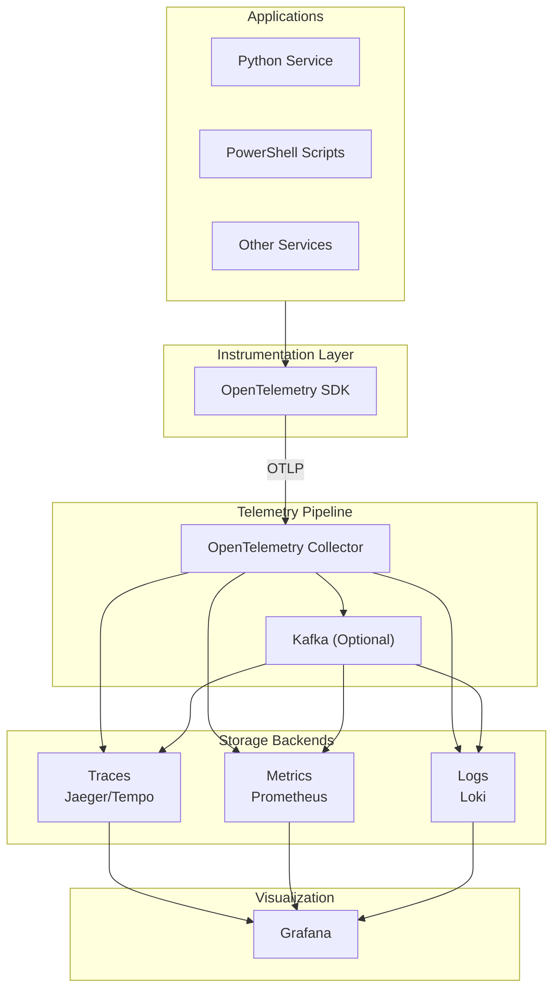

# Observability Tutorial Guide

## About This Tutorial

This comprehensive tutorial teaches enterprise observability from fundamentals to advanced implementation. It synthesizes content from the [architecture documentation](../../explanation/architecture/observability/) into a structured learning experience.

---

## Tutorial Structure

| Part | Title | Topics | Level |
|------|-------|--------|-------|
| 1 | [Introduction](01_INTRODUCTION.md) | What is observability, terminology, architecture | Beginner |
| 2 | [Three Pillars](02_THREE_PILLARS.md) | Traces, metrics, logs, correlation | Beginner |
| 3 | [Data Pipeline](03_DATA_PIPELINE_ARCHITECTURE.md) | Kafka, event streaming, schema evolution | Intermediate |
| 4 | [OpenTelemetry](04_OPENTELEMETRY.md) | SDK, Collector, deployment patterns | Intermediate |
| 5 | [PowerShell Logging](05_POWERSHELL_LOGGING.md) | Structured logging, streams, Kafka | Intermediate |
| 6 | [Python Integration](06_PYTHON_INTEGRATION.md) | Auto/manual instrumentation, metrics | Intermediate |
| 7 | [Kafka Streaming](07_KAFKA_STREAMING.md) | Producers, consumers, DLQ, exactly-once | Advanced |
| 8 | [Alerting](08_ALERTING_NOTIFICATION.md) | Rules, evaluation, circuit breaker | Advanced |
| 9 | [Best Practices](09_BEST_PRACTICES.md) | Design patterns, SOLID, security | Advanced |

---

## Learning Paths

### 🚀 Quick Start (1-2 hours)

For a high-level understanding:

1. [Introduction](01_INTRODUCTION.md)
2. [The Three Pillars](02_THREE_PILLARS.md)
3. [Quick Reference](QUICK_REFERENCE.md)

### 📚 Complete Course (8-10 hours)

Follow Parts 1-9 in order for comprehensive learning.

### 🔧 PowerShell Developer Path (3-4 hours)

1. [Introduction](01_INTRODUCTION.md)
2. [Three Pillars](02_THREE_PILLARS.md)
3. [PowerShell Logging](05_POWERSHELL_LOGGING.md)
4. [Best Practices](09_BEST_PRACTICES.md)
5. [Exercise: PowerShell Logging](exercises/03_powershell_logging.md)

### 🐍 Python Developer Path (3-4 hours)

1. [Introduction](01_INTRODUCTION.md)
2. [Three Pillars](02_THREE_PILLARS.md)
3. [OpenTelemetry](04_OPENTELEMETRY.md)
4. [Python Integration](06_PYTHON_INTEGRATION.md)
5. [Exercise: Instrument Python](exercises/02_instrument_python.md)

### 🏗️ Platform Engineer Path (5-6 hours)

1. [Data Pipeline Architecture](03_DATA_PIPELINE_ARCHITECTURE.md)
2. [OpenTelemetry](04_OPENTELEMETRY.md)
3. [Kafka Streaming](07_KAFKA_STREAMING.md)
4. [Alerting and Notification](08_ALERTING_NOTIFICATION.md)
5. [Exercise: Setup Collector](exercises/01_setup_collector.md)

---

## Hands-On Exercises

| Exercise | Description | Prerequisites |
|----------|-------------|---------------|
| [Setup Collector](exercises/01_setup_collector.md) | Deploy OpenTelemetry Collector with Docker | Docker, Part 4 |
| [Instrument Python](exercises/02_instrument_python.md) | Add tracing to a Flask app | Python 3.9+, Part 6 |
| [PowerShell Logging](exercises/03_powershell_logging.md) | Implement structured JSON logging | PowerShell 7+, Part 5 |
| [Create Alerts](exercises/04_create_alerts.md) | Build an alert evaluation system | Python 3.9+, Part 8 |

---

## Prerequisites

### For All Paths

- Basic understanding of distributed systems
- Familiarity with JSON and REST APIs

### For Hands-On Exercises

| Technology | Version | Required For |
|------------|---------|--------------|
| Python | 3.9+ | Parts 6, 8; Exercises 1, 2, 4 |
| PowerShell | 7+ | Part 5; Exercise 3 |
| Docker | Latest | Exercise 1 |

---

## Key Concepts at a Glance

---

## Related Documentation

### Architecture Reference

- [Enterprise Observability Architecture](../../explanation/architecture/observability/Enterprise_Observability_Notification_Data_Pipeline_Architecture.md)
- [OpenTelemetry Architecture](../../explanation/architecture/observability/OPENTELEMETRY_ARCHITECTURE.md)
- [PowerShell Logging Architecture](../../explanation/architecture/observability/POWERSHELL_LOGGING_ARCHITECTURE.md)

### Related Tutorials

- [Kafka Tutorial](../kafka/) - Detailed Kafka operations
- [Python Tutorial](../python/) - Python programming fundamentals

---

## Quick Reference

The [Quick Reference](QUICK_REFERENCE.md) provides:

- Common commands and configurations
- Code snippets for Python and PowerShell
- Troubleshooting tips
- Emergency procedures

---

## Feedback

If you find issues or have suggestions for improving this tutorial, please update the relevant markdown files and submit changes for review.
