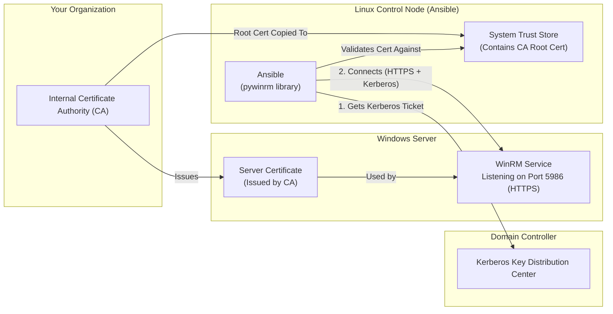

# WinRM Certificate Setup for Ansible

This tutorial provides a comprehensive guide to configuring **certificates and authentication** so that Ansible running on a Linux control node can securely connect to Windows servers via WinRM over HTTPS.

---

## Table of Contents

1. [Introduction: Why Certificates?](#1-introduction-why-certificates)
2. [The Big Picture](#2-the-big-picture)
3. [Understanding Certificates](#3-understanding-certificates)
4. [Step 1: Windows Server Certificate Setup](#4-step-1-windows-server-certificate-setup)
5. [Step 2: Linux Control Node Trust Setup](#5-step-2-linux-control-node-trust-setup)
6. [Step 3: Kerberos Authentication Setup](#6-step-3-kerberos-authentication-setup)
7. [Step 4: Ansible Configuration](#7-step-4-ansible-configuration)
8. [Testing the Connection](#8-testing-the-connection)
9. [Troubleshooting](#9-troubleshooting)
10. [Appendix: Certificate Scenarios](#10-appendix-certificate-scenarios)

---

## 1. Introduction: Why Certificates?

When Ansible connects to a Windows host, it uses **WinRM (Windows Remote Management)**. WinRM can operate over two protocols:

| Protocol | Port | Encryption | Status |
|----------|------|------------|--------|
| HTTP     | 5985 | None       | **Insecure. Do Not Use.** |
| HTTPS    | 5986 | TLS/SSL    | **Secure. Required for Production.** |

HTTPS encrypts all traffic between Ansible and the Windows server, preventing eavesdropping and man-in-the-middle attacks. To enable HTTPS, the Windows server needs an **SSL/TLS certificate**.

But a certificate alone isn't enough. The Ansible control node must also **trust** that certificate. Otherwise, it will refuse to connect because it cannot verify the server's identity. This is where understanding Certificate Authorities (CAs) becomes essential.

---

## 2. The Big Picture

Before diving into commands, let's visualize the entire system. There are **four key components** involved:



### What Happens When Ansible Connects

1. **Ansible obtains a Kerberos ticket** from the Domain Controller (KDC). This proves the Ansible user's identity.
2. **Ansible connects to the Windows Server** on port 5986 (HTTPS).
3. The Windows Server presents its **Server Certificate** to Ansible.
4. Ansible checks: "Is this certificate signed by a CA I trust?"
    * If the CA Root Certificate is in the Linux Trust Store, the answer is **Yes**. Connection proceeds.
    * If not, the answer is **No**. Connection **fails** with a certificate validation error.
5. Ansible sends the **Kerberos ticket** to the Windows Server for authentication.
6. If all checks pass, the WinRM session is established.

> [!IMPORTANT]
> **Two Independent Trust Relationships:**
>
> 1. **Certificate Trust**: Linux must trust the CA that issued the Windows server's certificate.
> 2. **Kerberos Trust**: Linux must be able to obtain a Kerberos ticket from the Domain Controller for the user.

---

## 3. Understanding Certificates

Certificates can be confusing. Here's a breakdown of the key concepts.

### What is a Certificate?

A digital certificate is like an ID card for a computer. It contains:

* **Subject Name (CN)**: The identity (e.g., `server01.example.com`).
* **Public Key**: Used for encryption.
* **Issuer**: Who signed and vouched for this certificate (the CA).
* **Validity Period**: When the certificate is valid.
* **Enhanced Key Usage (EKU)**: What the certificate can be used for (e.g., "Server Authentication").

### What is a Certificate Authority (CA)?

A Certificate Authority is a trusted entity that issues certificates. When a CA issues a certificate, it digitally signs it. This signature is the "seal of approval."

* **Root CA Certificate**: The CA's own certificate. This is the "trust anchor." If you trust the Root CA, you implicitly trust all certificates it has issued.
* **Intermediate CA**: Some organizations have a chain (Root CA → Intermediate CA → Server Cert). You need to trust the entire chain.

### Types of Certificates You'll Encounter

| Type | Description | File Extensions | Contains Private Key? |
|------|-------------|-----------------|-----------------------|
| **Root CA Certificate** | The trust anchor | `.crt`, `.cer`, `.pem` | No |
| **Server Certificate** | The Windows server's identity | `.crt`, `.cer`, `.pem` | No |
| **Private Key** | The secret key for the server | `.key` | Yes (This IS the key) |
| **PFX / PKCS#12** | A bundle containing the certificate AND private key | `.pfx`, `.p12` | Yes |

> [!CAUTION]
> **Private Keys are Secret!** Never share a `.key` or `.pfx` file. If compromised, an attacker can impersonate your server.

### The Chain of Trust

```
Root CA Certificate (Trusted by Linux)
    └── signs ──▶ Intermediate CA Certificate (Optional)
                        └── signs ──▶ Server Certificate (Used by Windows Server)
```

For Ansible to trust the Server Certificate, it must have the Root CA Certificate (and any Intermediate CA Certificates) in its trust store.

---

## 4. Step 1: Windows Server Certificate Setup

The Windows server needs a certificate with a private key in its Local Machine Personal certificate store (`Cert:\LocalMachine\My`) to enable the WinRM HTTPS listener.

### Option A: Certificate Already Exists (Auto-Enrollment / GPO)

Many organizations use Active Directory Certificate Services (AD CS) with auto-enrollment. In this case, the server likely already has a valid certificate.

**How to Check:**

```powershell
# List certificates in the Personal store
Get-ChildItem Cert:\LocalMachine\My | Format-Table Subject, Thumbprint, NotAfter -AutoSize
```

Look for a certificate where:

* `Subject` contains the server's hostname (e.g., `CN=server01.example.com`).
* `NotAfter` is in the future (not expired).

If a valid certificate exists, proceed to enable WinRM:

```powershell
Import-Module GDS.Windows
Enable-GDSWindowsRemoting  # Auto-detects the certificate
```

### Option B: Import a Certificate from a `.pfx` File

If your team provides you with a `.pfx` file (which bundles the certificate and its private key), import it:

```powershell
$pfxPath = "C:\certs\server01.pfx"
$pfxPassword = Read-Host -Prompt "Enter PFX password" -AsSecureString

Import-PfxCertificate -FilePath $pfxPath `
                      -CertStoreLocation "Cert:\LocalMachine\My" `
                      -Password $pfxPassword
```

Then enable WinRM:

```powershell
Import-Module GDS.Windows
Enable-GDSWindowsRemoting  # Auto-detects the imported certificate
```

### Option C: Generate a Self-Signed Certificate (Dev/Test Only)

For development or testing, you can generate a self-signed certificate. **Do not use this in production.**

```powershell
Import-Module GDS.Windows
Enable-GDSWindowsRemoting -ForceNewSSLCert
```

> [!WARNING]
> Self-signed certificates are not trusted by default. You will need to either:
>
> 1. Export the self-signed cert and import it into Linux's trust store (cumbersome).
> 2. Configure Ansible to skip certificate validation (insecure, not recommended for production).

### Verifying WinRM Listener

After running `Enable-GDSWindowsRemoting`, verify the HTTPS listener is active:

```powershell
winrm enumerate winrm/config/Listener
```

You should see output like:

```
Listener
    Address = *
    Transport = HTTPS
    Port = 5986
    Hostname = server01.example.com
    CertificateThumbprint = A1B2C3D4E5F6...
```

---

## 5. Step 2: Linux Control Node Trust Setup

The Ansible control node must trust the Certificate Authority (CA) that issued the Windows server's certificate.

### Step 2a: Obtain the CA Root Certificate

You need the **Root CA Certificate** (and any Intermediate CA Certificates) from your organization. This is typically a `.crt`, `.cer`, or `.pem` file.

**Where to get it:**

* Ask your IT Security or PKI team.
* Export it from a Windows machine that trusts the CA:

    ```powershell
    # On a domain-joined Windows machine
    # Open certmgr.msc, navigate to Trusted Root Certification Authorities,
    # right-click the CA, All Tasks > Export (Base-64 encoded X.509 .CER)
    ```

### Step 2b: Import the CA Root Certificate into Linux Trust Store

**Debian/Ubuntu:**

```bash
# Copy the certificate
sudo cp internal-ca.crt /usr/local/share/ca-certificates/

# Update the trust store
sudo update-ca-certificates
```

**RHEL/CentOS/Fedora:**

```bash
# Copy the certificate
sudo cp internal-ca.crt /etc/pki/ca-trust/source/anchors/

# Update the trust store
sudo update-ca-trust
```

### Step 2c: Verify the CA is Trusted

```bash
# Test using openssl
openssl s_client -connect server01.example.com:5986 </dev/null 2>/dev/null | openssl x509 -noout -issuer

# Expected output: issuer= /DC=com/DC=example/CN=Example-Root-CA
```

If the connection fails or shows "unable to get local issuer certificate," the CA is not properly trusted.

---

## 6. Step 3: Kerberos Authentication Setup

Kerberos is the recommended authentication method for domain-joined Windows servers. It uses tickets instead of passwords, making it more secure.

### Step 3a: Install Kerberos Packages

**Debian/Ubuntu:**

```bash
sudo apt-get update
sudo apt-get install -y krb5-user libkrb5-dev
```

**RHEL/CentOS/Fedora:**

```bash
sudo dnf install -y krb5-workstation krb5-devel
```

### Step 3b: Configure Kerberos (`/etc/krb5.conf`)

Edit `/etc/krb5.conf` to define your Active Directory domain:

```ini
[libdefaults]
    default_realm = EXAMPLE.COM
    dns_lookup_realm = false
    dns_lookup_kdc = true
    ticket_lifetime = 24h
    renew_lifetime = 7d
    forwardable = true
    rdns = false

[realms]
    EXAMPLE.COM = {
        kdc = dc01.example.com
        admin_server = dc01.example.com
    }

[domain_realm]
    .example.com = EXAMPLE.COM
    example.com = EXAMPLE.COM
```

**Key Settings:**

* `default_realm`: Your AD domain in **UPPERCASE**.
* `kdc`: The hostname of your Domain Controller.
* `[domain_realm]`: Maps DNS domains to Kerberos realms.

### Step 3c: Install Python Kerberos Libraries

Ansible uses the `pywinrm` library with Kerberos support:

```bash
pip install pywinrm[kerberos]
```

### Step 3d: Obtain a Kerberos Ticket

Before running Ansible, you must obtain a Kerberos ticket:

```bash
# Replace with your domain user (must be UPPERCASE realm)
kinit your_username@EXAMPLE.COM
```

You will be prompted for your password. After successful authentication:

```bash
# Verify the ticket
klist
```

Expected output:

```
Ticket cache: FILE:/tmp/krb5cc_1000
Default principal: your_username@EXAMPLE.COM

Valid starting       Expires              Service principal
12/05/2024 22:00:00  12/06/2024 08:00:00  krbtgt/EXAMPLE.COM@EXAMPLE.COM
```

> [!TIP]
> Tickets expire! By default, they last 10-24 hours. You can renew with `kinit -R` or re-authenticate.

---

## 7. Step 4: Ansible Configuration

Now that the Windows server has a certificate and the Linux node trusts it, configure Ansible.

### Inventory Variables

Configure your inventory file (e.g., `inventory/group_vars/windows.yml`):

```yaml
# Connection Settings
ansible_connection: winrm
ansible_port: 5986
ansible_winrm_scheme: https
ansible_winrm_transport: kerberos

# Certificate Validation (IMPORTANT!)
ansible_winrm_server_cert_validation: validate

# Optional: Kerberos realm (usually auto-detected)
ansible_winrm_kerberos_delegation: false
```

**Key Settings Explained:**

| Variable | Value | Purpose |
|----------|-------|---------|
| `ansible_connection` | `winrm` | Use WinRM instead of SSH |
| `ansible_port` | `5986` | HTTPS port |
| `ansible_winrm_scheme` | `https` | Use HTTPS, not HTTP |
| `ansible_winrm_transport` | `kerberos` | Use Kerberos authentication |
| `ansible_winrm_server_cert_validation` | `validate` | **Validate the server certificate** |

> [!CAUTION]
> **Do NOT set `ansible_winrm_server_cert_validation: ignore` in production.**
> This disables certificate validation, making you vulnerable to man-in-the-middle attacks.

### Example Inventory File

```ini
# inventory/production/hosts.ini
[windows]
server01.example.com
server02.example.com

[windows:vars]
ansible_user=your_username@EXAMPLE.COM
```

---

## 8. Testing the Connection

### Test 1: Basic Connectivity

```bash
# Ensure you have a valid Kerberos ticket
kinit your_username@EXAMPLE.COM

# Test with Ansible
ansible windows -i inventory/production -m win_ping
```

**Expected Output:**

```
server01.example.com | SUCCESS => {
    "changed": false,
    "ping": "pong"
}
```

### Test 2: Verbose Output for Troubleshooting

If the connection fails, use verbose mode:

```bash
ansible windows -i inventory/production -m win_ping -vvvv
```

---

## 9. Troubleshooting

### Problem: Certificate Validation Failed

**Error:**

```
ssl.SSLCertVerificationError: [SSL: CERTIFICATE_VERIFY_FAILED] certificate verify failed: unable to get local issuer certificate
```

**Cause:** The Linux node does not trust the CA that issued the Windows server's certificate.

**Solution:**

1. Obtain the CA Root Certificate (`.crt` file).
2. Import it into the Linux trust store (see [Step 2b](#step-2b-import-the-ca-root-certificate-into-linux-trust-store)).

---

### Problem: Kerberos Ticket Not Found

**Error:**

```
kerberos: authGSSClientStep() failed: GSSAPI Error: No Kerberos credentials available
```

**Cause:** No valid Kerberos ticket exists.

**Solution:**

```bash
kinit your_username@EXAMPLE.COM
```

---

### Problem: WinRM Connection Refused

**Error:**

```
winrm.exceptions.WinRMTransportError: [Errno 111] Connection refused
```

**Cause:** WinRM HTTPS listener is not running, or firewall is blocking port 5986.

**Solution (on Windows):**

```powershell
# Check if listener is configured
winrm enumerate winrm/config/Listener

# Check firewall
netsh advfirewall firewall show rule name="Allow WinRM HTTPS"
```

---

### Problem: Certificate Name Mismatch

**Error:**

```
ssl.SSLCertVerificationError: [SSL: CERTIFICATE_VERIFY_FAILED] certificate verify failed: Hostname mismatch
```

**Cause:** The certificate's Subject or Subject Alternative Name (SAN) does not match the hostname you're connecting to.

**Solution:**

* Ensure you connect using the exact hostname in the certificate (e.g., `server01.example.com`, not `server01` or an IP address).
* If using IP addresses, the certificate must include the IP in its SAN.

---

## 10. Appendix: Certificate Scenarios

### Scenario A: Enterprise with Internal CA (Recommended)

| Component | Configuration |
|-----------|---------------|
| Windows Server | Certificate issued by Internal CA, installed in `Cert:\LocalMachine\My` |
| Linux Node | Internal CA Root Certificate imported into `/usr/local/share/ca-certificates/` |
| Ansible | `ansible_winrm_server_cert_validation: validate` |

### Scenario B: Self-Signed Certificates (Dev/Test Only)

| Component | Configuration |
|-----------|---------------|
| Windows Server | Self-signed certificate generated by `Enable-GDSWindowsRemoting -ForceNewSSLCert` |
| Linux Node | Either: (1) Import the self-signed cert into trust store, OR (2) Disable validation (insecure) |
| Ansible | `ansible_winrm_server_cert_validation: ignore` (⚠️ Not recommended for production) |

### Scenario C: Public CA (Rare for Internal Servers)

| Component | Configuration |
|-----------|---------------|
| Windows Server | Certificate issued by a public CA (e.g., Let's Encrypt, DigiCert) |
| Linux Node | No additional configuration needed (public CAs are trusted by default) |
| Ansible | `ansible_winrm_server_cert_validation: validate` |

---

## Summary Checklist

Use this checklist to verify your setup:

* [ ] **Windows Server**: Has a valid Server Authentication certificate in `Cert:\LocalMachine\My`
* [ ] **Windows Server**: WinRM HTTPS listener is active on port 5986
* [ ] **Windows Server**: Firewall allows inbound TCP 5986
* [ ] **Linux Node**: CA Root Certificate is imported into the system trust store
* [ ] **Linux Node**: Kerberos is configured (`/etc/krb5.conf`)
* [ ] **Linux Node**: `pywinrm[kerberos]` is installed
* [ ] **Linux Node**: User has a valid Kerberos ticket (`klist` shows ticket)
* [ ] **Ansible**: Inventory uses `ansible_winrm_server_cert_validation: validate`
* [ ] **Test**: `ansible windows -m win_ping` returns SUCCESS
