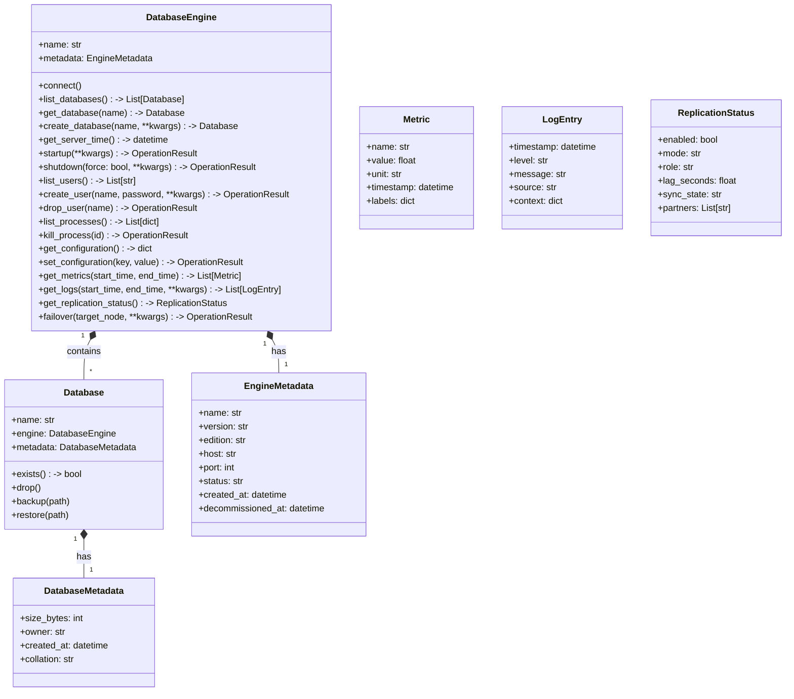

# GDS Database - Object-Oriented Design Document

**Date:** 2025-11-21
**Status:** Draft

## 1. Overview

This document outlines the design for refactoring the `gds_database` package to support a robust, extensible object-oriented model for database management. The goal is to provide a unified interface for interacting with various database platforms (MSSQL, PostgreSQL, Snowflake, MongoDB) while allowing for platform-specific features.

## 2. Core Concepts

The design is built around two primary entities:

1.  **DatabaseEngine**: Represents the database server, cluster, or account. It is the entry point for administration and contains one or more databases.
2.  **Database**: Represents a specific database within an engine. It is the unit of data organization and management (backup, restore, etc.).

### 2.1 Hierarchy



## 3. Abstractions (gds_database)

The `gds_database` package will define the abstract base classes (ABCs) and protocols.

### 3.1 DatabaseEngine (ABC)

Represents the server/cluster.

```python
class DatabaseEngine(ABC):
    def __init__(self, connection: DatabaseConnection):
        self.connection = connection

    @abstractmethod
    def get_version(self) -> str:
        """Return server version information."""
        pass

    @abstractmethod
    def list_databases(self) -> List['Database']:
        """List all databases on this engine."""
        pass

    @abstractmethod
    def get_database(self, name: str) -> 'Database':
        """Get a handle to a specific database (does not imply existence)."""
        pass

    @abstractmethod
    def get_server_time(self) -> datetime:
        """Get the current time on the database server."""
        pass

    @abstractmethod
    def startup(self, **kwargs) -> OperationResult:
        """Start the database engine."""
        pass

    @abstractmethod
    def shutdown(self, force: bool = False, **kwargs) -> OperationResult:
        """Stop the database engine."""
        pass

    # User Management
    @abstractmethod
    def list_users(self) -> List[str]:
        """List all users/logins on the engine."""
        pass

    @abstractmethod
    def create_user(self, name: str, password: str, **kwargs) -> OperationResult:
        """Create a new user/login."""
        pass

    @abstractmethod
    def drop_user(self, name: str) -> OperationResult:
        """Drop a user/login."""
        pass

    # Process Management
    @abstractmethod
    def list_processes(self) -> List[dict]:
        """List active processes/sessions."""
        pass

    @abstractmethod
    def kill_process(self, process_id: str) -> OperationResult:
        """Terminate a process/session."""
        pass

    # Configuration
    @abstractmethod
    def get_configuration(self) -> dict:
        """Get current server configuration."""
        pass

    @abstractmethod
    def set_configuration(self, key: str, value: Any) -> OperationResult:
        """Update server configuration."""
        pass

    # Observability
    @abstractmethod
    def get_metrics(self, start_time: datetime, end_time: datetime) -> List['Metric']:
        """Get engine metrics (CPU, Memory, Connections, etc.)."""
        pass

    @abstractmethod
    def get_logs(self, start_time: datetime, end_time: datetime, **kwargs) -> List['LogEntry']:
        """Get engine logs."""
        pass

    # High Availability & Disaster Recovery
    @abstractmethod
    def get_replication_status(self) -> 'ReplicationStatus':
        """Get current replication status."""
        pass

    @abstractmethod
    def failover(self, target_node: Optional[str] = None, **kwargs) -> OperationResult:
        """Initiate a failover to a standby node."""
        pass
```

### 3.2 Database (ABC)

Represents a single database.

```python
class Database(ABC):
    def __init__(self, engine: DatabaseEngine, name: str):
        self.engine = engine
        self.name = name

    @property
    @abstractmethod
    def metadata(self) -> DatabaseMetadata:
        """Get database metadata."""
        pass

    @abstractmethod
    def exists(self) -> bool:
        """Check if the database exists."""
        pass

    # Common Operations
    @abstractmethod
    def backup(self, path: str, **kwargs) -> OperationResult:
        pass
```

## 4. Extensibility

New database platforms can be added by:
1.  Creating a new package (e.g., `gds_oracle`).
2.  Inheriting from `DatabaseEngine` (e.g., `OracleEngine`).
3.  Inheriting from `Database` (e.g., `OracleDatabase`).
4.  Inheriting from `DatabaseMetadata` (e.g., `OracleMetadata`).

## 5. Package Structure

We recommend keeping the core abstractions in `gds_database` and platform-specific implementations in their respective packages.

```
gds_database/
  ├── __init__.py
  ├── base.py          # Existing connection ABCs
  ├── engine.py        # New DatabaseEngine ABC
  ├── database.py      # New Database ABC
  └── metadata.py      # New Metadata dataclasses
```

## 6. Example Usage

```python
# MSSQL Implementation
from gds_mssql import MSSQLEngine

# Connect to engine
engine = MSSQLEngine(connection_string="...")

# List databases
for db in engine.list_databases():
    print(f"Found DB: {db.name} ({db.metadata.size_bytes} bytes)")

# Manage a specific DB
my_db = engine.get_database("TargetDB")
if not my_db.exists():
    my_db.create(collation="Latin1_General_CI_AS")

my_db.backup("/tmp/backup.bak")
```
