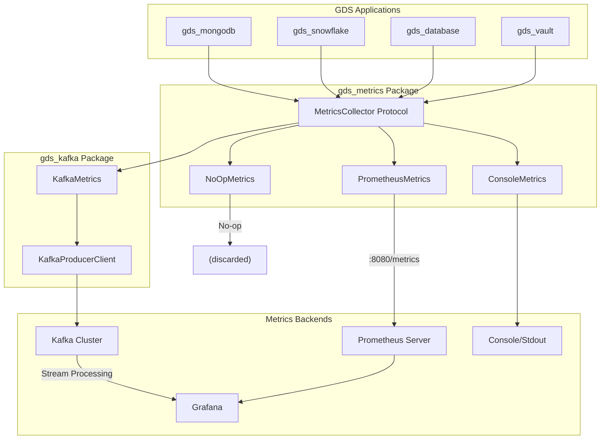
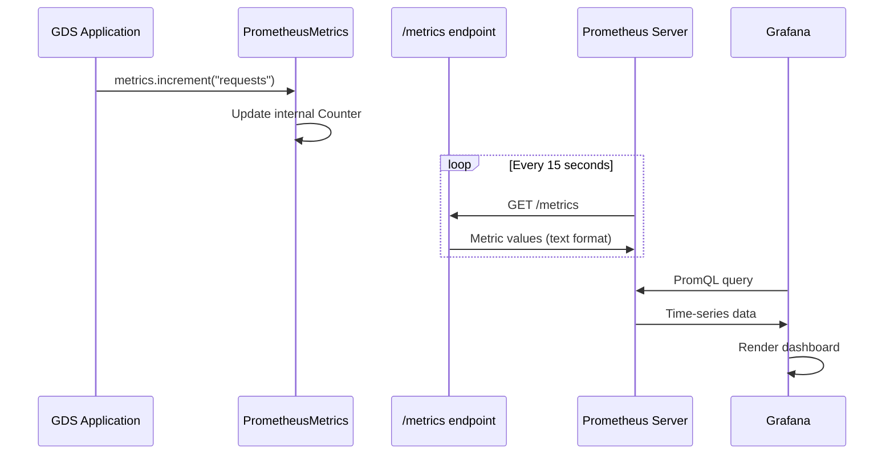
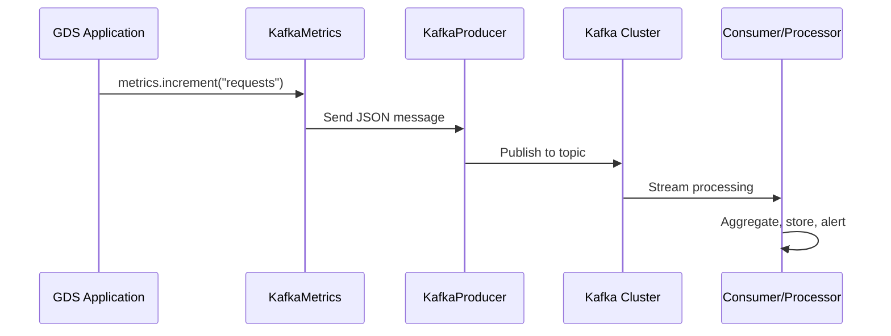

# GDS Metrics Architecture

## Overview

The GDS Metrics system provides a unified, protocol-based approach to metrics collection across all GDS tooling packages. It follows the **Strategy Pattern**, allowing applications to swap metrics backends without code changes.

---

## Architecture Diagram



---

## Data Flow

### Prometheus Path



### Kafka Path



---

## Component Details

### MetricsCollector Protocol

The core interface that all implementations must satisfy:

```python
from typing import Protocol, Optional

class MetricsCollector(Protocol):
    """Protocol for metrics collection - implement for any backend."""

    def increment(
        self,
        name: str,
        value: int = 1,
        labels: Optional[dict[str, str]] = None
    ) -> None:
        """Increment a counter metric."""
        ...

    def gauge(
        self,
        name: str,
        value: float,
        labels: Optional[dict[str, str]] = None
    ) -> None:
        """Set a gauge to a specific value."""
        ...

    def histogram(
        self,
        name: str,
        value: float,
        labels: Optional[dict[str, str]] = None
    ) -> None:
        """Record a value in a histogram (for distributions)."""
        ...

    def timing(
        self,
        name: str,
        value_ms: float,
        labels: Optional[dict[str, str]] = None
    ) -> None:
        """Record a timing measurement in milliseconds."""
        ...
```

### Metric Types

| Type | Use Case | Example |
|------|----------|---------|
| **Counter** | Cumulative values that only increase | `requests_total`, `errors_total` |
| **Gauge** | Values that can go up or down | `active_connections`, `queue_size` |
| **Histogram** | Distribution of values | `request_duration_seconds`, `response_size_bytes` |
| **Timing** | Duration measurements | `db_query_ms`, `api_latency_ms` |

---

## Implementation Classes

### NoOpMetrics (Default)

Zero-overhead implementation that discards all metrics. Used when metrics collection is disabled.

```python
class NoOpMetrics:
    """Null object pattern - does nothing."""

    def increment(self, name, value=1, labels=None): pass
    def gauge(self, name, value, labels=None): pass
    def histogram(self, name, value, labels=None): pass
    def timing(self, name, value_ms, labels=None): pass
```

### ConsoleMetrics (Debugging)

Prints metrics to stdout for debugging and development.

```python
class ConsoleMetrics:
    """Print metrics to console for debugging."""

    def increment(self, name, value=1, labels=None):
        print(f"[COUNTER] {name}: +{value} {labels or {}}")
```

### PrometheusMetrics

Exposes metrics via HTTP endpoint for Prometheus scraping.

```python
class PrometheusMetrics:
    """Prometheus metrics with HTTP endpoint."""

    def __init__(self, prefix: str = "gds", port: int = 8080):
        from prometheus_client import Counter, Gauge, Histogram, start_http_server

        self._prefix = prefix
        self._counters = {}
        self._gauges = {}
        self._histograms = {}

        # Start HTTP server for /metrics endpoint
        start_http_server(port)
```

### KafkaMetrics (via gds_kafka)

Streams metrics as JSON to Kafka topics for real-time processing.

```python
from gds_kafka import KafkaProducerClient

class KafkaMetrics:
    """Stream metrics to Kafka."""

    def __init__(self, producer: KafkaProducerClient, topic: str = "metrics"):
        self._producer = producer
        self._topic = topic

    def increment(self, name, value=1, labels=None):
        self._producer.send(self._topic, {
            "type": "counter",
            "name": name,
            "value": value,
            "labels": labels or {},
            "timestamp": time.time()
        })
```

---

## Integration Pattern

### Recommended Usage in GDS Packages

```python
# In gds_vault/client.py
from typing import TYPE_CHECKING, Optional

if TYPE_CHECKING:
    from gds_metrics import MetricsCollector

class VaultClient:
    def __init__(
        self,
        vault_addr: str,
        metrics: Optional["MetricsCollector"] = None,
        ...
    ):
        # Import here to avoid hard dependency
        from gds_metrics import NoOpMetrics
        self._metrics = metrics or NoOpMetrics()

    def get_secret(self, path: str) -> dict:
        start_time = time.time()

        try:
            # Check cache
            if path in self._cache:
                self._metrics.increment("cache_hits")
                return self._cache[path]

            self._metrics.increment("cache_misses")

            # Fetch from Vault
            secret = self._fetch_from_vault(path)
            self._metrics.increment("requests", labels={"status": "success"})
            return secret

        except Exception as e:
            self._metrics.increment("requests", labels={"status": "error"})
            raise

        finally:
            duration_ms = (time.time() - start_time) * 1000
            self._metrics.timing("request_duration_ms", duration_ms)
```

---

## Deployment Examples

### Prometheus + Grafana

```python
from gds_vault import VaultClient
from gds_metrics import PrometheusMetrics

# Create metrics collector (starts HTTP server on port 8080)
metrics = PrometheusMetrics(prefix="vault", port=8080)

# Or disable auto-start for custom server setup
metrics = PrometheusMetrics(prefix="vault", start_server=False)

# Use with Vault client
client = VaultClient(metrics=metrics)

# Prometheus scrapes http://your-app:8080/metrics
# Grafana queries Prometheus for visualization
```

### Kafka Streaming

```python
from gds_vault import VaultClient
from gds_kafka import KafkaProducerClient, KafkaMetrics

# Create Kafka producer
kafka = KafkaProducerClient("kafka-broker:9092")

# Create metrics collector
metrics = KafkaMetrics(kafka, topic="vault-metrics")

# Use with Vault client
client = VaultClient(metrics=metrics)

# Metrics stream to Kafka topic in real-time
```

### Multiple Backends (Fan-out)

```python
from gds_metrics import CompositeMetrics, PrometheusMetrics, ConsoleMetrics

# Send metrics to multiple backends
metrics = CompositeMetrics([
    PrometheusMetrics(prefix="vault"),
    ConsoleMetrics(),  # Also print for debugging
])

client = VaultClient(metrics=metrics)
```

---

## Metric Naming Conventions

Follow Prometheus naming conventions:

| Convention | Example | Description |
|------------|---------|-------------|
| Snake case | `request_duration_seconds` | All lowercase with underscores |
| Unit suffix | `_seconds`, `_bytes`, `_total` | Include unit in name |
| `_total` for counters | `requests_total` | Cumulative counters end in `_total` |
| Prefix with app name | `vault_requests_total` | Namespace by application |

### Standard Labels

```python
# Common labels used across GDS packages
labels = {
    "service": "vault",        # Service name
    "environment": "prod",     # Environment (dev/staging/prod)
    "operation": "get_secret", # Operation type
    "status": "success",       # Outcome (success/error)
}
```

---

## Performance Considerations

| Implementation | Overhead | Use Case |
|----------------|----------|----------|
| `NoOpMetrics` | ~0 ns | Production without metrics |
| `ConsoleMetrics` | ~1 µs | Development/debugging |
| `PrometheusMetrics` | ~5 µs | Production monitoring |
| `KafkaMetrics` | ~100 µs | Real-time streaming |

### Best Practices

1. **Use NoOpMetrics by default** - Zero overhead when metrics disabled
2. **Batch Kafka sends** - Reduce network calls
3. **Limit label cardinality** - Too many unique label values = memory explosion
4. **Use histograms sparingly** - More expensive than counters

---

## Testing

```python
import unittest
from gds_metrics import NoOpMetrics, ConsoleMetrics

class TestMetricsCollector(unittest.TestCase):
    def test_increment(self):
        metrics = ConsoleMetrics()
        metrics.increment("test_counter", value=5)
        # Verify output or state

    def test_noop_no_errors(self):
        metrics = NoOpMetrics()
        # Should not raise
        metrics.increment("anything")
        metrics.gauge("anything", 42)
```
