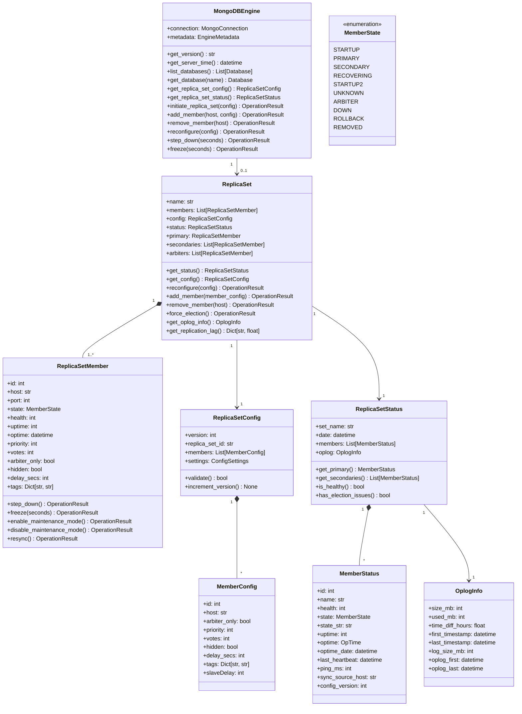

# MongoDB OOP Design
## Complete Object-Oriented Model for MongoDB Management

---

## 1. Overview

This document defines a comprehensive object-oriented design for managing MongoDB deployments, with emphasis on **Replica Sets** for high availability and disaster recovery. The design covers the complete lifecycle: provisioning, operations, monitoring, and troubleshooting.

> **Critical Design Note:**
> MongoDB implements **engine-level replication** via replica sets. Unlike MSSQL or Snowflake where replication is database-specific, MongoDB's replica set replicates ALL databases in the instance together. The `ReplicaSet` is therefore a property of `MongoDBEngine`, not individual databases.

## 2. Core Domain Model



## 3. Detailed Class Definitions

### 3.1 MongoDBEngine (Extends DatabaseEngine)

**Purpose:** Main entry point for MongoDB administration

**Attributes:**
- `connection: MongoConnection` - Connection to MongoDB instance
- `metadata: EngineMetadata` - Engine metadata
- `replica_set: Optional[ReplicaSet]` - Associated replica set (if configured)

**Core Operations:**
```python
# Replica Set Management
def get_replica_set_config() -> ReplicaSetConfig
def get_replica_set_status() -> ReplicaSetStatus
def initiate_replica_set(config: ReplicaSetConfig) -> OperationResult
def add_member(host: str, member_config: MemberConfig) -> OperationResult
def remove_member(host: str) -> OperationResult
def reconfigure(config: ReplicaSetConfig, force: bool = False) -> OperationResult

# Primary Management
def step_down(step_down_secs: int = 60, secondary_catch_up_secs: int = 10) -> OperationResult
def freeze(seconds: int) -> OperationResult  # Prevent secondary from becoming primary

# Monitoring
def get_oplog_status() -> OplogInfo
def get_replication_lag() -> Dict[str, float]  # hostname -> lag in seconds
def get_server_status() -> Dict[str, Any]
```

### 3.2 ReplicaSet

**Purpose:** Represents a MongoDB replica set

**Attributes:**
- `name: str` - Replica set name
- `members: List[ReplicaSetMember]` - All members
- `config: ReplicaSetConfig` - Current configuration
- `status: ReplicaSetStatus` - Current status
- `protocol_version: int` - Replication protocol version

**Key Operations:**
```python
# Configuration
def reconfigure(config: ReplicaSetConfig, force: bool = False) -> OperationResult
def add_member(member_config: MemberConfig) -> OperationResult
def remove_member(host: str) -> OperationResult

# Topology
def get_primary() -> ReplicaSetMember
def get_secondaries() -> List[ReplicaSetMember]
def get_arbiters() -> List[ReplicaSetMember]
def get_voting_members() -> List[ReplicaSetMember]
def get_data_bearing_members() -> List[ReplicaSetMember]

# Election & Failover
def force_election() -> OperationResult
def step_down_primary(seconds: int) -> OperationResult

# Health & Monitoring
def is_healthy() -> bool
def get_replication_lag() -> Dict[str, float]
def get_oplog_info() -> OplogInfo
def check_election_issues() -> List[str]  # Returns warnings

# Maintenance
def enable_maintenance_mode(member_host: str) -> OperationResult
def disable_maintenance_mode(member_host: str) -> OperationResult
def resync_member(member_host: str) -> OperationResult
```

### 3.3 ReplicaSetMember

**Purpose:** Represents a single member of a replica set

**Attributes:**
```python
id: int                    # Unique member ID (0-255)
host: str                  # Hostname
port: int                  # Port (default 27017)
state: MemberState         # Current state (PRIMARY, SECONDARY, etc.)
health: int                # 0 = down, 1 = up
uptime: int                # Seconds since started
optime: datetime           # Last operation timestamp
priority: int              # Election priority (0-1000, 0 = cannot be primary)
votes: int                 # Number of votes (0 or 1)
arbiter_only: bool         # Is this an arbiter?
hidden: bool               # Hidden from application reads
delay_secs: int            # Replication delay (delayed member)
tags: Dict[str, str]       # Custom tags for read preference
sync_source_host: str      # Currently syncing from this member
ping_ms: int               # Network latency
last_heartbeat: datetime   # Last heartbeat received
```

**Operations:**
```python
def step_down() -> OperationResult           # If primary, step down
def freeze(seconds: int) -> OperationResult  # Prevent election
def enable_maintenance_mode() -> OperationResult
def disable_maintenance_mode() -> OperationResult
def resync() -> OperationResult              # Full resync
def get_oplog_lag(reference: datetime) -> float
```

### 3.4 ReplicaSetConfig

**Purpose:** Configuration document for replica set

**Structure:**
```python
version: int                    # Configuration version (incremented on change)
replica_set_id: ObjectId        # Unique replica set identifier
members: List[MemberConfig]     # Member configurations
settings: ConfigSettings        # Global settings

class ConfigSettings:
    chaining_allowed: bool = True
    heartbeat_interval_millis: int = 2000
    heartbeat_timeout_secs: int = 10
    election_timeout_millis: int = 10000
    catchup_timeout_millis: int = -1
    getLastErrorModes: Dict[str, Dict[str, int]]  # Write concern modes
    getLastErrorDefaults: Dict[str, Any]
    reconfig_max_attempts: int = 10
```

**Operations:**
```python
def validate() -> bool                # Validate configuration
def increment_version() -> None       # Bump version for reconfig
def add_member(member: MemberConfig) -> None
def remove_member(member_id: int) -> None
def update_member(member_id: int, updates: Dict) -> None
def to_dict() -> Dict                 # For rs.reconfig()
```

### 3.5 MemberConfig

**Purpose:** Configuration for a single member

**Attributes:**
```python
id: int                    # Unique member ID
host: str                  # hostname:port
arbiter_only: bool = False
priority: int = 1          # 0-1000 (0 = cannot be primary)
votes: int = 1             # 0 or 1
hidden: bool = False       # Hidden from application
delay_secs: int = 0        # Replication delay
tags: Dict[str, str] = {}  # Custom tags
```

### 3.6 OplogInfo

**Purpose:** Oplog sizing and timing information

**Attributes:**
```python
size_mb: int               # Configured oplog size
used_mb: int               # Current usage
time_diff_hours: float     # Hours of operations covered
first_timestamp: datetime  # Oldest oplog entry
last_timestamp: datetime   # Newest oplog entry
log_size_mb: int          # Actual on-disk size
```

**Derived Metrics:**
```python
def get_usage_percent() -> float
def get_headroom_hours() -> float
def needs_resize() -> bool
```

## 4. High Availability & Disaster Recovery

### 4.1 Election Management

```python
class ElectionManager:
    """Manages replica set elections and failover"""

    def force_election() -> OperationResult
        """Trigger immediate election"""

    def configure_priorities(priorities: Dict[str, int]) -> OperationResult
        """Set member priorities for election preference"""

    def check_election_quorum() -> bool
        """Verify sufficient voting members"""

    def get_election_history() -> List[ElectionEvent]
        """Get recent election events from logs"""
```

### 4.2 Failover Scenarios

**Automatic Failover:**
- Primary failure detection (heartbeat timeout: 10s default)
- Election initiation by secondaries
- Majority vote required (>50% of voting members)
- New primary elected (highest priority among eligible)
- Clients automatically reconnect to new primary

**Planned Failover:**
```python
def planned_failover(target_secondary: str = None):
    """
    1. Primary calls rs.stepDown(60)
    2. Freezes for specified seconds
    3. Eligible secondaries hold election
    4. Specific secondary can be preferred via priority
    """
```

### 4.3 Replication Lag Monitoring

```python
class ReplicationMonitor:
    """Monitor replication health and lag"""

    def get_replication_lag(member: str) -> float
        """Get lag in seconds for a member"""

    def get_lag_threshold() -> float
        """Get warning threshold (default: 10 seconds)"""

    def check_lag_alerts() -> List[Alert]
        """Check if any members exceed threshold"""

    def get_oplog_window() -> timedelta
        """Get oplog time window"""

    def estimate_catch_up_time(member: str) -> timedelta
        """Estimate time for member to catch up"""
```

## 5. Provisioning & Operations

### 5.1 Replica Set Initialization

```python
class ReplicaSetProvisioner:
    """Provision new replica sets"""

    def provision_replica_set(
        name: str,
        members: List[MemberConfig],
        settings: Optional[ConfigSettings] = None
    ) -> ReplicaSet:
        """
        1. Validate member configurations
        2. Initiate replica set on first member
        3. Add remaining members
        4. Wait for initial sync
        5. Verify healthy state
        """

    def add_member_with_sync(
        host: str,
        config: MemberConfig,
        wait_for_sync: bool = True
    ) -> OperationResult:
        """Add member and optionally wait for initial sync"""

    def expand_replica_set(
        additional_members: List[MemberConfig]
    ) -> OperationResult:
        """Add multiple members efficiently"""
```

### 5.2 Maintenance Operations

```python
class MaintenanceManager:
    """Replica set maintenance operations"""

    def rolling_restart(order: str = "secondaries_first") -> OperationResult
        """Restart all members with minimal downtime"""

    def rolling_upgrade(version: str) -> OperationResult
        """Upgrade MongoDB version across replica set"""

    def compact_member(member: str) -> OperationResult
        """Compact data files on a member"""

    def backup_replica_set(
        backup_type: str = "secondary",
        destination: str
    ) -> OperationResult:
        """Backup from a secondary without impacting primary"""

    def perform_maintenance_on_member(
        member: str,
        operation: Callable
    ) -> OperationResult:
        """
        1. Enable maintenance mode
        2. Execute operation
        3. Wait for sync
        4. Disable maintenance mode
        """
```

## 6. Monitoring & Troubleshooting

### 6.1 Health Metrics

```python
class HealthMonitor:
    """Monitor replica set health"""

    # Overall Health
    def is_healthy() -> bool
    def get_health_score() -> int  # 0-100
    def get_health_report() -> HealthReport

    # Member Health
    def check_member_health(member: str) -> MemberHealth
    def get_unhealthy_members() -> List[str]

    # Connectivity
    def check_network_connectivity() -> Dict[str, Dict[str, int]]
    def get_heartbeat_latencies() -> Dict[str, int]

    # Replication Health
    def check_replication_health() -> ReplicationHealth
    def get_oplog_health() -> OplogHealth
```

### 6.2 Performance Metrics

```python
class PerformanceMonitor:
    """Monitor replica set performance"""

    def get_oplog_throughput() -> float     # ops/sec
    def get_replication_rate() -> Dict[str, float]
    def get_network_io() -> Dict[str, Dict[str, int]]
    def get_disk_io() -> Dict[str, Dict[str, int]]
    def get_member_load() -> Dict[str, ServerLoad]
```

### 6.3 Troubleshooting Tools

```python
class TroubleshootingTools:
    """Diagnostic and troubleshooting utilities"""

    def diagnose_replication_lag(member: str) -> DiagnosticReport
        """Analyze why a member is lagging"""

    def diagnose_election_failure() -> DiagnosticReport
        """Analyze failed elections"""

    def check_split_brain() -> bool
        """Check for split brain scenarios"""

    def validate_configuration() -> List[ConfigWarning]
        """Validate replica set configuration"""

    def analyze_oplog() -> OplogAnalysis
        """Analyze oplog for bottlenecks"""

    def get_sync_source_tree() -> SyncTree
        """Visualize replication sync sources"""
```

## 7. Example Usage

### 7.1 Provisioning a New Replica Set

```python
from gds_mongodb import MongoDBEngine, ReplicaSetProvisioner, MemberConfig

# Define members
members = [
    MemberConfig(id=0, host="mongo1:27017", priority=2),
    MemberConfig(id=1, host="mongo2:27017", priority=1),
    MemberConfig(id=2, host="mongo3:27017", priority=1),
]

# Provision
provisioner = ReplicaSetProvisioner()
replica_set = provisioner.provision_replica_set(
    name="rs0",
    members=members
)

# Verify
assert replica_set.is_healthy()
print(f"Primary: {replica_set.get_primary().host}")
```

### 7.2 Monitoring Replication

```python
from gds_mongodb import MongoDBEngine, ReplicationMonitor

engine = MongoDBEngine(connection)
monitor = ReplicationMonitor(engine)

# Check lag
lag = monitor.get_replication_lag("mongo2:27017")
if lag > 10:
    print(f"WARNING: Replication lag is {lag} seconds")

# Check oplog
oplog_info = engine.get_oplog_status()
print(f"Oplog covers {oplog_info.time_diff_hours} hours")
if oplog_info.get_usage_percent() > 80:
    print("WARNING: Oplog is 80% full")
```

### 7.3 Planned Failover

```python
from gds_mongodb import MongoDBEngine

engine = MongoDBEngine(connection)
replica_set = engine.replica_set

# Step down current primary
result = replica_set.step_down_primary(seconds=60)
if result.success:
    print(f"Stepped down, new primary will be elected")

    # Wait for election
    time.sleep(15)

    # Verify new primary
    new_primary = replica_set.get_primary()
    print(f"New primary: {new_primary.host}")
```

### 7.4 Adding a Member

```python
from gds_mongodb import MongoDBEngine, MemberConfig

engine = MongoDBEngine(connection)

# Add new member
new_member = MemberConfig(
    id=3,
    host="mongo4:27017",
    priority=1
)

result = engine.add_member("mongo4:27017", new_member)
if result.success:
    print("Member added successfully")

    # Wait for initial sync
    time.sleep(60)

    # Check status
    status = engine.get_replica_set_status()
    member_status = next(m for m in status.members if m.name == "mongo4:27017")
    print(f"New member state: {member_status.state_str}")
```

## 8. Implementation Notes

### 8.1 Key Considerations

1. **Thread Safety**: All operations must be thread-safe for concurrent access
2. **Connection Pooling**: Reuse connections efficiently
3. **Error Handling**: Graceful handling of network failures, elections
4. **Retry Logic**: Automatic retry for transient failures
5. **Timeouts**: Configurable timeouts for all operations
6. **Logging**: Comprehensive logging of all operations

### 8.2 Dependencies

```python
# Required MongoDB Driver
from pymongo import MongoClient, monitoring
from pymongo.errors import (
    ConnectionFailure,
    ConfigurationError,
    OperationFailure,
    ServerSelectionTimeoutError
)

# For monitoring
from pymongo.monitoring import (
    CommandListener,
    ServerListener,
    TopologyListener
)
```

### 8.3 Testing Strategy

1. **Unit Tests**: Test each class in isolation
2. **Integration Tests**: Test with real MongoDB instances
3. **Replica Set Tests**: Test elections, failover scenarios
4. **Performance Tests**: Test under load, lag scenarios
5. **Chaos Engineering**: Simulate failures (network, members)

---

## 9. Summary

This OOP design provides a comprehensive model for MongoDB management with emphasis on:

✅ **Complete Replica Set Management** - Provisioning, configuration, member management
✅ **High Availability** - Election management, failover handling
✅ **Disaster Recovery** - Backup strategies, resync operations
✅ **Monitoring** - Health, performance, replication lag tracking
✅ **Troubleshooting** - Diagnostic tools, configuration validation
✅ **Operations** - Maintenance, rolling upgrades, member operations

The design is production-ready and covers the full lifecycle of MongoDB replica set management.
